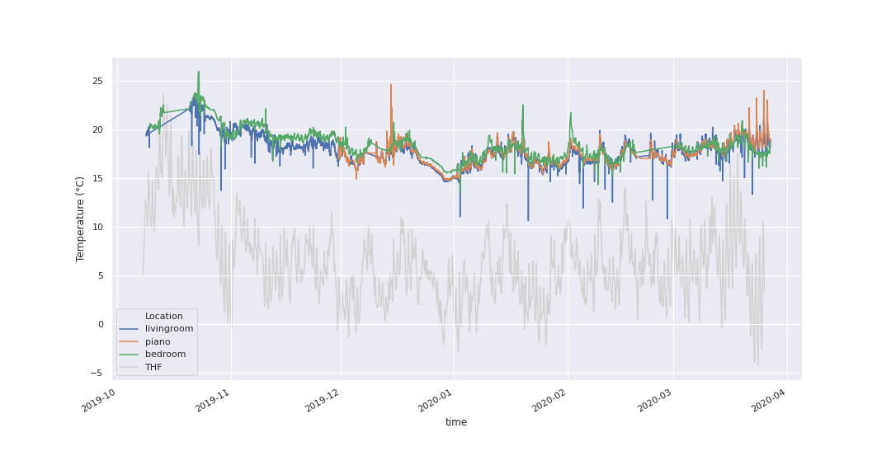

HomeSweetPi
===========

A Raspberry Pi-based data pipeline project
~~~~~~~~~~~~~~~~~~~~~~~~~~~~~~~~~~~~~~~~~~

.. container:: row

   .. container:: col-md-8

      .. raw:: html

         <h1>

      Motivation

      .. raw:: html

         </h1>

      ::

           <ul>
               <li>Humidity is a concern in my flat
                   <ul>
                       <li>Poor ventilation</li>
                       <li>Allergies</li>
                       <li>Piano</li>
                   </ul>
               </li>
                
               <li>Bought a dehumidifier
                   <ul>
                       <li>But how effective is it?</li>
                   </ul>
               </li>
                
               <li>A perfect excuse for a Raspberry Pi project!
                   <ul>
                       <li>Data collection started October 2019</li>
                       <li>Nothing done with the data until now</li>
                   </ul>
               </li>
           </ul>

   .. container:: col-md-4

Aims:
~~~~~

-  Build a pipeline to handle the data as it comes in
-  Build a simple web interface
-  Enable some insights and analysis

.. raw:: html

   <h1>

Set-up

.. raw:: html

   </h1>

.. container:: row

   .. container:: col-md-8

      .. raw:: html

         <h2>

      Hardware:

      .. raw:: html

         </h2>

      ::

           <ul>
               <li>Three Raspberry Pis
                   <ul>
                       <li>Two with sensors</li>
                       <li>One as Server</li>
                   </ul>
               </li>
                
               <li>Four Sensors
                   <ul>
                       <li>Living Room</li>
                       <li>Piano</li>
                       <li>Bed Room</li>
                       <li>Outside</li>
                   </ul>
               </li>
                
               <li>Parameters
                   <ul>
                       <li>Temperature</li>
                       <li>Humidity</li>
                       <li>Barometric Pressure (bedroom only)</li>
                       <li>Gas Resistance (bedroom only)</li>
                   </ul>
               </li>
                
               <li>Readings taken every 5 minutes (when functioning...)</li>
           </ul>

   .. container:: col-md-4

.. container:: row

   .. container:: col-md-8

      ::

         <h2>Software:</h2>
           <ul>
               <li>Languages
                   <ul>
                       <li>Python</li>
                       <li>Bash</li>
                   </ul>
               </li>
                
               <li>Service handling / automation
                   <ul>
                       <li>Systemd</li>
                   </ul>
               </li>
                
               <li>Database
                   <ul>
                       <li>SQLite (on Raspberry Pis)</li>
                       <li>PostGresSQL (on server)</li>
                       <li>SQLalchemy ORM for scripting</li>
                   </ul>
               </li>
                
               <li>Web server / APIs
                   <ul>
                       <li>Flask</li>
                   </ul>
               </li>
                
               <li>Interactive visualisation
                   <ul>
                       <li>Altair</li>
                   </ul>
               </li>
           </ul>

   .. container:: col-md-4

Pipeline
========

   Architecture

   Architecture

Web Interface
=============

`http://homesweetpi.duckdns.org:5002/ <http://192.168.1.237:5002/>`__.

Main page
---------

.. figure:: images/main_page.png
   :alt: Main page

   Main page

Chart page
----------

   Chart page

API
---

.. figure:: images/api.png
   :alt: API

   API

Interactive plots
-----------------

.. code:: ipython3

    chart

.. raw:: html

    

    <script type="text/javascript">
      (function(spec, embedOpt){
        const outputDiv = document.getElementById("altair-viz-eaf0077256984f05be88c3e167e0ff1c");
        const paths = {
          "vega": "https://cdn.jsdelivr.net/npm//vega@5?noext",
          "vega-lib": "https://cdn.jsdelivr.net/npm//vega-lib?noext",
          "vega-lite": "https://cdn.jsdelivr.net/npm//vega-lite@4.0.2?noext",
          "vega-embed": "https://cdn.jsdelivr.net/npm//vega-embed@6?noext",
        };

        function loadScript(lib) {
          return new Promise(function(resolve, reject) {
            var s = document.createElement('script');
            s.src = paths[lib];
            s.async = true;
            s.onload = () => resolve(paths[lib]);
            s.onerror = () => reject(`Error loading script: ${paths[lib]}`);
            document.getElementsByTagName("head")[0].appendChild(s);
          });
        }

        function showError(err) {
          outputDiv.innerHTML = `
${err}
`;
          throw err;
        }

        function displayChart(vegaEmbed) {
          vegaEmbed(outputDiv, spec, embedOpt)
            .catch(err => showError(`Javascript Error: ${err.message} This usually means there's a typo in your chart specification. See the javascript console for the full traceback.`));
        }

        if(typeof define === "function" && define.amd) {
          requirejs.config({paths});
          require(["vega-embed"], displayChart, err => showError(`Error loading script: ${err.message}`));
        } else if (typeof vegaEmbed === "function") {
          displayChart(vegaEmbed);
        } else {
          loadScript("vega")
            .then(() => loadScript("vega-lite"))
            .then(() => loadScript("vega-embed"))
            .catch(showError)
            .then(() => displayChart(vegaEmbed));
        }
      })({"config": {"view": {"continuousWidth": 400, "continuousHeight": 300}, "axisBottom": {"labelFontSize": 12, "title": null}, "axisLeft": {"labelFontSize": 12, "titleFontSize": 15}, "legend": {"labelFontSize": 12, "titleFontSize": 12}, "title": {"anchor": "start", "color": "darkgray", "fontSize": 16, "frame": "group"}}, "repeat": {"row": ["Temperature (\u00b0C)", "Relative Humidity (%)", "Pressure (hPa)", "Gas Resistance (\u03a9)"]}, "spec": {"layer": [{"mark": "line", "encoding": {"color": {"type": "nominal", "field": "Location"}, "x": {"type": "temporal", "field": "Time"}, "y": {"type": "quantitative", "field": {"repeat": "row"}, "scale": {"zero": false}}}, "selection": {"selector006": {"type": "interval", "bind": "scales", "encodings": ["x", "y"]}}}, {"mark": "point", "encoding": {"opacity": {"value": 0}, "x": {"type": "temporal", "field": "Time"}}, "selection": {"selector005": {"type": "single", "on": "mouseover", "fields": ["Time"], "nearest": true}}}, {"mark": "point", "encoding": {"color": {"type": "nominal", "field": "Location"}, "opacity": {"condition": {"value": 1, "selection": "selector005"}, "value": 0}, "x": {"type": "temporal", "field": "Time"}, "y": {"type": "quantitative", "field": {"repeat": "row"}, "scale": {"zero": false}}}}, {"mark": {"type": "rule", "color": "gray"}, "encoding": {"x": {"type": "temporal", "field": "Time"}}, "transform": [{"filter": {"selection": "selector005"}}]}, {"mark": {"type": "text", "align": "left", "dx": 5, "dy": -5}, "encoding": {"color": {"type": "nominal", "field": "Location"}, "text": {"condition": {"type": "quantitative", "field": {"repeat": "row"}, "selection": "selector005"}, "value": " "}, "x": {"type": "temporal", "field": "Time"}, "y": {"type": "quantitative", "field": {"repeat": "row"}, "scale": {"zero": false}}}}], "data": {"name": "data-434c8ec7fc2fb6c7012a3a6a6c840d09"}, "height": 200, "width": 600}, "title": "Readings from the last 7 days:", "$schema": "https://vega.github.io/schema/vega-lite/v4.0.2.json", "datasets": {"data-434c8ec7fc2fb6c7012a3a6a6c840d09": [{"Location": "livingroom", "Time": "2020-03-20T13:00:00", "Temperature (\u00b0C)": 19.4, "Relative Humidity (%)": 55.5, "Pressure (hPa)": null, "Gas Resistance (\u03a9)": null}, {"Location": "livingroom", "Time": "2020-03-20T13:30:00", "Temperature (\u00b0C)": 19.4, "Relative Humidity (%)": 55.6, "Pressure (hPa)": null, "Gas Resistance (\u03a9)": null}, {"Location": "livingroom", "Time": "2020-03-20T14:00:00", "Temperature (\u00b0C)": 19.5, "Relative Humidity (%)": 56.8, "Pressure (hPa)": null, "Gas Resistance (\u03a9)": null}, {"Location": "livingroom", "Time": "2020-03-20T14:30:00", "Temperature (\u00b0C)": 19.2, "Relative Humidity (%)": 49.9, "Pressure (hPa)": null, "Gas Resistance (\u03a9)": null}, {"Location": "livingroom", "Time": "2020-03-20T15:00:00", "Temperature (\u00b0C)": 19.6, "Relative Humidity (%)": 55.9, "Pressure (hPa)": null, "Gas Resistance (\u03a9)": null}, {"Location": "livingroom", "Time": "2020-03-20T15:30:00", "Temperature (\u00b0C)": 19.6, "Relative Humidity (%)": 57.9, "Pressure (hPa)": null, "Gas Resistance (\u03a9)": null}, {"Location": "livingroom", "Time": "2020-03-20T16:00:00", "Temperature (\u00b0C)": 19.5, "Relative Humidity (%)": 57.6, "Pressure (hPa)": null, "Gas Resistance (\u03a9)": null}, {"Location": "livingroom", "Time": "2020-03-20T16:30:00", "Temperature (\u00b0C)": 19.4, "Relative Humidity (%)": 56.1, "Pressure (hPa)": null, "Gas Resistance (\u03a9)": null}, {"Location": "livingroom", "Time": "2020-03-20T17:00:00", "Temperature (\u00b0C)": 19.5, "Relative Humidity (%)": 56.7, "Pressure (hPa)": null, "Gas Resistance (\u03a9)": null}, {"Location": "livingroom", "Time": "2020-03-20T17:30:00", "Temperature (\u00b0C)": 19.5, "Relative Humidity (%)": 57.1, "Pressure (hPa)": null, "Gas Resistance (\u03a9)": null}, {"Location": "livingroom", "Time": "2020-03-20T18:00:00", "Temperature (\u00b0C)": 19.6, "Relative Humidity (%)": 57.2, "Pressure (hPa)": null, "Gas Resistance (\u03a9)": null}, {"Location": "livingroom", "Time": "2020-03-20T18:30:00", "Temperature (\u00b0C)": 19.6, "Relative Humidity (%)": 61.1, "Pressure (hPa)": null, "Gas Resistance (\u03a9)": null}, {"Location": "livingroom", "Time": "2020-03-20T19:00:00", "Temperature (\u00b0C)": 19.6, "Relative Humidity (%)": 62.2, "Pressure (hPa)": null, "Gas Resistance (\u03a9)": null}, {"Location": "livingroom", "Time": "2020-03-20T19:30:00", "Temperature (\u00b0C)": 19.7, "Relative Humidity (%)": 63.2, "Pressure (hPa)": null, "Gas Resistance (\u03a9)": null}, {"Location": "livingroom", "Time": "2020-03-20T20:00:00", "Temperature (\u00b0C)": 19.9, "Relative Humidity (%)": 62.2, "Pressure (hPa)": null, "Gas Resistance (\u03a9)": null}, {"Location": "livingroom", "Time": "2020-03-20T20:30:00", "Temperature (\u00b0C)": 19.9, "Relative Humidity (%)": 65.2, "Pressure (hPa)": null, "Gas Resistance (\u03a9)": null}, {"Location": "livingroom", "Time": "2020-03-20T21:00:00", "Temperature (\u00b0C)": 19.8, "Relative Humidity (%)": 65.3, "Pressure (hPa)": null, "Gas Resistance (\u03a9)": null}, {"Location": "livingroom", "Time": "2020-03-20T21:30:00", "Temperature (\u00b0C)": 19.8, "Relative Humidity (%)": 65.2, "Pressure (hPa)": null, "Gas Resistance (\u03a9)": null}, {"Location": "livingroom", "Time": "2020-03-20T22:00:00", "Temperature (\u00b0C)": 19.8, "Relative Humidity (%)": 65.1, "Pressure (hPa)": null, "Gas Resistance (\u03a9)": null}, {"Location": "livingroom", "Time": "2020-03-20T22:30:00", "Temperature (\u00b0C)": 19.7, "Relative Humidity (%)": 64.4, "Pressure (hPa)": null, "Gas Resistance (\u03a9)": null}, {"Location": "livingroom", "Time": "2020-03-20T23:00:00", "Temperature (\u00b0C)": 19.6, "Relative Humidity (%)": 63.2, "Pressure (hPa)": null, "Gas Resistance (\u03a9)": null}, {"Location": "livingroom", "Time": "2020-03-20T23:30:00", "Temperature (\u00b0C)": 19.6, "Relative Humidity (%)": 62.7, "Pressure (hPa)": null, "Gas Resistance (\u03a9)": null}, {"Location": "livingroom", "Time": "2020-03-21T00:00:00", "Temperature (\u00b0C)": 19.5, "Relative Humidity (%)": 62.2, "Pressure (hPa)": null, "Gas Resistance (\u03a9)": null}, {"Location": "livingroom", "Time": "2020-03-21T00:30:00", "Temperature (\u00b0C)": 19.4, "Relative Humidity (%)": 61.8, "Pressure (hPa)": null, "Gas Resistance (\u03a9)": null}, {"Location": "livingroom", "Time": "2020-03-21T01:00:00", "Temperature (\u00b0C)": 19.4, "Relative Humidity (%)": 61.2, "Pressure (hPa)": null, "Gas Resistance (\u03a9)": null}, {"Location": "livingroom", "Time": "2020-03-21T01:30:00", "Temperature (\u00b0C)": 19.3, "Relative Humidity (%)": 61.0, "Pressure (hPa)": null, "Gas Resistance (\u03a9)": null}, {"Location": "livingroom", "Time": "2020-03-21T02:00:00", "Temperature (\u00b0C)": 19.3, "Relative Humidity (%)": 60.7, "Pressure (hPa)": null, "Gas Resistance (\u03a9)": null}, {"Location": "livingroom", "Time": "2020-03-21T02:30:00", "Temperature (\u00b0C)": 19.3, "Relative Humidity (%)": 60.4, "Pressure (hPa)": null, "Gas Resistance (\u03a9)": null}, {"Location": "livingroom", "Time": "2020-03-21T03:00:00", "Temperature (\u00b0C)": 19.2, "Relative Humidity (%)": 60.1, "Pressure (hPa)": null, "Gas Resistance (\u03a9)": null}, {"Location": "livingroom", "Time": "2020-03-21T03:30:00", "Temperature (\u00b0C)": 19.2, "Relative Humidity (%)": 59.8, "Pressure (hPa)": null, "Gas Resistance (\u03a9)": null}, {"Location": "livingroom", "Time": "2020-03-21T04:00:00", "Temperature (\u00b0C)": 19.1, "Relative Humidity (%)": 59.6, "Pressure (hPa)": null, "Gas Resistance (\u03a9)": null}, {"Location": "livingroom", "Time": "2020-03-21T04:30:00", "Temperature (\u00b0C)": 19.1, "Relative Humidity (%)": 59.4, "Pressure (hPa)": null, "Gas Resistance (\u03a9)": null}, {"Location": "livingroom", "Time": "2020-03-21T05:00:00", "Temperature (\u00b0C)": 19.0, "Relative Humidity (%)": 59.1, "Pressure (hPa)": null, "Gas Resistance (\u03a9)": null}, {"Location": "livingroom", "Time": "2020-03-21T05:30:00", "Temperature (\u00b0C)": 19.0, "Relative Humidity (%)": 58.9, "Pressure (hPa)": null, "Gas Resistance (\u03a9)": null}, {"Location": "livingroom", "Time": "2020-03-21T06:00:00", "Temperature (\u00b0C)": 18.9, "Relative Humidity (%)": 58.6, "Pressure (hPa)": null, "Gas Resistance (\u03a9)": null}, {"Location": "livingroom", "Time": "2020-03-21T06:30:00", "Temperature (\u00b0C)": 18.8, "Relative Humidity (%)": 58.5, "Pressure (hPa)": null, "Gas Resistance (\u03a9)": null}, {"Location": "livingroom", "Time": "2020-03-21T07:00:00", "Temperature (\u00b0C)": 18.8, "Relative Humidity (%)": 58.4, "Pressure (hPa)": null, "Gas Resistance (\u03a9)": null}, {"Location": "livingroom", "Time": "2020-03-21T07:30:00", "Temperature (\u00b0C)": 18.8, "Relative Humidity (%)": 58.2, "Pressure (hPa)": null, "Gas Resistance (\u03a9)": null}, {"Location": "livingroom", "Time": "2020-03-21T08:00:00", "Temperature (\u00b0C)": 18.7, "Relative Humidity (%)": 58.0, "Pressure (hPa)": null, "Gas Resistance (\u03a9)": null}, {"Location": "livingroom", "Time": "2020-03-21T08:30:00", "Temperature (\u00b0C)": 18.7, "Relative Humidity (%)": 57.9, "Pressure (hPa)": null, "Gas Resistance (\u03a9)": null}, {"Location": "livingroom", "Time": "2020-03-21T09:00:00", "Temperature (\u00b0C)": 18.7, "Relative Humidity (%)": 58.0, "Pressure (hPa)": null, "Gas Resistance (\u03a9)": null}, {"Location": "livingroom", "Time": "2020-03-21T09:30:00", "Temperature (\u00b0C)": 18.8, "Relative Humidity (%)": 50.9, "Pressure (hPa)": null, "Gas Resistance (\u03a9)": null}, {"Location": "livingroom", "Time": "2020-03-21T10:00:00", "Temperature (\u00b0C)": 18.8, "Relative Humidity (%)": 51.1, "Pressure (hPa)": null, "Gas Resistance (\u03a9)": null}, {"Location": "livingroom", "Time": "2020-03-21T10:30:00", "Temperature (\u00b0C)": 17.6, "Relative Humidity (%)": 46.6, "Pressure (hPa)": null, "Gas Resistance (\u03a9)": null}, {"Location": "livingroom", "Time": "2020-03-21T11:00:00", "Temperature (\u00b0C)": 17.6, "Relative Humidity (%)": 41.6, "Pressure (hPa)": null, "Gas Resistance (\u03a9)": null}, {"Location": "livingroom", "Time": "2020-03-21T11:30:00", "Temperature (\u00b0C)": 18.5, "Relative Humidity (%)": 49.9, "Pressure (hPa)": null, "Gas Resistance (\u03a9)": null}, {"Location": "livingroom", "Time": "2020-03-21T12:00:00", "Temperature (\u00b0C)": 18.7, "Relative Humidity (%)": 48.4, "Pressure (hPa)": null, "Gas Resistance (\u03a9)": null}, {"Location": "livingroom", "Time": "2020-03-21T12:30:00", "Temperature (\u00b0C)": 18.2, "Relative Humidity (%)": 44.0, "Pressure (hPa)": null, "Gas Resistance (\u03a9)": null}, {"Location": "livingroom", "Time": "2020-03-21T13:00:00", "Temperature (\u00b0C)": 17.4, "Relative Humidity (%)": 37.6, "Pressure (hPa)": null, "Gas Resistance (\u03a9)": null}, {"Location": "livingroom", "Time": "2020-03-21T13:30:00", "Temperature (\u00b0C)": 18.2, "Relative Humidity (%)": 44.2, "Pressure (hPa)": null, "Gas Resistance (\u03a9)": null}, {"Location": "livingroom", "Time": "2020-03-21T14:00:00", "Temperature (\u00b0C)": 18.8, "Relative Humidity (%)": 50.1, "Pressure (hPa)": null, "Gas Resistance (\u03a9)": null}, {"Location": "livingroom", "Time": "2020-03-21T14:30:00", "Temperature (\u00b0C)": 18.8, "Relative Humidity (%)": 49.4, "Pressure (hPa)": null, "Gas Resistance (\u03a9)": null}, {"Location": "livingroom", "Time": "2020-03-21T15:00:00", "Temperature (\u00b0C)": 19.0, "Relative Humidity (%)": 51.4, "Pressure (hPa)": null, "Gas Resistance (\u03a9)": null}, {"Location": "livingroom", "Time": "2020-03-21T15:30:00", "Temperature (\u00b0C)": 19.2, "Relative Humidity (%)": 48.3, "Pressure (hPa)": null, "Gas Resistance (\u03a9)": null}, {"Location": "livingroom", "Time": "2020-03-21T16:00:00", "Temperature (\u00b0C)": 20.0, "Relative Humidity (%)": 53.0, "Pressure (hPa)": null, "Gas Resistance (\u03a9)": null}, {"Location": "livingroom", "Time": "2020-03-21T16:30:00", "Temperature (\u00b0C)": 19.8, "Relative Humidity (%)": 50.8, "Pressure (hPa)": null, "Gas Resistance (\u03a9)": null}, {"Location": "livingroom", "Time": "2020-03-21T17:00:00", "Temperature (\u00b0C)": 20.2, "Relative Humidity (%)": 43.7, "Pressure (hPa)": null, "Gas Resistance (\u03a9)": null}, {"Location": "livingroom", "Time": "2020-03-21T17:30:00", "Temperature (\u00b0C)": 20.4, "Relative Humidity (%)": 39.1, "Pressure (hPa)": null, "Gas Resistance (\u03a9)": null}, {"Location": "livingroom", "Time": "2020-03-21T18:00:00", "Temperature (\u00b0C)": 19.6, "Relative Humidity (%)": 42.8, "Pressure (hPa)": null, "Gas Resistance (\u03a9)": null}, {"Location": "livingroom", "Time": "2020-03-21T18:30:00", "Temperature (\u00b0C)": 19.3, "Relative Humidity (%)": 47.2, "Pressure (hPa)": null, "Gas Resistance (\u03a9)": null}, {"Location": "livingroom", "Time": "2020-03-21T19:00:00", "Temperature (\u00b0C)": 19.1, "Relative Humidity (%)": 48.3, "Pressure (hPa)": null, "Gas Resistance (\u03a9)": null}, {"Location": "livingroom", "Time": "2020-03-21T19:30:00", "Temperature (\u00b0C)": 19.2, "Relative Humidity (%)": 51.4, "Pressure (hPa)": null, "Gas Resistance (\u03a9)": null}, {"Location": "livingroom", "Time": "2020-03-21T20:00:00", "Temperature (\u00b0C)": 19.3, "Relative Humidity (%)": 52.8, "Pressure (hPa)": null, "Gas Resistance (\u03a9)": null}, {"Location": "livingroom", "Time": "2020-03-21T20:30:00", "Temperature (\u00b0C)": 19.2, "Relative Humidity (%)": 55.0, "Pressure (hPa)": null, "Gas Resistance (\u03a9)": null}, {"Location": "livingroom", "Time": "2020-03-21T21:00:00", "Temperature (\u00b0C)": 19.2, "Relative Humidity (%)": 55.6, "Pressure (hPa)": null, "Gas Resistance (\u03a9)": null}, {"Location": "livingroom", "Time": "2020-03-21T21:30:00", "Temperature (\u00b0C)": 19.0, "Relative Humidity (%)": 54.6, "Pressure (hPa)": null, "Gas Resistance (\u03a9)": null}, {"Location": "livingroom", "Time": "2020-03-21T22:00:00", "Temperature (\u00b0C)": 19.0, "Relative Humidity (%)": 54.8, "Pressure (hPa)": null, "Gas Resistance (\u03a9)": null}, {"Location": "livingroom", "Time": "2020-03-21T22:30:00", "Temperature (\u00b0C)": 19.0, "Relative Humidity (%)": 55.7, "Pressure (hPa)": null, "Gas Resistance (\u03a9)": null}, {"Location": "livingroom", "Time": "2020-03-21T23:00:00", "Temperature (\u00b0C)": 19.0, "Relative Humidity (%)": 56.4, "Pressure (hPa)": null, "Gas Resistance (\u03a9)": null}, {"Location": "livingroom", "Time": "2020-03-21T23:30:00", "Temperature (\u00b0C)": 18.9, "Relative Humidity (%)": 56.7, "Pressure (hPa)": null, "Gas Resistance (\u03a9)": null}, {"Location": "livingroom", "Time": "2020-03-22T00:00:00", "Temperature (\u00b0C)": 18.8, "Relative Humidity (%)": 55.6, "Pressure (hPa)": null, "Gas Resistance (\u03a9)": null}, {"Location": "livingroom", "Time": "2020-03-22T00:30:00", "Temperature (\u00b0C)": 18.6, "Relative Humidity (%)": 54.8, "Pressure (hPa)": null, "Gas Resistance (\u03a9)": null}, {"Location": "livingroom", "Time": "2020-03-22T01:00:00", "Temperature (\u00b0C)": 18.5, "Relative Humidity (%)": 54.1, "Pressure (hPa)": null, "Gas Resistance (\u03a9)": null}, {"Location": "livingroom", "Time": "2020-03-22T01:30:00", "Temperature (\u00b0C)": 18.4, "Relative Humidity (%)": 53.5, "Pressure (hPa)": null, "Gas Resistance (\u03a9)": null}, {"Location": "livingroom", "Time": "2020-03-22T02:00:00", "Temperature (\u00b0C)": 18.4, "Relative Humidity (%)": 53.0, "Pressure (hPa)": null, "Gas Resistance (\u03a9)": null}, {"Location": "livingroom", "Time": "2020-03-22T02:30:00", "Temperature (\u00b0C)": 18.3, "Relative Humidity (%)": 52.5, "Pressure (hPa)": null, "Gas Resistance (\u03a9)": null}, {"Location": "livingroom", "Time": "2020-03-22T03:00:00", "Temperature (\u00b0C)": 18.2, "Relative Humidity (%)": 52.1, "Pressure (hPa)": null, "Gas Resistance (\u03a9)": null}, {"Location": "livingroom", "Time": "2020-03-22T03:30:00", "Temperature (\u00b0C)": 18.2, "Relative Humidity (%)": 52.1, "Pressure (hPa)": null, "Gas Resistance (\u03a9)": null}, {"Location": "livingroom", "Time": "2020-03-22T04:00:00", "Temperature (\u00b0C)": 18.1, "Relative Humidity (%)": 51.8, "Pressure (hPa)": null, "Gas Resistance (\u03a9)": null}, {"Location": "livingroom", "Time": "2020-03-22T04:30:00", "Temperature (\u00b0C)": 18.1, "Relative Humidity (%)": 51.7, "Pressure (hPa)": null, "Gas Resistance (\u03a9)": null}, {"Location": "livingroom", "Time": "2020-03-22T05:00:00", "Temperature (\u00b0C)": 18.0, "Relative Humidity (%)": 51.5, "Pressure (hPa)": null, "Gas Resistance (\u03a9)": null}, {"Location": "livingroom", "Time": "2020-03-22T05:30:00", "Temperature (\u00b0C)": 18.0, "Relative Humidity (%)": 51.0, "Pressure (hPa)": null, "Gas Resistance (\u03a9)": null}, {"Location": "livingroom", "Time": "2020-03-22T06:00:00", "Temperature (\u00b0C)": 18.0, "Relative Humidity (%)": 50.3, "Pressure (hPa)": null, "Gas Resistance (\u03a9)": null}, {"Location": "livingroom", "Time": "2020-03-22T06:30:00", "Temperature (\u00b0C)": 17.9, "Relative Humidity (%)": 50.3, "Pressure (hPa)": null, "Gas Resistance (\u03a9)": null}, {"Location": "livingroom", "Time": "2020-03-22T07:00:00", "Temperature (\u00b0C)": 17.9, "Relative Humidity (%)": 50.2, "Pressure (hPa)": null, "Gas Resistance (\u03a9)": null}, {"Location": "livingroom", "Time": "2020-03-22T07:30:00", "Temperature (\u00b0C)": 17.9, "Relative Humidity (%)": 50.1, "Pressure (hPa)": null, "Gas Resistance (\u03a9)": null}, {"Location": "livingroom", "Time": "2020-03-22T08:00:00", "Temperature (\u00b0C)": 17.8, "Relative Humidity (%)": 49.9, "Pressure (hPa)": null, "Gas Resistance (\u03a9)": null}, {"Location": "livingroom", "Time": "2020-03-22T08:30:00", "Temperature (\u00b0C)": 17.8, "Relative Humidity (%)": 50.2, "Pressure (hPa)": null, "Gas Resistance (\u03a9)": null}, {"Location": "livingroom", "Time": "2020-03-22T09:00:00", "Temperature (\u00b0C)": 17.9, "Relative Humidity (%)": 52.0, "Pressure (hPa)": null, "Gas Resistance (\u03a9)": null}, {"Location": "livingroom", "Time": "2020-03-22T09:30:00", "Temperature (\u00b0C)": 18.0, "Relative Humidity (%)": 55.2, "Pressure (hPa)": null, "Gas Resistance (\u03a9)": null}, {"Location": "livingroom", "Time": "2020-03-22T10:00:00", "Temperature (\u00b0C)": 18.1, "Relative Humidity (%)": 56.2, "Pressure (hPa)": null, "Gas Resistance (\u03a9)": null}, {"Location": "livingroom", "Time": "2020-03-22T10:30:00", "Temperature (\u00b0C)": 18.2, "Relative Humidity (%)": 55.8, "Pressure (hPa)": null, "Gas Resistance (\u03a9)": null}, {"Location": "livingroom", "Time": "2020-03-22T11:00:00", "Temperature (\u00b0C)": 18.2, "Relative Humidity (%)": 55.2, "Pressure (hPa)": null, "Gas Resistance (\u03a9)": null}, {"Location": "livingroom", "Time": "2020-03-22T11:30:00", "Temperature (\u00b0C)": 18.3, "Relative Humidity (%)": 55.5, "Pressure (hPa)": null, "Gas Resistance (\u03a9)": null}, {"Location": "livingroom", "Time": "2020-03-22T12:00:00", "Temperature (\u00b0C)": 18.4, "Relative Humidity (%)": 55.8, "Pressure (hPa)": null, "Gas Resistance (\u03a9)": null}, {"Location": "livingroom", "Time": "2020-03-22T12:30:00", "Temperature (\u00b0C)": 18.4, "Relative Humidity (%)": 56.7, "Pressure (hPa)": null, "Gas Resistance (\u03a9)": null}, {"Location": "livingroom", "Time": "2020-03-22T13:00:00", "Temperature (\u00b0C)": 18.1, "Relative Humidity (%)": 45.0, "Pressure (hPa)": null, "Gas Resistance (\u03a9)": null}, {"Location": "livingroom", "Time": "2020-03-22T13:30:00", "Temperature (\u00b0C)": 18.1, "Relative Humidity (%)": 47.8, "Pressure (hPa)": null, "Gas Resistance (\u03a9)": null}, {"Location": "livingroom", "Time": "2020-03-22T14:00:00", "Temperature (\u00b0C)": 18.2, "Relative Humidity (%)": 54.7, "Pressure (hPa)": null, "Gas Resistance (\u03a9)": null}, {"Location": "livingroom", "Time": "2020-03-22T14:30:00", "Temperature (\u00b0C)": 18.2, "Relative Humidity (%)": 56.3, "Pressure (hPa)": null, "Gas Resistance (\u03a9)": null}, {"Location": "livingroom", "Time": "2020-03-22T15:00:00", "Temperature (\u00b0C)": 14.9, "Relative Humidity (%)": 31.9, "Pressure (hPa)": null, "Gas Resistance (\u03a9)": null}, {"Location": "livingroom", "Time": "2020-03-22T15:30:00", "Temperature (\u00b0C)": 17.0, "Relative Humidity (%)": 40.3, "Pressure (hPa)": null, "Gas Resistance (\u03a9)": null}, {"Location": "livingroom", "Time": "2020-03-22T16:00:00", "Temperature (\u00b0C)": 18.7, "Relative Humidity (%)": 45.1, "Pressure (hPa)": null, "Gas Resistance (\u03a9)": null}, {"Location": "livingroom", "Time": "2020-03-22T16:30:00", "Temperature (\u00b0C)": 19.0, "Relative Humidity (%)": 47.2, "Pressure (hPa)": null, "Gas Resistance (\u03a9)": null}, {"Location": "livingroom", "Time": "2020-03-22T17:00:00", "Temperature (\u00b0C)": 19.2, "Relative Humidity (%)": 50.0, "Pressure (hPa)": null, "Gas Resistance (\u03a9)": null}, {"Location": "livingroom", "Time": "2020-03-22T17:30:00", "Temperature (\u00b0C)": 19.3, "Relative Humidity (%)": 50.4, "Pressure (hPa)": null, "Gas Resistance (\u03a9)": null}, {"Location": "livingroom", "Time": "2020-03-22T18:00:00", "Temperature (\u00b0C)": 19.2, "Relative Humidity (%)": 51.1, "Pressure (hPa)": null, "Gas Resistance (\u03a9)": null}, {"Location": "livingroom", "Time": "2020-03-22T18:30:00", "Temperature (\u00b0C)": 18.9, "Relative Humidity (%)": 52.5, "Pressure (hPa)": null, "Gas Resistance (\u03a9)": null}, {"Location": "livingroom", "Time": "2020-03-22T19:00:00", "Temperature (\u00b0C)": 18.8, "Relative Humidity (%)": 53.6, "Pressure (hPa)": null, "Gas Resistance (\u03a9)": null}, {"Location": "livingroom", "Time": "2020-03-22T19:30:00", "Temperature (\u00b0C)": 18.7, "Relative Humidity (%)": 57.4, "Pressure (hPa)": null, "Gas Resistance (\u03a9)": null}, {"Location": "livingroom", "Time": "2020-03-22T20:00:00", "Temperature (\u00b0C)": 18.6, "Relative Humidity (%)": 56.4, "Pressure (hPa)": null, "Gas Resistance (\u03a9)": null}, {"Location": "livingroom", "Time": "2020-03-22T20:30:00", "Temperature (\u00b0C)": 18.7, "Relative Humidity (%)": 63.4, "Pressure (hPa)": null, "Gas Resistance (\u03a9)": null}, {"Location": "livingroom", "Time": "2020-03-22T21:00:00", "Temperature (\u00b0C)": 18.7, "Relative Humidity (%)": 62.3, "Pressure (hPa)": null, "Gas Resistance (\u03a9)": null}, {"Location": "livingroom", "Time": "2020-03-22T21:30:00", "Temperature (\u00b0C)": 18.6, "Relative Humidity (%)": 59.3, "Pressure (hPa)": null, "Gas Resistance (\u03a9)": null}, {"Location": "livingroom", "Time": "2020-03-22T22:00:00", "Temperature (\u00b0C)": 18.6, "Relative Humidity (%)": 59.1, "Pressure (hPa)": null, "Gas Resistance (\u03a9)": null}, {"Location": "livingroom", "Time": "2020-03-22T22:30:00", "Temperature (\u00b0C)": 18.6, "Relative Humidity (%)": 60.1, "Pressure (hPa)": null, "Gas Resistance (\u03a9)": null}, {"Location": "livingroom", "Time": "2020-03-22T23:00:00", "Temperature (\u00b0C)": 18.5, "Relative Humidity (%)": 60.4, "Pressure (hPa)": null, "Gas Resistance (\u03a9)": null}, {"Location": "livingroom", "Time": "2020-03-22T23:30:00", "Temperature (\u00b0C)": 18.4, "Relative Humidity (%)": 57.6, "Pressure (hPa)": null, "Gas Resistance (\u03a9)": null}, {"Location": "livingroom", "Time": "2020-03-23T00:00:00", "Temperature (\u00b0C)": 18.2, "Relative Humidity (%)": 56.5, "Pressure (hPa)": null, "Gas Resistance (\u03a9)": null}, {"Location": "livingroom", "Time": "2020-03-23T00:30:00", "Temperature (\u00b0C)": 18.1, "Relative Humidity (%)": 54.9, "Pressure (hPa)": null, "Gas Resistance (\u03a9)": null}, {"Location": "livingroom", "Time": "2020-03-23T01:00:00", "Temperature (\u00b0C)": 18.0, "Relative Humidity (%)": 53.8, "Pressure (hPa)": null, "Gas Resistance (\u03a9)": null}, {"Location": "livingroom", "Time": "2020-03-23T01:30:00", "Temperature (\u00b0C)": 17.9, "Relative Humidity (%)": 52.7, "Pressure (hPa)": null, "Gas Resistance (\u03a9)": null}, {"Location": "livingroom", "Time": "2020-03-23T02:00:00", "Temperature (\u00b0C)": 17.8, "Relative Humidity (%)": 51.9, "Pressure (hPa)": null, "Gas Resistance (\u03a9)": null}, {"Location": "livingroom", "Time": "2020-03-23T02:30:00", "Temperature (\u00b0C)": 17.7, "Relative Humidity (%)": 51.2, "Pressure (hPa)": null, "Gas Resistance (\u03a9)": null}, {"Location": "livingroom", "Time": "2020-03-23T03:00:00", "Temperature (\u00b0C)": 17.7, "Relative Humidity (%)": 50.6, "Pressure (hPa)": null, "Gas Resistance (\u03a9)": null}, {"Location": "livingroom", "Time": "2020-03-23T03:30:00", "Temperature (\u00b0C)": 17.6, "Relative Humidity (%)": 50.0, "Pressure (hPa)": null, "Gas Resistance (\u03a9)": null}, {"Location": "livingroom", "Time": "2020-03-23T04:00:00", "Temperature (\u00b0C)": 17.5, "Relative Humidity (%)": 49.5, "Pressure (hPa)": null, "Gas Resistance (\u03a9)": null}, {"Location": "livingroom", "Time": "2020-03-23T04:30:00", "Temperature (\u00b0C)": 17.4, "Relative Humidity (%)": 49.2, "Pressure (hPa)": null, "Gas Resistance (\u03a9)": null}, {"Location": "livingroom", "Time": "2020-03-23T05:00:00", "Temperature (\u00b0C)": 17.4, "Relative Humidity (%)": 49.0, "Pressure (hPa)": null, "Gas Resistance (\u03a9)": null}, {"Location": "livingroom", "Time": "2020-03-23T05:30:00", "Temperature (\u00b0C)": 17.4, "Relative Humidity (%)": 48.6, "Pressure (hPa)": null, "Gas Resistance (\u03a9)": null}, {"Location": "livingroom", "Time": "2020-03-23T06:00:00", "Temperature (\u00b0C)": 17.3, "Relative Humidity (%)": 48.1, "Pressure (hPa)": null, "Gas Resistance (\u03a9)": null}, {"Location": "livingroom", "Time": "2020-03-23T06:30:00", "Temperature (\u00b0C)": 17.3, "Relative Humidity (%)": 48.0, "Pressure (hPa)": null, "Gas Resistance (\u03a9)": null}, {"Location": "livingroom", "Time": "2020-03-23T07:00:00", "Temperature (\u00b0C)": 17.2, "Relative Humidity (%)": 48.0, "Pressure (hPa)": null, "Gas Resistance (\u03a9)": null}, {"Location": "livingroom", "Time": "2020-03-23T07:30:00", "Temperature (\u00b0C)": 17.2, "Relative Humidity (%)": 47.9, "Pressure (hPa)": null, "Gas Resistance (\u03a9)": null}, {"Location": "livingroom", "Time": "2020-03-23T08:00:00", "Temperature (\u00b0C)": 17.2, "Relative Humidity (%)": 48.2, "Pressure (hPa)": null, "Gas Resistance (\u03a9)": null}, {"Location": "livingroom", "Time": "2020-03-23T08:30:00", "Temperature (\u00b0C)": 17.2, "Relative Humidity (%)": 50.7, "Pressure (hPa)": null, "Gas Resistance (\u03a9)": null}, {"Location": "livingroom", "Time": "2020-03-23T09:00:00", "Temperature (\u00b0C)": 17.3, "Relative Humidity (%)": 47.5, "Pressure (hPa)": null, "Gas Resistance (\u03a9)": null}, {"Location": "livingroom", "Time": "2020-03-23T09:30:00", "Temperature (\u00b0C)": 17.5, "Relative Humidity (%)": 53.8, "Pressure (hPa)": null, "Gas Resistance (\u03a9)": null}, {"Location": "livingroom", "Time": "2020-03-23T10:00:00", "Temperature (\u00b0C)": 17.5, "Relative Humidity (%)": 54.5, "Pressure (hPa)": null, "Gas Resistance (\u03a9)": null}, {"Location": "livingroom", "Time": "2020-03-23T10:30:00", "Temperature (\u00b0C)": 17.7, "Relative Humidity (%)": 54.5, "Pressure (hPa)": null, "Gas Resistance (\u03a9)": null}, {"Location": "livingroom", "Time": "2020-03-23T11:00:00", "Temperature (\u00b0C)": 18.1, "Relative Humidity (%)": 54.4, "Pressure (hPa)": null, "Gas Resistance (\u03a9)": null}, {"Location": "livingroom", "Time": "2020-03-23T11:30:00", "Temperature (\u00b0C)": 18.3, "Relative Humidity (%)": 54.4, "Pressure (hPa)": null, "Gas Resistance (\u03a9)": null}, {"Location": "livingroom", "Time": "2020-03-23T12:00:00", "Temperature (\u00b0C)": 18.5, "Relative Humidity (%)": 54.5, "Pressure (hPa)": null, "Gas Resistance (\u03a9)": null}, {"Location": "livingroom", "Time": "2020-03-23T12:30:00", "Temperature (\u00b0C)": 18.6, "Relative Humidity (%)": 55.0, "Pressure (hPa)": null, "Gas Resistance (\u03a9)": null}, {"Location": "livingroom", "Time": "2020-03-23T13:00:00", "Temperature (\u00b0C)": 18.6, "Relative Humidity (%)": 55.4, "Pressure (hPa)": null, "Gas Resistance (\u03a9)": null}, {"Location": "livingroom", "Time": "2020-03-23T13:30:00", "Temperature (\u00b0C)": 18.6, "Relative Humidity (%)": 57.6, "Pressure (hPa)": null, "Gas Resistance (\u03a9)": null}, {"Location": "livingroom", "Time": "2020-03-23T14:00:00", "Temperature (\u00b0C)": 18.7, "Relative Humidity (%)": 58.1, "Pressure (hPa)": null, "Gas Resistance (\u03a9)": null}, {"Location": "livingroom", "Time": "2020-03-23T14:30:00", "Temperature (\u00b0C)": 18.7, "Relative Humidity (%)": 58.2, "Pressure (hPa)": null, "Gas Resistance (\u03a9)": null}, {"Location": "livingroom", "Time": "2020-03-23T15:00:00", "Temperature (\u00b0C)": 18.8, "Relative Humidity (%)": 58.6, "Pressure (hPa)": null, "Gas Resistance (\u03a9)": null}, {"Location": "livingroom", "Time": "2020-03-23T15:30:00", "Temperature (\u00b0C)": 19.1, "Relative Humidity (%)": 58.0, "Pressure (hPa)": null, "Gas Resistance (\u03a9)": null}, {"Location": "livingroom", "Time": "2020-03-23T16:00:00", "Temperature (\u00b0C)": 19.5, "Relative Humidity (%)": 54.0, "Pressure (hPa)": null, "Gas Resistance (\u03a9)": null}, {"Location": "livingroom", "Time": "2020-03-23T16:30:00", "Temperature (\u00b0C)": 19.8, "Relative Humidity (%)": 53.3, "Pressure (hPa)": null, "Gas Resistance (\u03a9)": null}, {"Location": "livingroom", "Time": "2020-03-23T17:00:00", "Temperature (\u00b0C)": 20.6, "Relative Humidity (%)": 52.3, "Pressure (hPa)": null, "Gas Resistance (\u03a9)": null}, {"Location": "livingroom", "Time": "2020-03-23T17:30:00", "Temperature (\u00b0C)": 20.8, "Relative Humidity (%)": 53.6, "Pressure (hPa)": null, "Gas Resistance (\u03a9)": null}, {"Location": "livingroom", "Time": "2020-03-23T18:00:00", "Temperature (\u00b0C)": 20.0, "Relative Humidity (%)": 55.9, "Pressure (hPa)": null, "Gas Resistance (\u03a9)": null}, {"Location": "livingroom", "Time": "2020-03-23T18:30:00", "Temperature (\u00b0C)": 19.5, "Relative Humidity (%)": 56.9, "Pressure (hPa)": null, "Gas Resistance (\u03a9)": null}, {"Location": "livingroom", "Time": "2020-03-23T19:00:00", "Temperature (\u00b0C)": 19.3, "Relative Humidity (%)": 59.7, "Pressure (hPa)": null, "Gas Resistance (\u03a9)": null}, {"Location": "livingroom", "Time": "2020-03-23T19:30:00", "Temperature (\u00b0C)": 19.2, "Relative Humidity (%)": 63.7, "Pressure (hPa)": null, "Gas Resistance (\u03a9)": null}, {"Location": "livingroom", "Time": "2020-03-23T20:00:00", "Temperature (\u00b0C)": 18.9, "Relative Humidity (%)": 56.5, "Pressure (hPa)": null, "Gas Resistance (\u03a9)": null}, {"Location": "livingroom", "Time": "2020-03-23T20:30:00", "Temperature (\u00b0C)": 19.0, "Relative Humidity (%)": 58.8, "Pressure (hPa)": null, "Gas Resistance (\u03a9)": null}, {"Location": "livingroom", "Time": "2020-03-23T21:00:00", "Temperature (\u00b0C)": 18.9, "Relative Humidity (%)": 61.0, "Pressure (hPa)": null, "Gas Resistance (\u03a9)": null}, {"Location": "livingroom", "Time": "2020-03-23T21:30:00", "Temperature (\u00b0C)": 18.8, "Relative Humidity (%)": 61.1, "Pressure (hPa)": null, "Gas Resistance (\u03a9)": null}, {"Location": "livingroom", "Time": "2020-03-23T22:00:00", "Temperature (\u00b0C)": 18.8, "Relative Humidity (%)": 60.7, "Pressure (hPa)": null, "Gas Resistance (\u03a9)": null}, {"Location": "livingroom", "Time": "2020-03-23T22:30:00", "Temperature (\u00b0C)": 18.8, "Relative Humidity (%)": 51.5, "Pressure (hPa)": null, "Gas Resistance (\u03a9)": null}, {"Location": "livingroom", "Time": "2020-03-23T23:00:00", "Temperature (\u00b0C)": 18.9, "Relative Humidity (%)": 60.2, "Pressure (hPa)": null, "Gas Resistance (\u03a9)": null}, {"Location": "livingroom", "Time": "2020-03-23T23:30:00", "Temperature (\u00b0C)": 18.9, "Relative Humidity (%)": 59.9, "Pressure (hPa)": null, "Gas Resistance (\u03a9)": null}, {"Location": "livingroom", "Time": "2020-03-24T00:00:00", "Temperature (\u00b0C)": 18.9, "Relative Humidity (%)": 62.4, "Pressure (hPa)": null, "Gas Resistance (\u03a9)": null}, {"Location": "livingroom", "Time": "2020-03-24T00:30:00", "Temperature (\u00b0C)": 18.7, "Relative Humidity (%)": 61.5, "Pressure (hPa)": null, "Gas Resistance (\u03a9)": null}, {"Location": "livingroom", "Time": "2020-03-24T01:00:00", "Temperature (\u00b0C)": 18.5, "Relative Humidity (%)": 60.8, "Pressure (hPa)": null, "Gas Resistance (\u03a9)": null}, {"Location": "livingroom", "Time": "2020-03-24T01:30:00", "Temperature (\u00b0C)": 18.4, "Relative Humidity (%)": 60.2, "Pressure (hPa)": null, "Gas Resistance (\u03a9)": null}, {"Location": "livingroom", "Time": "2020-03-24T02:00:00", "Temperature (\u00b0C)": 18.3, "Relative Humidity (%)": 59.7, "Pressure (hPa)": null, "Gas Resistance (\u03a9)": null}, {"Location": "livingroom", "Time": "2020-03-24T02:30:00", "Temperature (\u00b0C)": 18.2, "Relative Humidity (%)": 59.2, "Pressure (hPa)": null, "Gas Resistance (\u03a9)": null}, {"Location": "livingroom", "Time": "2020-03-24T03:00:00", "Temperature (\u00b0C)": 18.1, "Relative Humidity (%)": 58.9, "Pressure (hPa)": null, "Gas Resistance (\u03a9)": null}, {"Location": "livingroom", "Time": "2020-03-24T03:30:00", "Temperature (\u00b0C)": 17.9, "Relative Humidity (%)": 58.5, "Pressure (hPa)": null, "Gas Resistance (\u03a9)": null}, {"Location": "livingroom", "Time": "2020-03-24T04:00:00", "Temperature (\u00b0C)": 17.8, "Relative Humidity (%)": 58.2, "Pressure (hPa)": null, "Gas Resistance (\u03a9)": null}, {"Location": "livingroom", "Time": "2020-03-24T04:30:00", "Temperature (\u00b0C)": 17.7, "Relative Humidity (%)": 57.8, "Pressure (hPa)": null, "Gas Resistance (\u03a9)": null}, {"Location": "livingroom", "Time": "2020-03-24T05:00:00", "Temperature (\u00b0C)": 17.7, "Relative Humidity (%)": 57.6, "Pressure (hPa)": null, "Gas Resistance (\u03a9)": null}, {"Location": "livingroom", "Time": "2020-03-24T05:30:00", "Temperature (\u00b0C)": 17.6, "Relative Humidity (%)": 57.3, "Pressure (hPa)": null, "Gas Resistance (\u03a9)": null}, {"Location": "livingroom", "Time": "2020-03-24T06:00:00", "Temperature (\u00b0C)": 17.6, "Relative Humidity (%)": 57.1, "Pressure (hPa)": null, "Gas Resistance (\u03a9)": null}, {"Location": "livingroom", "Time": "2020-03-24T06:30:00", "Temperature (\u00b0C)": 17.5, "Relative Humidity (%)": 56.9, "Pressure (hPa)": null, "Gas Resistance (\u03a9)": null}, {"Location": "livingroom", "Time": "2020-03-24T07:00:00", "Temperature (\u00b0C)": 17.4, "Relative Humidity (%)": 56.8, "Pressure (hPa)": null, "Gas Resistance (\u03a9)": null}, {"Location": "livingroom", "Time": "2020-03-24T07:30:00", "Temperature (\u00b0C)": 17.4, "Relative Humidity (%)": 56.7, "Pressure (hPa)": null, "Gas Resistance (\u03a9)": null}, {"Location": "livingroom", "Time": "2020-03-24T08:00:00", "Temperature (\u00b0C)": 17.3, "Relative Humidity (%)": 56.6, "Pressure (hPa)": null, "Gas Resistance (\u03a9)": null}, {"Location": "livingroom", "Time": "2020-03-24T08:30:00", "Temperature (\u00b0C)": 17.4, "Relative Humidity (%)": 58.0, "Pressure (hPa)": null, "Gas Resistance (\u03a9)": null}, {"Location": "livingroom", "Time": "2020-03-24T09:00:00", "Temperature (\u00b0C)": 17.6, "Relative Humidity (%)": 57.5, "Pressure (hPa)": null, "Gas Resistance (\u03a9)": null}, {"Location": "livingroom", "Time": "2020-03-24T09:30:00", "Temperature (\u00b0C)": 17.6, "Relative Humidity (%)": 57.4, "Pressure (hPa)": null, "Gas Resistance (\u03a9)": null}, {"Location": "livingroom", "Time": "2020-03-24T10:00:00", "Temperature (\u00b0C)": 17.5, "Relative Humidity (%)": 55.9, "Pressure (hPa)": null, "Gas Resistance (\u03a9)": null}, {"Location": "livingroom", "Time": "2020-03-24T10:30:00", "Temperature (\u00b0C)": 16.9, "Relative Humidity (%)": 50.1, "Pressure (hPa)": null, "Gas Resistance (\u03a9)": null}, {"Location": "livingroom", "Time": "2020-03-24T11:00:00", "Temperature (\u00b0C)": 17.6, "Relative Humidity (%)": 56.2, "Pressure (hPa)": null, "Gas Resistance (\u03a9)": null}, {"Location": "livingroom", "Time": "2020-03-24T11:30:00", "Temperature (\u00b0C)": 18.0, "Relative Humidity (%)": 56.2, "Pressure (hPa)": null, "Gas Resistance (\u03a9)": null}, {"Location": "livingroom", "Time": "2020-03-24T12:00:00", "Temperature (\u00b0C)": 18.4, "Relative Humidity (%)": 55.8, "Pressure (hPa)": null, "Gas Resistance (\u03a9)": null}, {"Location": "livingroom", "Time": "2020-03-24T12:30:00", "Temperature (\u00b0C)": 18.6, "Relative Humidity (%)": 55.7, "Pressure (hPa)": null, "Gas Resistance (\u03a9)": null}, {"Location": "livingroom", "Time": "2020-03-24T13:00:00", "Temperature (\u00b0C)": 18.7, "Relative Humidity (%)": 54.6, "Pressure (hPa)": null, "Gas Resistance (\u03a9)": null}, {"Location": "livingroom", "Time": "2020-03-24T13:30:00", "Temperature (\u00b0C)": 18.8, "Relative Humidity (%)": 55.5, "Pressure (hPa)": null, "Gas Resistance (\u03a9)": null}, {"Location": "livingroom", "Time": "2020-03-24T14:00:00", "Temperature (\u00b0C)": 18.9, "Relative Humidity (%)": 58.5, "Pressure (hPa)": null, "Gas Resistance (\u03a9)": null}, {"Location": "livingroom", "Time": "2020-03-24T14:30:00", "Temperature (\u00b0C)": 18.9, "Relative Humidity (%)": 59.9, "Pressure (hPa)": null, "Gas Resistance (\u03a9)": null}, {"Location": "livingroom", "Time": "2020-03-24T15:00:00", "Temperature (\u00b0C)": 18.9, "Relative Humidity (%)": 61.0, "Pressure (hPa)": null, "Gas Resistance (\u03a9)": null}, {"Location": "livingroom", "Time": "2020-03-24T15:30:00", "Temperature (\u00b0C)": 19.3, "Relative Humidity (%)": 60.4, "Pressure (hPa)": null, "Gas Resistance (\u03a9)": null}, {"Location": "livingroom", "Time": "2020-03-24T16:00:00", "Temperature (\u00b0C)": 20.0, "Relative Humidity (%)": 58.8, "Pressure (hPa)": null, "Gas Resistance (\u03a9)": null}, {"Location": "livingroom", "Time": "2020-03-24T16:30:00", "Temperature (\u00b0C)": 20.3, "Relative Humidity (%)": 61.9, "Pressure (hPa)": null, "Gas Resistance (\u03a9)": null}, {"Location": "livingroom", "Time": "2020-03-24T17:00:00", "Temperature (\u00b0C)": null, "Relative Humidity (%)": null, "Pressure (hPa)": null, "Gas Resistance (\u03a9)": null}, {"Location": "livingroom", "Time": "2020-03-24T17:30:00", "Temperature (\u00b0C)": null, "Relative Humidity (%)": null, "Pressure (hPa)": null, "Gas Resistance (\u03a9)": null}, {"Location": "livingroom", "Time": "2020-03-24T18:00:00", "Temperature (\u00b0C)": null, "Relative Humidity (%)": null, "Pressure (hPa)": null, "Gas Resistance (\u03a9)": null}, {"Location": "livingroom", "Time": "2020-03-24T18:30:00", "Temperature (\u00b0C)": null, "Relative Humidity (%)": null, "Pressure (hPa)": null, "Gas Resistance (\u03a9)": null}, {"Location": "livingroom", "Time": "2020-03-24T19:00:00", "Temperature (\u00b0C)": null, "Relative Humidity (%)": null, "Pressure (hPa)": null, "Gas Resistance (\u03a9)": null}, {"Location": "livingroom", "Time": "2020-03-24T19:30:00", "Temperature (\u00b0C)": null, "Relative Humidity (%)": null, "Pressure (hPa)": null, "Gas Resistance (\u03a9)": null}, {"Location": "livingroom", "Time": "2020-03-24T20:00:00", "Temperature (\u00b0C)": null, "Relative Humidity (%)": null, "Pressure (hPa)": null, "Gas Resistance (\u03a9)": null}, {"Location": "livingroom", "Time": "2020-03-24T20:30:00", "Temperature (\u00b0C)": null, "Relative Humidity (%)": null, "Pressure (hPa)": null, "Gas Resistance (\u03a9)": null}, {"Location": "livingroom", "Time": "2020-03-24T21:00:00", "Temperature (\u00b0C)": null, "Relative Humidity (%)": null, "Pressure (hPa)": null, "Gas Resistance (\u03a9)": null}, {"Location": "livingroom", "Time": "2020-03-24T21:30:00", "Temperature (\u00b0C)": null, "Relative Humidity (%)": null, "Pressure (hPa)": null, "Gas Resistance (\u03a9)": null}, {"Location": "livingroom", "Time": "2020-03-24T22:00:00", "Temperature (\u00b0C)": null, "Relative Humidity (%)": null, "Pressure (hPa)": null, "Gas Resistance (\u03a9)": null}, {"Location": "livingroom", "Time": "2020-03-24T22:30:00", "Temperature (\u00b0C)": null, "Relative Humidity (%)": null, "Pressure (hPa)": null, "Gas Resistance (\u03a9)": null}, {"Location": "livingroom", "Time": "2020-03-24T23:00:00", "Temperature (\u00b0C)": null, "Relative Humidity (%)": null, "Pressure (hPa)": null, "Gas Resistance (\u03a9)": null}, {"Location": "livingroom", "Time": "2020-03-24T23:30:00", "Temperature (\u00b0C)": null, "Relative Humidity (%)": null, "Pressure (hPa)": null, "Gas Resistance (\u03a9)": null}, {"Location": "livingroom", "Time": "2020-03-25T00:00:00", "Temperature (\u00b0C)": null, "Relative Humidity (%)": null, "Pressure (hPa)": null, "Gas Resistance (\u03a9)": null}, {"Location": "livingroom", "Time": "2020-03-25T00:30:00", "Temperature (\u00b0C)": null, "Relative Humidity (%)": null, "Pressure (hPa)": null, "Gas Resistance (\u03a9)": null}, {"Location": "livingroom", "Time": "2020-03-25T01:00:00", "Temperature (\u00b0C)": null, "Relative Humidity (%)": null, "Pressure (hPa)": null, "Gas Resistance (\u03a9)": null}, {"Location": "livingroom", "Time": "2020-03-25T01:30:00", "Temperature (\u00b0C)": null, "Relative Humidity (%)": null, "Pressure (hPa)": null, "Gas Resistance (\u03a9)": null}, {"Location": "livingroom", "Time": "2020-03-25T02:00:00", "Temperature (\u00b0C)": null, "Relative Humidity (%)": null, "Pressure (hPa)": null, "Gas Resistance (\u03a9)": null}, {"Location": "livingroom", "Time": "2020-03-25T02:30:00", "Temperature (\u00b0C)": null, "Relative Humidity (%)": null, "Pressure (hPa)": null, "Gas Resistance (\u03a9)": null}, {"Location": "livingroom", "Time": "2020-03-25T03:00:00", "Temperature (\u00b0C)": null, "Relative Humidity (%)": null, "Pressure (hPa)": null, "Gas Resistance (\u03a9)": null}, {"Location": "livingroom", "Time": "2020-03-25T03:30:00", "Temperature (\u00b0C)": null, "Relative Humidity (%)": null, "Pressure (hPa)": null, "Gas Resistance (\u03a9)": null}, {"Location": "livingroom", "Time": "2020-03-25T04:00:00", "Temperature (\u00b0C)": null, "Relative Humidity (%)": null, "Pressure (hPa)": null, "Gas Resistance (\u03a9)": null}, {"Location": "livingroom", "Time": "2020-03-25T04:30:00", "Temperature (\u00b0C)": null, "Relative Humidity (%)": null, "Pressure (hPa)": null, "Gas Resistance (\u03a9)": null}, {"Location": "livingroom", "Time": "2020-03-25T05:00:00", "Temperature (\u00b0C)": null, "Relative Humidity (%)": null, "Pressure (hPa)": null, "Gas Resistance (\u03a9)": null}, {"Location": "livingroom", "Time": "2020-03-25T05:30:00", "Temperature (\u00b0C)": null, "Relative Humidity (%)": null, "Pressure (hPa)": null, "Gas Resistance (\u03a9)": null}, {"Location": "livingroom", "Time": "2020-03-25T06:00:00", "Temperature (\u00b0C)": null, "Relative Humidity (%)": null, "Pressure (hPa)": null, "Gas Resistance (\u03a9)": null}, {"Location": "livingroom", "Time": "2020-03-25T06:30:00", "Temperature (\u00b0C)": null, "Relative Humidity (%)": null, "Pressure (hPa)": null, "Gas Resistance (\u03a9)": null}, {"Location": "livingroom", "Time": "2020-03-25T07:00:00", "Temperature (\u00b0C)": null, "Relative Humidity (%)": null, "Pressure (hPa)": null, "Gas Resistance (\u03a9)": null}, {"Location": "livingroom", "Time": "2020-03-25T07:30:00", "Temperature (\u00b0C)": null, "Relative Humidity (%)": null, "Pressure (hPa)": null, "Gas Resistance (\u03a9)": null}, {"Location": "livingroom", "Time": "2020-03-25T08:00:00", "Temperature (\u00b0C)": null, "Relative Humidity (%)": null, "Pressure (hPa)": null, "Gas Resistance (\u03a9)": null}, {"Location": "livingroom", "Time": "2020-03-25T08:30:00", "Temperature (\u00b0C)": null, "Relative Humidity (%)": null, "Pressure (hPa)": null, "Gas Resistance (\u03a9)": null}, {"Location": "livingroom", "Time": "2020-03-25T09:00:00", "Temperature (\u00b0C)": 17.6, "Relative Humidity (%)": 55.8, "Pressure (hPa)": null, "Gas Resistance (\u03a9)": null}, {"Location": "livingroom", "Time": "2020-03-25T09:30:00", "Temperature (\u00b0C)": 17.6, "Relative Humidity (%)": 53.7, "Pressure (hPa)": null, "Gas Resistance (\u03a9)": null}, {"Location": "livingroom", "Time": "2020-03-25T10:00:00", "Temperature (\u00b0C)": 18.2, "Relative Humidity (%)": 53.0, "Pressure (hPa)": null, "Gas Resistance (\u03a9)": null}, {"Location": "livingroom", "Time": "2020-03-25T10:30:00", "Temperature (\u00b0C)": 18.4, "Relative Humidity (%)": 54.9, "Pressure (hPa)": null, "Gas Resistance (\u03a9)": null}, {"Location": "livingroom", "Time": "2020-03-25T11:00:00", "Temperature (\u00b0C)": 18.5, "Relative Humidity (%)": 54.7, "Pressure (hPa)": null, "Gas Resistance (\u03a9)": null}, {"Location": "livingroom", "Time": "2020-03-25T11:30:00", "Temperature (\u00b0C)": 18.7, "Relative Humidity (%)": 54.2, "Pressure (hPa)": null, "Gas Resistance (\u03a9)": null}, {"Location": "livingroom", "Time": "2020-03-25T12:00:00", "Temperature (\u00b0C)": 18.9, "Relative Humidity (%)": 56.3, "Pressure (hPa)": null, "Gas Resistance (\u03a9)": null}, {"Location": "livingroom", "Time": "2020-03-25T12:30:00", "Temperature (\u00b0C)": 18.9, "Relative Humidity (%)": 56.9, "Pressure (hPa)": null, "Gas Resistance (\u03a9)": null}, {"Location": "livingroom", "Time": "2020-03-25T13:00:00", "Temperature (\u00b0C)": 19.0, "Relative Humidity (%)": 57.1, "Pressure (hPa)": null, "Gas Resistance (\u03a9)": null}, {"Location": "livingroom", "Time": "2020-03-25T13:30:00", "Temperature (\u00b0C)": 19.2, "Relative Humidity (%)": 57.2, "Pressure (hPa)": null, "Gas Resistance (\u03a9)": null}, {"Location": "livingroom", "Time": "2020-03-25T14:00:00", "Temperature (\u00b0C)": 19.1, "Relative Humidity (%)": 51.5, "Pressure (hPa)": null, "Gas Resistance (\u03a9)": null}, {"Location": "livingroom", "Time": "2020-03-25T14:30:00", "Temperature (\u00b0C)": 19.3, "Relative Humidity (%)": 55.3, "Pressure (hPa)": null, "Gas Resistance (\u03a9)": null}, {"Location": "livingroom", "Time": "2020-03-25T15:00:00", "Temperature (\u00b0C)": 19.3, "Relative Humidity (%)": 56.7, "Pressure (hPa)": null, "Gas Resistance (\u03a9)": null}, {"Location": "livingroom", "Time": "2020-03-25T15:30:00", "Temperature (\u00b0C)": 19.6, "Relative Humidity (%)": 57.3, "Pressure (hPa)": null, "Gas Resistance (\u03a9)": null}, {"Location": "livingroom", "Time": "2020-03-25T16:00:00", "Temperature (\u00b0C)": 20.3, "Relative Humidity (%)": 56.4, "Pressure (hPa)": null, "Gas Resistance (\u03a9)": null}, {"Location": "livingroom", "Time": "2020-03-25T16:30:00", "Temperature (\u00b0C)": 20.8, "Relative Humidity (%)": 52.8, "Pressure (hPa)": null, "Gas Resistance (\u03a9)": null}, {"Location": "livingroom", "Time": "2020-03-25T17:00:00", "Temperature (\u00b0C)": 21.9, "Relative Humidity (%)": 51.2, "Pressure (hPa)": null, "Gas Resistance (\u03a9)": null}, {"Location": "livingroom", "Time": "2020-03-25T17:30:00", "Temperature (\u00b0C)": 21.6, "Relative Humidity (%)": 53.8, "Pressure (hPa)": null, "Gas Resistance (\u03a9)": null}, {"Location": "livingroom", "Time": "2020-03-25T18:00:00", "Temperature (\u00b0C)": 20.0, "Relative Humidity (%)": 53.5, "Pressure (hPa)": null, "Gas Resistance (\u03a9)": null}, {"Location": "livingroom", "Time": "2020-03-25T18:30:00", "Temperature (\u00b0C)": 19.8, "Relative Humidity (%)": 55.7, "Pressure (hPa)": null, "Gas Resistance (\u03a9)": null}, {"Location": "livingroom", "Time": "2020-03-25T19:00:00", "Temperature (\u00b0C)": 19.7, "Relative Humidity (%)": 59.4, "Pressure (hPa)": null, "Gas Resistance (\u03a9)": null}, {"Location": "livingroom", "Time": "2020-03-25T19:30:00", "Temperature (\u00b0C)": 19.2, "Relative Humidity (%)": 56.6, "Pressure (hPa)": null, "Gas Resistance (\u03a9)": null}, {"Location": "livingroom", "Time": "2020-03-25T20:00:00", "Temperature (\u00b0C)": 19.7, "Relative Humidity (%)": 64.3, "Pressure (hPa)": null, "Gas Resistance (\u03a9)": null}, {"Location": "livingroom", "Time": "2020-03-25T20:30:00", "Temperature (\u00b0C)": 19.7, "Relative Humidity (%)": 64.2, "Pressure (hPa)": null, "Gas Resistance (\u03a9)": null}, {"Location": "livingroom", "Time": "2020-03-25T21:00:00", "Temperature (\u00b0C)": 19.5, "Relative Humidity (%)": 63.7, "Pressure (hPa)": null, "Gas Resistance (\u03a9)": null}, {"Location": "livingroom", "Time": "2020-03-25T21:30:00", "Temperature (\u00b0C)": 19.5, "Relative Humidity (%)": 64.5, "Pressure (hPa)": null, "Gas Resistance (\u03a9)": null}, {"Location": "livingroom", "Time": "2020-03-25T22:00:00", "Temperature (\u00b0C)": 19.4, "Relative Humidity (%)": 64.5, "Pressure (hPa)": null, "Gas Resistance (\u03a9)": null}, {"Location": "livingroom", "Time": "2020-03-25T22:30:00", "Temperature (\u00b0C)": 19.2, "Relative Humidity (%)": 61.8, "Pressure (hPa)": null, "Gas Resistance (\u03a9)": null}, {"Location": "livingroom", "Time": "2020-03-25T23:00:00", "Temperature (\u00b0C)": 19.0, "Relative Humidity (%)": 60.7, "Pressure (hPa)": null, "Gas Resistance (\u03a9)": null}, {"Location": "livingroom", "Time": "2020-03-25T23:30:00", "Temperature (\u00b0C)": 18.9, "Relative Humidity (%)": 60.3, "Pressure (hPa)": null, "Gas Resistance (\u03a9)": null}, {"Location": "livingroom", "Time": "2020-03-26T00:00:00", "Temperature (\u00b0C)": 18.7, "Relative Humidity (%)": 60.0, "Pressure (hPa)": null, "Gas Resistance (\u03a9)": null}, {"Location": "livingroom", "Time": "2020-03-26T00:30:00", "Temperature (\u00b0C)": 18.7, "Relative Humidity (%)": 59.7, "Pressure (hPa)": null, "Gas Resistance (\u03a9)": null}, {"Location": "livingroom", "Time": "2020-03-26T01:00:00", "Temperature (\u00b0C)": 18.6, "Relative Humidity (%)": 59.5, "Pressure (hPa)": null, "Gas Resistance (\u03a9)": null}, {"Location": "livingroom", "Time": "2020-03-26T01:30:00", "Temperature (\u00b0C)": 18.5, "Relative Humidity (%)": 59.2, "Pressure (hPa)": null, "Gas Resistance (\u03a9)": null}, {"Location": "livingroom", "Time": "2020-03-26T02:00:00", "Temperature (\u00b0C)": 18.4, "Relative Humidity (%)": 59.0, "Pressure (hPa)": null, "Gas Resistance (\u03a9)": null}, {"Location": "livingroom", "Time": "2020-03-26T02:30:00", "Temperature (\u00b0C)": 18.3, "Relative Humidity (%)": 58.8, "Pressure (hPa)": null, "Gas Resistance (\u03a9)": null}, {"Location": "livingroom", "Time": "2020-03-26T03:00:00", "Temperature (\u00b0C)": 18.2, "Relative Humidity (%)": 58.5, "Pressure (hPa)": null, "Gas Resistance (\u03a9)": null}, {"Location": "livingroom", "Time": "2020-03-26T03:30:00", "Temperature (\u00b0C)": 18.1, "Relative Humidity (%)": 58.2, "Pressure (hPa)": null, "Gas Resistance (\u03a9)": null}, {"Location": "livingroom", "Time": "2020-03-26T04:00:00", "Temperature (\u00b0C)": 18.0, "Relative Humidity (%)": 58.0, "Pressure (hPa)": null, "Gas Resistance (\u03a9)": null}, {"Location": "livingroom", "Time": "2020-03-26T04:30:00", "Temperature (\u00b0C)": 17.9, "Relative Humidity (%)": 57.8, "Pressure (hPa)": null, "Gas Resistance (\u03a9)": null}, {"Location": "livingroom", "Time": "2020-03-26T05:00:00", "Temperature (\u00b0C)": 17.9, "Relative Humidity (%)": 57.6, "Pressure (hPa)": null, "Gas Resistance (\u03a9)": null}, {"Location": "livingroom", "Time": "2020-03-26T05:30:00", "Temperature (\u00b0C)": 17.8, "Relative Humidity (%)": 57.5, "Pressure (hPa)": null, "Gas Resistance (\u03a9)": null}, {"Location": "livingroom", "Time": "2020-03-26T06:00:00", "Temperature (\u00b0C)": 17.7, "Relative Humidity (%)": 57.3, "Pressure (hPa)": null, "Gas Resistance (\u03a9)": null}, {"Location": "livingroom", "Time": "2020-03-26T06:30:00", "Temperature (\u00b0C)": 17.7, "Relative Humidity (%)": 57.1, "Pressure (hPa)": null, "Gas Resistance (\u03a9)": null}, {"Location": "livingroom", "Time": "2020-03-26T07:00:00", "Temperature (\u00b0C)": 17.6, "Relative Humidity (%)": 57.0, "Pressure (hPa)": null, "Gas Resistance (\u03a9)": null}, {"Location": "livingroom", "Time": "2020-03-26T07:30:00", "Temperature (\u00b0C)": 17.6, "Relative Humidity (%)": 56.9, "Pressure (hPa)": null, "Gas Resistance (\u03a9)": null}, {"Location": "livingroom", "Time": "2020-03-26T08:00:00", "Temperature (\u00b0C)": 17.6, "Relative Humidity (%)": 56.9, "Pressure (hPa)": null, "Gas Resistance (\u03a9)": null}, {"Location": "livingroom", "Time": "2020-03-26T08:30:00", "Temperature (\u00b0C)": 17.2, "Relative Humidity (%)": 52.8, "Pressure (hPa)": null, "Gas Resistance (\u03a9)": null}, {"Location": "livingroom", "Time": "2020-03-26T09:00:00", "Temperature (\u00b0C)": 17.4, "Relative Humidity (%)": 54.0, "Pressure (hPa)": null, "Gas Resistance (\u03a9)": null}, {"Location": "livingroom", "Time": "2020-03-26T09:30:00", "Temperature (\u00b0C)": 17.7, "Relative Humidity (%)": 59.4, "Pressure (hPa)": null, "Gas Resistance (\u03a9)": null}, {"Location": "livingroom", "Time": "2020-03-26T10:00:00", "Temperature (\u00b0C)": 17.9, "Relative Humidity (%)": 57.6, "Pressure (hPa)": null, "Gas Resistance (\u03a9)": null}, {"Location": "livingroom", "Time": "2020-03-26T10:30:00", "Temperature (\u00b0C)": 18.0, "Relative Humidity (%)": 58.2, "Pressure (hPa)": null, "Gas Resistance (\u03a9)": null}, {"Location": "livingroom", "Time": "2020-03-26T11:00:00", "Temperature (\u00b0C)": 18.4, "Relative Humidity (%)": 58.2, "Pressure (hPa)": null, "Gas Resistance (\u03a9)": null}, {"Location": "livingroom", "Time": "2020-03-26T11:30:00", "Temperature (\u00b0C)": 18.6, "Relative Humidity (%)": 58.5, "Pressure (hPa)": null, "Gas Resistance (\u03a9)": null}, {"Location": "livingroom", "Time": "2020-03-26T12:00:00", "Temperature (\u00b0C)": 18.7, "Relative Humidity (%)": 58.5, "Pressure (hPa)": null, "Gas Resistance (\u03a9)": null}, {"Location": "livingroom", "Time": "2020-03-26T12:30:00", "Temperature (\u00b0C)": 18.9, "Relative Humidity (%)": 58.2, "Pressure (hPa)": null, "Gas Resistance (\u03a9)": null}, {"Location": "livingroom", "Time": "2020-03-26T13:00:00", "Temperature (\u00b0C)": 19.0, "Relative Humidity (%)": 57.5, "Pressure (hPa)": null, "Gas Resistance (\u03a9)": null}, {"Location": "livingroom", "Time": "2020-03-26T13:30:00", "Temperature (\u00b0C)": 19.1, "Relative Humidity (%)": 58.0, "Pressure (hPa)": null, "Gas Resistance (\u03a9)": null}, {"Location": "livingroom", "Time": "2020-03-26T14:00:00", "Temperature (\u00b0C)": 19.2, "Relative Humidity (%)": 58.4, "Pressure (hPa)": null, "Gas Resistance (\u03a9)": null}, {"Location": "livingroom", "Time": "2020-03-26T14:30:00", "Temperature (\u00b0C)": 19.4, "Relative Humidity (%)": 58.6, "Pressure (hPa)": null, "Gas Resistance (\u03a9)": null}, {"Location": "livingroom", "Time": "2020-03-26T15:00:00", "Temperature (\u00b0C)": 19.1, "Relative Humidity (%)": 51.8, "Pressure (hPa)": null, "Gas Resistance (\u03a9)": null}, {"Location": "livingroom", "Time": "2020-03-26T15:30:00", "Temperature (\u00b0C)": 19.6, "Relative Humidity (%)": 53.9, "Pressure (hPa)": null, "Gas Resistance (\u03a9)": null}, {"Location": "livingroom", "Time": "2020-03-26T16:00:00", "Temperature (\u00b0C)": 20.1, "Relative Humidity (%)": 52.5, "Pressure (hPa)": null, "Gas Resistance (\u03a9)": null}, {"Location": "livingroom", "Time": "2020-03-26T16:30:00", "Temperature (\u00b0C)": 20.7, "Relative Humidity (%)": 52.8, "Pressure (hPa)": null, "Gas Resistance (\u03a9)": null}, {"Location": "livingroom", "Time": "2020-03-26T17:00:00", "Temperature (\u00b0C)": 21.6, "Relative Humidity (%)": 52.9, "Pressure (hPa)": null, "Gas Resistance (\u03a9)": null}, {"Location": "livingroom", "Time": "2020-03-26T17:30:00", "Temperature (\u00b0C)": 19.6, "Relative Humidity (%)": 52.8, "Pressure (hPa)": null, "Gas Resistance (\u03a9)": null}, {"Location": "livingroom", "Time": "2020-03-26T18:00:00", "Temperature (\u00b0C)": 18.8, "Relative Humidity (%)": 55.1, "Pressure (hPa)": null, "Gas Resistance (\u03a9)": null}, {"Location": "livingroom", "Time": "2020-03-26T18:30:00", "Temperature (\u00b0C)": 19.1, "Relative Humidity (%)": 54.5, "Pressure (hPa)": null, "Gas Resistance (\u03a9)": null}, {"Location": "livingroom", "Time": "2020-03-26T19:00:00", "Temperature (\u00b0C)": 19.4, "Relative Humidity (%)": 56.6, "Pressure (hPa)": null, "Gas Resistance (\u03a9)": null}, {"Location": "livingroom", "Time": "2020-03-26T19:30:00", "Temperature (\u00b0C)": 19.5, "Relative Humidity (%)": 60.2, "Pressure (hPa)": null, "Gas Resistance (\u03a9)": null}, {"Location": "livingroom", "Time": "2020-03-26T20:00:00", "Temperature (\u00b0C)": 19.6, "Relative Humidity (%)": 63.8, "Pressure (hPa)": null, "Gas Resistance (\u03a9)": null}, {"Location": "livingroom", "Time": "2020-03-26T20:30:00", "Temperature (\u00b0C)": 19.5, "Relative Humidity (%)": 64.1, "Pressure (hPa)": null, "Gas Resistance (\u03a9)": null}, {"Location": "livingroom", "Time": "2020-03-26T21:00:00", "Temperature (\u00b0C)": 19.4, "Relative Humidity (%)": 64.1, "Pressure (hPa)": null, "Gas Resistance (\u03a9)": null}, {"Location": "livingroom", "Time": "2020-03-26T21:30:00", "Temperature (\u00b0C)": 19.4, "Relative Humidity (%)": 66.8, "Pressure (hPa)": null, "Gas Resistance (\u03a9)": null}, {"Location": "livingroom", "Time": "2020-03-26T22:00:00", "Temperature (\u00b0C)": 19.3, "Relative Humidity (%)": 67.4, "Pressure (hPa)": null, "Gas Resistance (\u03a9)": null}, {"Location": "livingroom", "Time": "2020-03-26T22:30:00", "Temperature (\u00b0C)": 19.3, "Relative Humidity (%)": 67.0, "Pressure (hPa)": null, "Gas Resistance (\u03a9)": null}, {"Location": "livingroom", "Time": "2020-03-26T23:00:00", "Temperature (\u00b0C)": 19.2, "Relative Humidity (%)": 66.2, "Pressure (hPa)": null, "Gas Resistance (\u03a9)": null}, {"Location": "livingroom", "Time": "2020-03-26T23:30:00", "Temperature (\u00b0C)": 19.2, "Relative Humidity (%)": 65.0, "Pressure (hPa)": null, "Gas Resistance (\u03a9)": null}, {"Location": "livingroom", "Time": "2020-03-27T00:00:00", "Temperature (\u00b0C)": 19.1, "Relative Humidity (%)": 64.5, "Pressure (hPa)": null, "Gas Resistance (\u03a9)": null}, {"Location": "livingroom", "Time": "2020-03-27T00:30:00", "Temperature (\u00b0C)": 19.0, "Relative Humidity (%)": 63.5, "Pressure (hPa)": null, "Gas Resistance (\u03a9)": null}, {"Location": "livingroom", "Time": "2020-03-27T01:00:00", "Temperature (\u00b0C)": 18.8, "Relative Humidity (%)": 62.8, "Pressure (hPa)": null, "Gas Resistance (\u03a9)": null}, {"Location": "livingroom", "Time": "2020-03-27T01:30:00", "Temperature (\u00b0C)": 18.8, "Relative Humidity (%)": 62.2, "Pressure (hPa)": null, "Gas Resistance (\u03a9)": null}, {"Location": "livingroom", "Time": "2020-03-27T02:00:00", "Temperature (\u00b0C)": 18.7, "Relative Humidity (%)": 61.7, "Pressure (hPa)": null, "Gas Resistance (\u03a9)": null}, {"Location": "livingroom", "Time": "2020-03-27T02:30:00", "Temperature (\u00b0C)": 18.6, "Relative Humidity (%)": 61.3, "Pressure (hPa)": null, "Gas Resistance (\u03a9)": null}, {"Location": "livingroom", "Time": "2020-03-27T03:00:00", "Temperature (\u00b0C)": 18.5, "Relative Humidity (%)": 60.9, "Pressure (hPa)": null, "Gas Resistance (\u03a9)": null}, {"Location": "livingroom", "Time": "2020-03-27T03:30:00", "Temperature (\u00b0C)": 18.5, "Relative Humidity (%)": 60.6, "Pressure (hPa)": null, "Gas Resistance (\u03a9)": null}, {"Location": "livingroom", "Time": "2020-03-27T04:00:00", "Temperature (\u00b0C)": 18.4, "Relative Humidity (%)": 60.1, "Pressure (hPa)": null, "Gas Resistance (\u03a9)": null}, {"Location": "livingroom", "Time": "2020-03-27T04:30:00", "Temperature (\u00b0C)": 18.4, "Relative Humidity (%)": 59.9, "Pressure (hPa)": null, "Gas Resistance (\u03a9)": null}, {"Location": "livingroom", "Time": "2020-03-27T05:00:00", "Temperature (\u00b0C)": 18.3, "Relative Humidity (%)": 59.6, "Pressure (hPa)": null, "Gas Resistance (\u03a9)": null}, {"Location": "livingroom", "Time": "2020-03-27T05:30:00", "Temperature (\u00b0C)": 18.2, "Relative Humidity (%)": 59.4, "Pressure (hPa)": null, "Gas Resistance (\u03a9)": null}, {"Location": "livingroom", "Time": "2020-03-27T06:00:00", "Temperature (\u00b0C)": 18.2, "Relative Humidity (%)": 59.3, "Pressure (hPa)": null, "Gas Resistance (\u03a9)": null}, {"Location": "livingroom", "Time": "2020-03-27T06:30:00", "Temperature (\u00b0C)": 18.1, "Relative Humidity (%)": 59.1, "Pressure (hPa)": null, "Gas Resistance (\u03a9)": null}, {"Location": "livingroom", "Time": "2020-03-27T07:00:00", "Temperature (\u00b0C)": 18.1, "Relative Humidity (%)": 58.9, "Pressure (hPa)": null, "Gas Resistance (\u03a9)": null}, {"Location": "livingroom", "Time": "2020-03-27T07:30:00", "Temperature (\u00b0C)": 18.1, "Relative Humidity (%)": 59.1, "Pressure (hPa)": null, "Gas Resistance (\u03a9)": null}, {"Location": "livingroom", "Time": "2020-03-27T08:00:00", "Temperature (\u00b0C)": 18.2, "Relative Humidity (%)": 60.8, "Pressure (hPa)": null, "Gas Resistance (\u03a9)": null}, {"Location": "livingroom", "Time": "2020-03-27T08:30:00", "Temperature (\u00b0C)": 18.2, "Relative Humidity (%)": 61.4, "Pressure (hPa)": null, "Gas Resistance (\u03a9)": null}, {"Location": "livingroom", "Time": "2020-03-27T09:00:00", "Temperature (\u00b0C)": 18.2, "Relative Humidity (%)": 61.4, "Pressure (hPa)": null, "Gas Resistance (\u03a9)": null}, {"Location": "livingroom", "Time": "2020-03-27T09:30:00", "Temperature (\u00b0C)": 18.3, "Relative Humidity (%)": 61.5, "Pressure (hPa)": null, "Gas Resistance (\u03a9)": null}, {"Location": "livingroom", "Time": "2020-03-27T10:00:00", "Temperature (\u00b0C)": 18.6, "Relative Humidity (%)": 60.3, "Pressure (hPa)": null, "Gas Resistance (\u03a9)": null}, {"Location": "livingroom", "Time": "2020-03-27T10:30:00", "Temperature (\u00b0C)": 18.7, "Relative Humidity (%)": 59.7, "Pressure (hPa)": null, "Gas Resistance (\u03a9)": null}, {"Location": "livingroom", "Time": "2020-03-27T11:00:00", "Temperature (\u00b0C)": 18.7, "Relative Humidity (%)": 59.6, "Pressure (hPa)": null, "Gas Resistance (\u03a9)": null}, {"Location": "livingroom", "Time": "2020-03-27T11:30:00", "Temperature (\u00b0C)": 18.7, "Relative Humidity (%)": 61.2, "Pressure (hPa)": null, "Gas Resistance (\u03a9)": null}, {"Location": "livingroom", "Time": "2020-03-27T12:00:00", "Temperature (\u00b0C)": 18.8, "Relative Humidity (%)": 61.7, "Pressure (hPa)": null, "Gas Resistance (\u03a9)": null}, {"Location": "livingroom", "Time": "2020-03-27T12:30:00", "Temperature (\u00b0C)": 18.8, "Relative Humidity (%)": 62.1, "Pressure (hPa)": null, "Gas Resistance (\u03a9)": null}, {"Location": "livingroom", "Time": "2020-03-27T13:00:00", "Temperature (\u00b0C)": 18.8, "Relative Humidity (%)": 62.3, "Pressure (hPa)": null, "Gas Resistance (\u03a9)": null}, {"Location": "piano", "Time": "2020-03-20T13:00:00", "Temperature (\u00b0C)": 19.2, "Relative Humidity (%)": 55.9, "Pressure (hPa)": null, "Gas Resistance (\u03a9)": null}, {"Location": "piano", "Time": "2020-03-20T13:30:00", "Temperature (\u00b0C)": 19.3, "Relative Humidity (%)": 55.7, "Pressure (hPa)": null, "Gas Resistance (\u03a9)": null}, {"Location": "piano", "Time": "2020-03-20T14:00:00", "Temperature (\u00b0C)": 19.4, "Relative Humidity (%)": 55.6, "Pressure (hPa)": null, "Gas Resistance (\u03a9)": null}, {"Location": "piano", "Time": "2020-03-20T14:30:00", "Temperature (\u00b0C)": 19.4, "Relative Humidity (%)": 55.6, "Pressure (hPa)": null, "Gas Resistance (\u03a9)": null}, {"Location": "piano", "Time": "2020-03-20T15:00:00", "Temperature (\u00b0C)": 19.4, "Relative Humidity (%)": 55.5, "Pressure (hPa)": null, "Gas Resistance (\u03a9)": null}, {"Location": "piano", "Time": "2020-03-20T15:30:00", "Temperature (\u00b0C)": 19.5, "Relative Humidity (%)": 55.6, "Pressure (hPa)": null, "Gas Resistance (\u03a9)": null}, {"Location": "piano", "Time": "2020-03-20T16:00:00", "Temperature (\u00b0C)": 19.5, "Relative Humidity (%)": 55.7, "Pressure (hPa)": null, "Gas Resistance (\u03a9)": null}, {"Location": "piano", "Time": "2020-03-20T16:30:00", "Temperature (\u00b0C)": 19.5, "Relative Humidity (%)": 55.6, "Pressure (hPa)": null, "Gas Resistance (\u03a9)": null}, {"Location": "piano", "Time": "2020-03-20T17:00:00", "Temperature (\u00b0C)": 19.5, "Relative Humidity (%)": 55.5, "Pressure (hPa)": null, "Gas Resistance (\u03a9)": null}, {"Location": "piano", "Time": "2020-03-20T17:30:00", "Temperature (\u00b0C)": 19.5, "Relative Humidity (%)": 55.7, "Pressure (hPa)": null, "Gas Resistance (\u03a9)": null}, {"Location": "piano", "Time": "2020-03-20T18:00:00", "Temperature (\u00b0C)": 19.5, "Relative Humidity (%)": 55.7, "Pressure (hPa)": null, "Gas Resistance (\u03a9)": null}, {"Location": "piano", "Time": "2020-03-20T18:30:00", "Temperature (\u00b0C)": 19.5, "Relative Humidity (%)": 55.8, "Pressure (hPa)": null, "Gas Resistance (\u03a9)": null}, {"Location": "piano", "Time": "2020-03-20T19:00:00", "Temperature (\u00b0C)": 19.6, "Relative Humidity (%)": 56.0, "Pressure (hPa)": null, "Gas Resistance (\u03a9)": null}, {"Location": "piano", "Time": "2020-03-20T19:30:00", "Temperature (\u00b0C)": 19.6, "Relative Humidity (%)": 56.3, "Pressure (hPa)": null, "Gas Resistance (\u03a9)": null}, {"Location": "piano", "Time": "2020-03-20T20:00:00", "Temperature (\u00b0C)": 19.7, "Relative Humidity (%)": 56.6, "Pressure (hPa)": null, "Gas Resistance (\u03a9)": null}, {"Location": "piano", "Time": "2020-03-20T20:30:00", "Temperature (\u00b0C)": 19.8, "Relative Humidity (%)": 56.4, "Pressure (hPa)": null, "Gas Resistance (\u03a9)": null}, {"Location": "piano", "Time": "2020-03-20T21:00:00", "Temperature (\u00b0C)": 19.8, "Relative Humidity (%)": 56.4, "Pressure (hPa)": null, "Gas Resistance (\u03a9)": null}, {"Location": "piano", "Time": "2020-03-20T21:30:00", "Temperature (\u00b0C)": 19.8, "Relative Humidity (%)": 56.4, "Pressure (hPa)": null, "Gas Resistance (\u03a9)": null}, {"Location": "piano", "Time": "2020-03-20T22:00:00", "Temperature (\u00b0C)": 19.8, "Relative Humidity (%)": 56.4, "Pressure (hPa)": null, "Gas Resistance (\u03a9)": null}, {"Location": "piano", "Time": "2020-03-20T22:30:00", "Temperature (\u00b0C)": 19.8, "Relative Humidity (%)": 56.4, "Pressure (hPa)": null, "Gas Resistance (\u03a9)": null}, {"Location": "piano", "Time": "2020-03-20T23:00:00", "Temperature (\u00b0C)": 19.8, "Relative Humidity (%)": 56.4, "Pressure (hPa)": null, "Gas Resistance (\u03a9)": null}, {"Location": "piano", "Time": "2020-03-20T23:30:00", "Temperature (\u00b0C)": 19.8, "Relative Humidity (%)": 56.6, "Pressure (hPa)": null, "Gas Resistance (\u03a9)": null}, {"Location": "piano", "Time": "2020-03-21T00:00:00", "Temperature (\u00b0C)": 19.7, "Relative Humidity (%)": 56.6, "Pressure (hPa)": null, "Gas Resistance (\u03a9)": null}, {"Location": "piano", "Time": "2020-03-21T00:30:00", "Temperature (\u00b0C)": 19.7, "Relative Humidity (%)": 56.6, "Pressure (hPa)": null, "Gas Resistance (\u03a9)": null}, {"Location": "piano", "Time": "2020-03-21T01:00:00", "Temperature (\u00b0C)": 19.7, "Relative Humidity (%)": 56.6, "Pressure (hPa)": null, "Gas Resistance (\u03a9)": null}, {"Location": "piano", "Time": "2020-03-21T01:30:00", "Temperature (\u00b0C)": 19.6, "Relative Humidity (%)": 56.6, "Pressure (hPa)": null, "Gas Resistance (\u03a9)": null}, {"Location": "piano", "Time": "2020-03-21T02:00:00", "Temperature (\u00b0C)": 19.6, "Relative Humidity (%)": 56.6, "Pressure (hPa)": null, "Gas Resistance (\u03a9)": null}, {"Location": "piano", "Time": "2020-03-21T02:30:00", "Temperature (\u00b0C)": 19.6, "Relative Humidity (%)": 56.6, "Pressure (hPa)": null, "Gas Resistance (\u03a9)": null}, {"Location": "piano", "Time": "2020-03-21T03:00:00", "Temperature (\u00b0C)": 19.5, "Relative Humidity (%)": 56.6, "Pressure (hPa)": null, "Gas Resistance (\u03a9)": null}, {"Location": "piano", "Time": "2020-03-21T03:30:00", "Temperature (\u00b0C)": 19.5, "Relative Humidity (%)": 56.6, "Pressure (hPa)": null, "Gas Resistance (\u03a9)": null}, {"Location": "piano", "Time": "2020-03-21T04:00:00", "Temperature (\u00b0C)": 19.4, "Relative Humidity (%)": 56.6, "Pressure (hPa)": null, "Gas Resistance (\u03a9)": null}, {"Location": "piano", "Time": "2020-03-21T04:30:00", "Temperature (\u00b0C)": 19.4, "Relative Humidity (%)": 56.6, "Pressure (hPa)": null, "Gas Resistance (\u03a9)": null}, {"Location": "piano", "Time": "2020-03-21T05:00:00", "Temperature (\u00b0C)": 19.4, "Relative Humidity (%)": 56.6, "Pressure (hPa)": null, "Gas Resistance (\u03a9)": null}, {"Location": "piano", "Time": "2020-03-21T05:30:00", "Temperature (\u00b0C)": 19.3, "Relative Humidity (%)": 56.6, "Pressure (hPa)": null, "Gas Resistance (\u03a9)": null}, {"Location": "piano", "Time": "2020-03-21T06:00:00", "Temperature (\u00b0C)": 19.3, "Relative Humidity (%)": 56.6, "Pressure (hPa)": null, "Gas Resistance (\u03a9)": null}, {"Location": "piano", "Time": "2020-03-21T06:30:00", "Temperature (\u00b0C)": 19.2, "Relative Humidity (%)": 56.5, "Pressure (hPa)": null, "Gas Resistance (\u03a9)": null}, {"Location": "piano", "Time": "2020-03-21T07:00:00", "Temperature (\u00b0C)": 19.2, "Relative Humidity (%)": 56.5, "Pressure (hPa)": null, "Gas Resistance (\u03a9)": null}, {"Location": "piano", "Time": "2020-03-21T07:30:00", "Temperature (\u00b0C)": 19.2, "Relative Humidity (%)": 56.5, "Pressure (hPa)": null, "Gas Resistance (\u03a9)": null}, {"Location": "piano", "Time": "2020-03-21T08:00:00", "Temperature (\u00b0C)": 19.1, "Relative Humidity (%)": 56.5, "Pressure (hPa)": null, "Gas Resistance (\u03a9)": null}, {"Location": "piano", "Time": "2020-03-21T08:30:00", "Temperature (\u00b0C)": 19.1, "Relative Humidity (%)": 56.5, "Pressure (hPa)": null, "Gas Resistance (\u03a9)": null}, {"Location": "piano", "Time": "2020-03-21T09:00:00", "Temperature (\u00b0C)": 19.0, "Relative Humidity (%)": 56.4, "Pressure (hPa)": null, "Gas Resistance (\u03a9)": null}, {"Location": "piano", "Time": "2020-03-21T09:30:00", "Temperature (\u00b0C)": 19.0, "Relative Humidity (%)": 56.5, "Pressure (hPa)": null, "Gas Resistance (\u03a9)": null}, {"Location": "piano", "Time": "2020-03-21T10:00:00", "Temperature (\u00b0C)": 19.0, "Relative Humidity (%)": 56.5, "Pressure (hPa)": null, "Gas Resistance (\u03a9)": null}, {"Location": "piano", "Time": "2020-03-21T10:30:00", "Temperature (\u00b0C)": 19.0, "Relative Humidity (%)": 56.4, "Pressure (hPa)": null, "Gas Resistance (\u03a9)": null}, {"Location": "piano", "Time": "2020-03-21T11:00:00", "Temperature (\u00b0C)": 18.9, "Relative Humidity (%)": 56.3, "Pressure (hPa)": null, "Gas Resistance (\u03a9)": null}, {"Location": "piano", "Time": "2020-03-21T11:30:00", "Temperature (\u00b0C)": 18.9, "Relative Humidity (%)": 56.4, "Pressure (hPa)": null, "Gas Resistance (\u03a9)": null}, {"Location": "piano", "Time": "2020-03-21T12:00:00", "Temperature (\u00b0C)": 18.8, "Relative Humidity (%)": 56.3, "Pressure (hPa)": null, "Gas Resistance (\u03a9)": null}, {"Location": "piano", "Time": "2020-03-21T12:30:00", "Temperature (\u00b0C)": 18.8, "Relative Humidity (%)": 56.3, "Pressure (hPa)": null, "Gas Resistance (\u03a9)": null}, {"Location": "piano", "Time": "2020-03-21T13:00:00", "Temperature (\u00b0C)": 18.8, "Relative Humidity (%)": 56.2, "Pressure (hPa)": null, "Gas Resistance (\u03a9)": null}, {"Location": "piano", "Time": "2020-03-21T13:30:00", "Temperature (\u00b0C)": 18.8, "Relative Humidity (%)": 56.2, "Pressure (hPa)": null, "Gas Resistance (\u03a9)": null}, {"Location": "piano", "Time": "2020-03-21T14:00:00", "Temperature (\u00b0C)": 18.8, "Relative Humidity (%)": 56.2, "Pressure (hPa)": null, "Gas Resistance (\u03a9)": null}, {"Location": "piano", "Time": "2020-03-21T14:30:00", "Temperature (\u00b0C)": 18.8, "Relative Humidity (%)": 56.1, "Pressure (hPa)": null, "Gas Resistance (\u03a9)": null}, {"Location": "piano", "Time": "2020-03-21T15:00:00", "Temperature (\u00b0C)": 18.8, "Relative Humidity (%)": 56.1, "Pressure (hPa)": null, "Gas Resistance (\u03a9)": null}, {"Location": "piano", "Time": "2020-03-21T15:30:00", "Temperature (\u00b0C)": 18.9, "Relative Humidity (%)": 56.0, "Pressure (hPa)": null, "Gas Resistance (\u03a9)": null}, {"Location": "piano", "Time": "2020-03-21T16:00:00", "Temperature (\u00b0C)": 19.1, "Relative Humidity (%)": 55.9, "Pressure (hPa)": null, "Gas Resistance (\u03a9)": null}, {"Location": "piano", "Time": "2020-03-21T16:30:00", "Temperature (\u00b0C)": 19.5, "Relative Humidity (%)": 56.5, "Pressure (hPa)": null, "Gas Resistance (\u03a9)": null}, {"Location": "piano", "Time": "2020-03-21T17:00:00", "Temperature (\u00b0C)": 20.3, "Relative Humidity (%)": 57.4, "Pressure (hPa)": null, "Gas Resistance (\u03a9)": null}, {"Location": "piano", "Time": "2020-03-21T17:30:00", "Temperature (\u00b0C)": 21.8, "Relative Humidity (%)": 55.3, "Pressure (hPa)": null, "Gas Resistance (\u03a9)": null}, {"Location": "piano", "Time": "2020-03-21T18:00:00", "Temperature (\u00b0C)": 22.0, "Relative Humidity (%)": 52.4, "Pressure (hPa)": null, "Gas Resistance (\u03a9)": null}, {"Location": "piano", "Time": "2020-03-21T18:30:00", "Temperature (\u00b0C)": 21.2, "Relative Humidity (%)": 52.5, "Pressure (hPa)": null, "Gas Resistance (\u03a9)": null}, {"Location": "piano", "Time": "2020-03-21T19:00:00", "Temperature (\u00b0C)": 20.7, "Relative Humidity (%)": 52.8, "Pressure (hPa)": null, "Gas Resistance (\u03a9)": null}, {"Location": "piano", "Time": "2020-03-21T19:30:00", "Temperature (\u00b0C)": 20.3, "Relative Humidity (%)": 53.2, "Pressure (hPa)": null, "Gas Resistance (\u03a9)": null}, {"Location": "piano", "Time": "2020-03-21T20:00:00", "Temperature (\u00b0C)": 20.1, "Relative Humidity (%)": 53.7, "Pressure (hPa)": null, "Gas Resistance (\u03a9)": null}, {"Location": "piano", "Time": "2020-03-21T20:30:00", "Temperature (\u00b0C)": 20.0, "Relative Humidity (%)": 54.0, "Pressure (hPa)": null, "Gas Resistance (\u03a9)": null}, {"Location": "piano", "Time": "2020-03-21T21:00:00", "Temperature (\u00b0C)": 19.9, "Relative Humidity (%)": 54.1, "Pressure (hPa)": null, "Gas Resistance (\u03a9)": null}, {"Location": "piano", "Time": "2020-03-21T21:30:00", "Temperature (\u00b0C)": 19.8, "Relative Humidity (%)": 54.3, "Pressure (hPa)": null, "Gas Resistance (\u03a9)": null}, {"Location": "piano", "Time": "2020-03-21T22:00:00", "Temperature (\u00b0C)": 19.7, "Relative Humidity (%)": 54.4, "Pressure (hPa)": null, "Gas Resistance (\u03a9)": null}, {"Location": "piano", "Time": "2020-03-21T22:30:00", "Temperature (\u00b0C)": 19.6, "Relative Humidity (%)": 54.5, "Pressure (hPa)": null, "Gas Resistance (\u03a9)": null}, {"Location": "piano", "Time": "2020-03-21T23:00:00", "Temperature (\u00b0C)": 19.6, "Relative Humidity (%)": 54.6, "Pressure (hPa)": null, "Gas Resistance (\u03a9)": null}, {"Location": "piano", "Time": "2020-03-21T23:30:00", "Temperature (\u00b0C)": 19.5, "Relative Humidity (%)": 54.6, "Pressure (hPa)": null, "Gas Resistance (\u03a9)": null}, {"Location": "piano", "Time": "2020-03-22T00:00:00", "Temperature (\u00b0C)": 19.4, "Relative Humidity (%)": 54.7, "Pressure (hPa)": null, "Gas Resistance (\u03a9)": null}, {"Location": "piano", "Time": "2020-03-22T00:30:00", "Temperature (\u00b0C)": 19.3, "Relative Humidity (%)": 54.8, "Pressure (hPa)": null, "Gas Resistance (\u03a9)": null}, {"Location": "piano", "Time": "2020-03-22T01:00:00", "Temperature (\u00b0C)": 19.2, "Relative Humidity (%)": 54.8, "Pressure (hPa)": null, "Gas Resistance (\u03a9)": null}, {"Location": "piano", "Time": "2020-03-22T01:30:00", "Temperature (\u00b0C)": 19.2, "Relative Humidity (%)": 54.8, "Pressure (hPa)": null, "Gas Resistance (\u03a9)": null}, {"Location": "piano", "Time": "2020-03-22T02:00:00", "Temperature (\u00b0C)": 19.1, "Relative Humidity (%)": 54.8, "Pressure (hPa)": null, "Gas Resistance (\u03a9)": null}, {"Location": "piano", "Time": "2020-03-22T02:30:00", "Temperature (\u00b0C)": 19.0, "Relative Humidity (%)": 54.8, "Pressure (hPa)": null, "Gas Resistance (\u03a9)": null}, {"Location": "piano", "Time": "2020-03-22T03:00:00", "Temperature (\u00b0C)": 18.9, "Relative Humidity (%)": 54.8, "Pressure (hPa)": null, "Gas Resistance (\u03a9)": null}, {"Location": "piano", "Time": "2020-03-22T03:30:00", "Temperature (\u00b0C)": 18.8, "Relative Humidity (%)": 54.8, "Pressure (hPa)": null, "Gas Resistance (\u03a9)": null}, {"Location": "piano", "Time": "2020-03-22T04:00:00", "Temperature (\u00b0C)": 18.8, "Relative Humidity (%)": 54.8, "Pressure (hPa)": null, "Gas Resistance (\u03a9)": null}, {"Location": "piano", "Time": "2020-03-22T04:30:00", "Temperature (\u00b0C)": 18.7, "Relative Humidity (%)": 54.8, "Pressure (hPa)": null, "Gas Resistance (\u03a9)": null}, {"Location": "piano", "Time": "2020-03-22T05:00:00", "Temperature (\u00b0C)": 18.6, "Relative Humidity (%)": 54.8, "Pressure (hPa)": null, "Gas Resistance (\u03a9)": null}, {"Location": "piano", "Time": "2020-03-22T05:30:00", "Temperature (\u00b0C)": 18.6, "Relative Humidity (%)": 54.8, "Pressure (hPa)": null, "Gas Resistance (\u03a9)": null}, {"Location": "piano", "Time": "2020-03-22T06:00:00", "Temperature (\u00b0C)": 18.6, "Relative Humidity (%)": 54.8, "Pressure (hPa)": null, "Gas Resistance (\u03a9)": null}, {"Location": "piano", "Time": "2020-03-22T06:30:00", "Temperature (\u00b0C)": 18.5, "Relative Humidity (%)": 54.8, "Pressure (hPa)": null, "Gas Resistance (\u03a9)": null}, {"Location": "piano", "Time": "2020-03-22T07:00:00", "Temperature (\u00b0C)": 18.5, "Relative Humidity (%)": 54.8, "Pressure (hPa)": null, "Gas Resistance (\u03a9)": null}, {"Location": "piano", "Time": "2020-03-22T07:30:00", "Temperature (\u00b0C)": 18.4, "Relative Humidity (%)": 54.8, "Pressure (hPa)": null, "Gas Resistance (\u03a9)": null}, {"Location": "piano", "Time": "2020-03-22T08:00:00", "Temperature (\u00b0C)": 18.4, "Relative Humidity (%)": 54.8, "Pressure (hPa)": null, "Gas Resistance (\u03a9)": null}, {"Location": "piano", "Time": "2020-03-22T08:30:00", "Temperature (\u00b0C)": 18.3, "Relative Humidity (%)": 54.8, "Pressure (hPa)": null, "Gas Resistance (\u03a9)": null}, {"Location": "piano", "Time": "2020-03-22T09:00:00", "Temperature (\u00b0C)": 18.3, "Relative Humidity (%)": 54.7, "Pressure (hPa)": null, "Gas Resistance (\u03a9)": null}, {"Location": "piano", "Time": "2020-03-22T09:30:00", "Temperature (\u00b0C)": 18.3, "Relative Humidity (%)": 54.8, "Pressure (hPa)": null, "Gas Resistance (\u03a9)": null}, {"Location": "piano", "Time": "2020-03-22T10:00:00", "Temperature (\u00b0C)": 18.3, "Relative Humidity (%)": 54.8, "Pressure (hPa)": null, "Gas Resistance (\u03a9)": null}, {"Location": "piano", "Time": "2020-03-22T10:30:00", "Temperature (\u00b0C)": 18.3, "Relative Humidity (%)": 54.8, "Pressure (hPa)": null, "Gas Resistance (\u03a9)": null}, {"Location": "piano", "Time": "2020-03-22T11:00:00", "Temperature (\u00b0C)": 18.3, "Relative Humidity (%)": 54.8, "Pressure (hPa)": null, "Gas Resistance (\u03a9)": null}, {"Location": "piano", "Time": "2020-03-22T11:30:00", "Temperature (\u00b0C)": 18.4, "Relative Humidity (%)": 54.8, "Pressure (hPa)": null, "Gas Resistance (\u03a9)": null}, {"Location": "piano", "Time": "2020-03-22T12:00:00", "Temperature (\u00b0C)": 18.4, "Relative Humidity (%)": 54.8, "Pressure (hPa)": null, "Gas Resistance (\u03a9)": null}, {"Location": "piano", "Time": "2020-03-22T12:30:00", "Temperature (\u00b0C)": 18.5, "Relative Humidity (%)": 54.9, "Pressure (hPa)": null, "Gas Resistance (\u03a9)": null}, {"Location": "piano", "Time": "2020-03-22T13:00:00", "Temperature (\u00b0C)": 18.4, "Relative Humidity (%)": 54.6, "Pressure (hPa)": null, "Gas Resistance (\u03a9)": null}, {"Location": "piano", "Time": "2020-03-22T13:30:00", "Temperature (\u00b0C)": 18.4, "Relative Humidity (%)": 54.5, "Pressure (hPa)": null, "Gas Resistance (\u03a9)": null}, {"Location": "piano", "Time": "2020-03-22T14:00:00", "Temperature (\u00b0C)": 18.4, "Relative Humidity (%)": 54.5, "Pressure (hPa)": null, "Gas Resistance (\u03a9)": null}, {"Location": "piano", "Time": "2020-03-22T14:30:00", "Temperature (\u00b0C)": 18.4, "Relative Humidity (%)": 54.6, "Pressure (hPa)": null, "Gas Resistance (\u03a9)": null}, {"Location": "piano", "Time": "2020-03-22T15:00:00", "Temperature (\u00b0C)": 18.3, "Relative Humidity (%)": 54.2, "Pressure (hPa)": null, "Gas Resistance (\u03a9)": null}, {"Location": "piano", "Time": "2020-03-22T15:30:00", "Temperature (\u00b0C)": 18.0, "Relative Humidity (%)": 53.8, "Pressure (hPa)": null, "Gas Resistance (\u03a9)": null}, {"Location": "piano", "Time": "2020-03-22T16:00:00", "Temperature (\u00b0C)": 18.2, "Relative Humidity (%)": 53.2, "Pressure (hPa)": null, "Gas Resistance (\u03a9)": null}, {"Location": "piano", "Time": "2020-03-22T16:30:00", "Temperature (\u00b0C)": 18.5, "Relative Humidity (%)": 52.1, "Pressure (hPa)": null, "Gas Resistance (\u03a9)": null}, {"Location": "piano", "Time": "2020-03-22T17:00:00", "Temperature (\u00b0C)": 18.7, "Relative Humidity (%)": 52.9, "Pressure (hPa)": null, "Gas Resistance (\u03a9)": null}, {"Location": "piano", "Time": "2020-03-22T17:30:00", "Temperature (\u00b0C)": 19.0, "Relative Humidity (%)": 53.5, "Pressure (hPa)": null, "Gas Resistance (\u03a9)": null}, {"Location": "piano", "Time": "2020-03-22T18:00:00", "Temperature (\u00b0C)": 19.3, "Relative Humidity (%)": 53.7, "Pressure (hPa)": null, "Gas Resistance (\u03a9)": null}, {"Location": "piano", "Time": "2020-03-22T18:30:00", "Temperature (\u00b0C)": 19.3, "Relative Humidity (%)": 53.5, "Pressure (hPa)": null, "Gas Resistance (\u03a9)": null}, {"Location": "piano", "Time": "2020-03-22T19:00:00", "Temperature (\u00b0C)": 19.2, "Relative Humidity (%)": 53.5, "Pressure (hPa)": null, "Gas Resistance (\u03a9)": null}, {"Location": "piano", "Time": "2020-03-22T19:30:00", "Temperature (\u00b0C)": 19.2, "Relative Humidity (%)": 53.6, "Pressure (hPa)": null, "Gas Resistance (\u03a9)": null}, {"Location": "piano", "Time": "2020-03-22T20:00:00", "Temperature (\u00b0C)": 19.1, "Relative Humidity (%)": 53.7, "Pressure (hPa)": null, "Gas Resistance (\u03a9)": null}, {"Location": "piano", "Time": "2020-03-22T20:30:00", "Temperature (\u00b0C)": 19.1, "Relative Humidity (%)": 53.8, "Pressure (hPa)": null, "Gas Resistance (\u03a9)": null}, {"Location": "piano", "Time": "2020-03-22T21:00:00", "Temperature (\u00b0C)": 19.1, "Relative Humidity (%)": 54.0, "Pressure (hPa)": null, "Gas Resistance (\u03a9)": null}, {"Location": "piano", "Time": "2020-03-22T21:30:00", "Temperature (\u00b0C)": 19.0, "Relative Humidity (%)": 53.9, "Pressure (hPa)": null, "Gas Resistance (\u03a9)": null}, {"Location": "piano", "Time": "2020-03-22T22:00:00", "Temperature (\u00b0C)": 19.0, "Relative Humidity (%)": 54.0, "Pressure (hPa)": null, "Gas Resistance (\u03a9)": null}, {"Location": "piano", "Time": "2020-03-22T22:30:00", "Temperature (\u00b0C)": 19.0, "Relative Humidity (%)": 54.0, "Pressure (hPa)": null, "Gas Resistance (\u03a9)": null}, {"Location": "piano", "Time": "2020-03-22T23:00:00", "Temperature (\u00b0C)": 18.9, "Relative Humidity (%)": 54.0, "Pressure (hPa)": null, "Gas Resistance (\u03a9)": null}, {"Location": "piano", "Time": "2020-03-22T23:30:00", "Temperature (\u00b0C)": 18.9, "Relative Humidity (%)": 54.0, "Pressure (hPa)": null, "Gas Resistance (\u03a9)": null}, {"Location": "piano", "Time": "2020-03-23T00:00:00", "Temperature (\u00b0C)": 18.8, "Relative Humidity (%)": 54.0, "Pressure (hPa)": null, "Gas Resistance (\u03a9)": null}, {"Location": "piano", "Time": "2020-03-23T00:30:00", "Temperature (\u00b0C)": 18.8, "Relative Humidity (%)": 54.1, "Pressure (hPa)": null, "Gas Resistance (\u03a9)": null}, {"Location": "piano", "Time": "2020-03-23T01:00:00", "Temperature (\u00b0C)": 18.7, "Relative Humidity (%)": 54.2, "Pressure (hPa)": null, "Gas Resistance (\u03a9)": null}, {"Location": "piano", "Time": "2020-03-23T01:30:00", "Temperature (\u00b0C)": 18.7, "Relative Humidity (%)": 54.3, "Pressure (hPa)": null, "Gas Resistance (\u03a9)": null}, {"Location": "piano", "Time": "2020-03-23T02:00:00", "Temperature (\u00b0C)": 18.6, "Relative Humidity (%)": 54.3, "Pressure (hPa)": null, "Gas Resistance (\u03a9)": null}, {"Location": "piano", "Time": "2020-03-23T02:30:00", "Temperature (\u00b0C)": 18.5, "Relative Humidity (%)": 54.3, "Pressure (hPa)": null, "Gas Resistance (\u03a9)": null}, {"Location": "piano", "Time": "2020-03-23T03:00:00", "Temperature (\u00b0C)": 18.4, "Relative Humidity (%)": 54.3, "Pressure (hPa)": null, "Gas Resistance (\u03a9)": null}, {"Location": "piano", "Time": "2020-03-23T03:30:00", "Temperature (\u00b0C)": 18.3, "Relative Humidity (%)": 54.3, "Pressure (hPa)": null, "Gas Resistance (\u03a9)": null}, {"Location": "piano", "Time": "2020-03-23T04:00:00", "Temperature (\u00b0C)": 18.3, "Relative Humidity (%)": 54.3, "Pressure (hPa)": null, "Gas Resistance (\u03a9)": null}, {"Location": "piano", "Time": "2020-03-23T04:30:00", "Temperature (\u00b0C)": 18.2, "Relative Humidity (%)": 54.3, "Pressure (hPa)": null, "Gas Resistance (\u03a9)": null}, {"Location": "piano", "Time": "2020-03-23T05:00:00", "Temperature (\u00b0C)": 18.2, "Relative Humidity (%)": 54.3, "Pressure (hPa)": null, "Gas Resistance (\u03a9)": null}, {"Location": "piano", "Time": "2020-03-23T05:30:00", "Temperature (\u00b0C)": 18.1, "Relative Humidity (%)": 54.2, "Pressure (hPa)": null, "Gas Resistance (\u03a9)": null}, {"Location": "piano", "Time": "2020-03-23T06:00:00", "Temperature (\u00b0C)": 18.1, "Relative Humidity (%)": 54.2, "Pressure (hPa)": null, "Gas Resistance (\u03a9)": null}, {"Location": "piano", "Time": "2020-03-23T06:30:00", "Temperature (\u00b0C)": 18.0, "Relative Humidity (%)": 54.2, "Pressure (hPa)": null, "Gas Resistance (\u03a9)": null}, {"Location": "piano", "Time": "2020-03-23T07:00:00", "Temperature (\u00b0C)": 18.0, "Relative Humidity (%)": 54.2, "Pressure (hPa)": null, "Gas Resistance (\u03a9)": null}, {"Location": "piano", "Time": "2020-03-23T07:30:00", "Temperature (\u00b0C)": 17.9, "Relative Humidity (%)": 54.2, "Pressure (hPa)": null, "Gas Resistance (\u03a9)": null}, {"Location": "piano", "Time": "2020-03-23T08:00:00", "Temperature (\u00b0C)": 17.9, "Relative Humidity (%)": 54.2, "Pressure (hPa)": null, "Gas Resistance (\u03a9)": null}, {"Location": "piano", "Time": "2020-03-23T08:30:00", "Temperature (\u00b0C)": 17.8, "Relative Humidity (%)": 54.2, "Pressure (hPa)": null, "Gas Resistance (\u03a9)": null}, {"Location": "piano", "Time": "2020-03-23T09:00:00", "Temperature (\u00b0C)": 17.8, "Relative Humidity (%)": 54.0, "Pressure (hPa)": null, "Gas Resistance (\u03a9)": null}, {"Location": "piano", "Time": "2020-03-23T09:30:00", "Temperature (\u00b0C)": 17.8, "Relative Humidity (%)": 54.1, "Pressure (hPa)": null, "Gas Resistance (\u03a9)": null}, {"Location": "piano", "Time": "2020-03-23T10:00:00", "Temperature (\u00b0C)": 17.8, "Relative Humidity (%)": 54.1, "Pressure (hPa)": null, "Gas Resistance (\u03a9)": null}, {"Location": "piano", "Time": "2020-03-23T10:30:00", "Temperature (\u00b0C)": 17.8, "Relative Humidity (%)": 54.1, "Pressure (hPa)": null, "Gas Resistance (\u03a9)": null}, {"Location": "piano", "Time": "2020-03-23T11:00:00", "Temperature (\u00b0C)": 17.9, "Relative Humidity (%)": 54.3, "Pressure (hPa)": null, "Gas Resistance (\u03a9)": null}, {"Location": "piano", "Time": "2020-03-23T11:30:00", "Temperature (\u00b0C)": 18.0, "Relative Humidity (%)": 54.4, "Pressure (hPa)": null, "Gas Resistance (\u03a9)": null}, {"Location": "piano", "Time": "2020-03-23T12:00:00", "Temperature (\u00b0C)": 18.2, "Relative Humidity (%)": 54.4, "Pressure (hPa)": null, "Gas Resistance (\u03a9)": null}, {"Location": "piano", "Time": "2020-03-23T12:30:00", "Temperature (\u00b0C)": 18.4, "Relative Humidity (%)": 54.4, "Pressure (hPa)": null, "Gas Resistance (\u03a9)": null}, {"Location": "piano", "Time": "2020-03-23T13:00:00", "Temperature (\u00b0C)": 18.6, "Relative Humidity (%)": 54.3, "Pressure (hPa)": null, "Gas Resistance (\u03a9)": null}, {"Location": "piano", "Time": "2020-03-23T13:30:00", "Temperature (\u00b0C)": 18.6, "Relative Humidity (%)": 54.4, "Pressure (hPa)": null, "Gas Resistance (\u03a9)": null}, {"Location": "piano", "Time": "2020-03-23T14:00:00", "Temperature (\u00b0C)": 18.7, "Relative Humidity (%)": 54.4, "Pressure (hPa)": null, "Gas Resistance (\u03a9)": null}, {"Location": "piano", "Time": "2020-03-23T14:30:00", "Temperature (\u00b0C)": 18.8, "Relative Humidity (%)": 54.5, "Pressure (hPa)": null, "Gas Resistance (\u03a9)": null}, {"Location": "piano", "Time": "2020-03-23T15:00:00", "Temperature (\u00b0C)": 18.8, "Relative Humidity (%)": 54.5, "Pressure (hPa)": null, "Gas Resistance (\u03a9)": null}, {"Location": "piano", "Time": "2020-03-23T15:30:00", "Temperature (\u00b0C)": 18.9, "Relative Humidity (%)": 54.5, "Pressure (hPa)": null, "Gas Resistance (\u03a9)": null}, {"Location": "piano", "Time": "2020-03-23T16:00:00", "Temperature (\u00b0C)": 19.2, "Relative Humidity (%)": 55.1, "Pressure (hPa)": null, "Gas Resistance (\u03a9)": null}, {"Location": "piano", "Time": "2020-03-23T16:30:00", "Temperature (\u00b0C)": 19.8, "Relative Humidity (%)": 57.1, "Pressure (hPa)": null, "Gas Resistance (\u03a9)": null}, {"Location": "piano", "Time": "2020-03-23T17:00:00", "Temperature (\u00b0C)": 21.1, "Relative Humidity (%)": 57.1, "Pressure (hPa)": null, "Gas Resistance (\u03a9)": null}, {"Location": "piano", "Time": "2020-03-23T17:30:00", "Temperature (\u00b0C)": 22.7, "Relative Humidity (%)": 56.4, "Pressure (hPa)": null, "Gas Resistance (\u03a9)": null}, {"Location": "piano", "Time": "2020-03-23T18:00:00", "Temperature (\u00b0C)": 22.8, "Relative Humidity (%)": 53.3, "Pressure (hPa)": null, "Gas Resistance (\u03a9)": null}, {"Location": "piano", "Time": "2020-03-23T18:30:00", "Temperature (\u00b0C)": 21.8, "Relative Humidity (%)": 52.6, "Pressure (hPa)": null, "Gas Resistance (\u03a9)": null}, {"Location": "piano", "Time": "2020-03-23T19:00:00", "Temperature (\u00b0C)": 21.2, "Relative Humidity (%)": 52.6, "Pressure (hPa)": null, "Gas Resistance (\u03a9)": null}, {"Location": "piano", "Time": "2020-03-23T19:30:00", "Temperature (\u00b0C)": 20.8, "Relative Humidity (%)": 53.4, "Pressure (hPa)": null, "Gas Resistance (\u03a9)": null}, {"Location": "piano", "Time": "2020-03-23T20:00:00", "Temperature (\u00b0C)": 20.6, "Relative Humidity (%)": 53.9, "Pressure (hPa)": null, "Gas Resistance (\u03a9)": null}, {"Location": "piano", "Time": "2020-03-23T20:30:00", "Temperature (\u00b0C)": 20.4, "Relative Humidity (%)": 54.0, "Pressure (hPa)": null, "Gas Resistance (\u03a9)": null}, {"Location": "piano", "Time": "2020-03-23T21:00:00", "Temperature (\u00b0C)": 20.2, "Relative Humidity (%)": 54.0, "Pressure (hPa)": null, "Gas Resistance (\u03a9)": null}, {"Location": "piano", "Time": "2020-03-23T21:30:00", "Temperature (\u00b0C)": 20.1, "Relative Humidity (%)": 54.1, "Pressure (hPa)": null, "Gas Resistance (\u03a9)": null}, {"Location": "piano", "Time": "2020-03-23T22:00:00", "Temperature (\u00b0C)": 19.9, "Relative Humidity (%)": 54.1, "Pressure (hPa)": null, "Gas Resistance (\u03a9)": null}, {"Location": "piano", "Time": "2020-03-23T22:30:00", "Temperature (\u00b0C)": 19.8, "Relative Humidity (%)": 54.2, "Pressure (hPa)": null, "Gas Resistance (\u03a9)": null}, {"Location": "piano", "Time": "2020-03-23T23:00:00", "Temperature (\u00b0C)": 19.7, "Relative Humidity (%)": 54.2, "Pressure (hPa)": null, "Gas Resistance (\u03a9)": null}, {"Location": "piano", "Time": "2020-03-23T23:30:00", "Temperature (\u00b0C)": 19.7, "Relative Humidity (%)": 54.1, "Pressure (hPa)": null, "Gas Resistance (\u03a9)": null}, {"Location": "piano", "Time": "2020-03-24T00:00:00", "Temperature (\u00b0C)": 19.7, "Relative Humidity (%)": 54.1, "Pressure (hPa)": null, "Gas Resistance (\u03a9)": null}, {"Location": "piano", "Time": "2020-03-24T00:30:00", "Temperature (\u00b0C)": 19.6, "Relative Humidity (%)": 54.0, "Pressure (hPa)": null, "Gas Resistance (\u03a9)": null}, {"Location": "piano", "Time": "2020-03-24T01:00:00", "Temperature (\u00b0C)": 19.5, "Relative Humidity (%)": 54.0, "Pressure (hPa)": null, "Gas Resistance (\u03a9)": null}, {"Location": "piano", "Time": "2020-03-24T01:30:00", "Temperature (\u00b0C)": 19.4, "Relative Humidity (%)": 54.1, "Pressure (hPa)": null, "Gas Resistance (\u03a9)": null}, {"Location": "piano", "Time": "2020-03-24T02:00:00", "Temperature (\u00b0C)": 19.3, "Relative Humidity (%)": 54.2, "Pressure (hPa)": null, "Gas Resistance (\u03a9)": null}, {"Location": "piano", "Time": "2020-03-24T02:30:00", "Temperature (\u00b0C)": 19.2, "Relative Humidity (%)": 54.2, "Pressure (hPa)": null, "Gas Resistance (\u03a9)": null}, {"Location": "piano", "Time": "2020-03-24T03:00:00", "Temperature (\u00b0C)": 19.1, "Relative Humidity (%)": 54.3, "Pressure (hPa)": null, "Gas Resistance (\u03a9)": null}, {"Location": "piano", "Time": "2020-03-24T03:30:00", "Temperature (\u00b0C)": 19.0, "Relative Humidity (%)": 54.3, "Pressure (hPa)": null, "Gas Resistance (\u03a9)": null}, {"Location": "piano", "Time": "2020-03-24T04:00:00", "Temperature (\u00b0C)": 18.8, "Relative Humidity (%)": 54.3, "Pressure (hPa)": null, "Gas Resistance (\u03a9)": null}, {"Location": "piano", "Time": "2020-03-24T04:30:00", "Temperature (\u00b0C)": 18.7, "Relative Humidity (%)": 54.3, "Pressure (hPa)": null, "Gas Resistance (\u03a9)": null}, {"Location": "piano", "Time": "2020-03-24T05:00:00", "Temperature (\u00b0C)": 18.7, "Relative Humidity (%)": 54.3, "Pressure (hPa)": null, "Gas Resistance (\u03a9)": null}, {"Location": "piano", "Time": "2020-03-24T05:30:00", "Temperature (\u00b0C)": 18.6, "Relative Humidity (%)": 54.2, "Pressure (hPa)": null, "Gas Resistance (\u03a9)": null}, {"Location": "piano", "Time": "2020-03-24T06:00:00", "Temperature (\u00b0C)": 18.5, "Relative Humidity (%)": 54.2, "Pressure (hPa)": null, "Gas Resistance (\u03a9)": null}, {"Location": "piano", "Time": "2020-03-24T06:30:00", "Temperature (\u00b0C)": 18.4, "Relative Humidity (%)": 54.2, "Pressure (hPa)": null, "Gas Resistance (\u03a9)": null}, {"Location": "piano", "Time": "2020-03-24T07:00:00", "Temperature (\u00b0C)": 18.3, "Relative Humidity (%)": 54.1, "Pressure (hPa)": null, "Gas Resistance (\u03a9)": null}, {"Location": "piano", "Time": "2020-03-24T07:30:00", "Temperature (\u00b0C)": 18.2, "Relative Humidity (%)": 54.1, "Pressure (hPa)": null, "Gas Resistance (\u03a9)": null}, {"Location": "piano", "Time": "2020-03-24T08:00:00", "Temperature (\u00b0C)": 18.2, "Relative Humidity (%)": 54.1, "Pressure (hPa)": null, "Gas Resistance (\u03a9)": null}, {"Location": "piano", "Time": "2020-03-24T08:30:00", "Temperature (\u00b0C)": 18.1, "Relative Humidity (%)": 54.1, "Pressure (hPa)": null, "Gas Resistance (\u03a9)": null}, {"Location": "piano", "Time": "2020-03-24T09:00:00", "Temperature (\u00b0C)": 18.1, "Relative Humidity (%)": 54.0, "Pressure (hPa)": null, "Gas Resistance (\u03a9)": null}, {"Location": "piano", "Time": "2020-03-24T09:30:00", "Temperature (\u00b0C)": 18.1, "Relative Humidity (%)": 54.0, "Pressure (hPa)": null, "Gas Resistance (\u03a9)": null}, {"Location": "piano", "Time": "2020-03-24T10:00:00", "Temperature (\u00b0C)": 18.1, "Relative Humidity (%)": 54.0, "Pressure (hPa)": null, "Gas Resistance (\u03a9)": null}, {"Location": "piano", "Time": "2020-03-24T10:30:00", "Temperature (\u00b0C)": 18.0, "Relative Humidity (%)": 53.9, "Pressure (hPa)": null, "Gas Resistance (\u03a9)": null}, {"Location": "piano", "Time": "2020-03-24T11:00:00", "Temperature (\u00b0C)": 18.0, "Relative Humidity (%)": 54.0, "Pressure (hPa)": null, "Gas Resistance (\u03a9)": null}, {"Location": "piano", "Time": "2020-03-24T11:30:00", "Temperature (\u00b0C)": 18.0, "Relative Humidity (%)": 54.2, "Pressure (hPa)": null, "Gas Resistance (\u03a9)": null}, {"Location": "piano", "Time": "2020-03-24T12:00:00", "Temperature (\u00b0C)": 18.2, "Relative Humidity (%)": 54.6, "Pressure (hPa)": null, "Gas Resistance (\u03a9)": null}, {"Location": "piano", "Time": "2020-03-24T12:30:00", "Temperature (\u00b0C)": 18.3, "Relative Humidity (%)": 54.5, "Pressure (hPa)": null, "Gas Resistance (\u03a9)": null}, {"Location": "piano", "Time": "2020-03-24T13:00:00", "Temperature (\u00b0C)": 18.5, "Relative Humidity (%)": 54.4, "Pressure (hPa)": null, "Gas Resistance (\u03a9)": null}, {"Location": "piano", "Time": "2020-03-24T13:30:00", "Temperature (\u00b0C)": 18.6, "Relative Humidity (%)": 54.4, "Pressure (hPa)": null, "Gas Resistance (\u03a9)": null}, {"Location": "piano", "Time": "2020-03-24T14:00:00", "Temperature (\u00b0C)": 18.8, "Relative Humidity (%)": 54.6, "Pressure (hPa)": null, "Gas Resistance (\u03a9)": null}, {"Location": "piano", "Time": "2020-03-24T14:30:00", "Temperature (\u00b0C)": 18.9, "Relative Humidity (%)": 54.5, "Pressure (hPa)": null, "Gas Resistance (\u03a9)": null}, {"Location": "piano", "Time": "2020-03-24T15:00:00", "Temperature (\u00b0C)": 19.0, "Relative Humidity (%)": 54.5, "Pressure (hPa)": null, "Gas Resistance (\u03a9)": null}, {"Location": "piano", "Time": "2020-03-24T15:30:00", "Temperature (\u00b0C)": 19.0, "Relative Humidity (%)": 54.7, "Pressure (hPa)": null, "Gas Resistance (\u03a9)": null}, {"Location": "piano", "Time": "2020-03-24T16:00:00", "Temperature (\u00b0C)": 19.3, "Relative Humidity (%)": 56.7, "Pressure (hPa)": null, "Gas Resistance (\u03a9)": null}, {"Location": "piano", "Time": "2020-03-24T16:30:00", "Temperature (\u00b0C)": 19.7, "Relative Humidity (%)": 59.6, "Pressure (hPa)": null, "Gas Resistance (\u03a9)": null}, {"Location": "piano", "Time": "2020-03-24T17:00:00", "Temperature (\u00b0C)": null, "Relative Humidity (%)": null, "Pressure (hPa)": null, "Gas Resistance (\u03a9)": null}, {"Location": "piano", "Time": "2020-03-24T17:30:00", "Temperature (\u00b0C)": null, "Relative Humidity (%)": null, "Pressure (hPa)": null, "Gas Resistance (\u03a9)": null}, {"Location": "piano", "Time": "2020-03-24T18:00:00", "Temperature (\u00b0C)": null, "Relative Humidity (%)": null, "Pressure (hPa)": null, "Gas Resistance (\u03a9)": null}, {"Location": "piano", "Time": "2020-03-24T18:30:00", "Temperature (\u00b0C)": null, "Relative Humidity (%)": null, "Pressure (hPa)": null, "Gas Resistance (\u03a9)": null}, {"Location": "piano", "Time": "2020-03-24T19:00:00", "Temperature (\u00b0C)": null, "Relative Humidity (%)": null, "Pressure (hPa)": null, "Gas Resistance (\u03a9)": null}, {"Location": "piano", "Time": "2020-03-24T19:30:00", "Temperature (\u00b0C)": null, "Relative Humidity (%)": null, "Pressure (hPa)": null, "Gas Resistance (\u03a9)": null}, {"Location": "piano", "Time": "2020-03-24T20:00:00", "Temperature (\u00b0C)": null, "Relative Humidity (%)": null, "Pressure (hPa)": null, "Gas Resistance (\u03a9)": null}, {"Location": "piano", "Time": "2020-03-24T20:30:00", "Temperature (\u00b0C)": null, "Relative Humidity (%)": null, "Pressure (hPa)": null, "Gas Resistance (\u03a9)": null}, {"Location": "piano", "Time": "2020-03-24T21:00:00", "Temperature (\u00b0C)": null, "Relative Humidity (%)": null, "Pressure (hPa)": null, "Gas Resistance (\u03a9)": null}, {"Location": "piano", "Time": "2020-03-24T21:30:00", "Temperature (\u00b0C)": null, "Relative Humidity (%)": null, "Pressure (hPa)": null, "Gas Resistance (\u03a9)": null}, {"Location": "piano", "Time": "2020-03-24T22:00:00", "Temperature (\u00b0C)": null, "Relative Humidity (%)": null, "Pressure (hPa)": null, "Gas Resistance (\u03a9)": null}, {"Location": "piano", "Time": "2020-03-24T22:30:00", "Temperature (\u00b0C)": null, "Relative Humidity (%)": null, "Pressure (hPa)": null, "Gas Resistance (\u03a9)": null}, {"Location": "piano", "Time": "2020-03-24T23:00:00", "Temperature (\u00b0C)": null, "Relative Humidity (%)": null, "Pressure (hPa)": null, "Gas Resistance (\u03a9)": null}, {"Location": "piano", "Time": "2020-03-24T23:30:00", "Temperature (\u00b0C)": null, "Relative Humidity (%)": null, "Pressure (hPa)": null, "Gas Resistance (\u03a9)": null}, {"Location": "piano", "Time": "2020-03-25T00:00:00", "Temperature (\u00b0C)": null, "Relative Humidity (%)": null, "Pressure (hPa)": null, "Gas Resistance (\u03a9)": null}, {"Location": "piano", "Time": "2020-03-25T00:30:00", "Temperature (\u00b0C)": null, "Relative Humidity (%)": null, "Pressure (hPa)": null, "Gas Resistance (\u03a9)": null}, {"Location": "piano", "Time": "2020-03-25T01:00:00", "Temperature (\u00b0C)": null, "Relative Humidity (%)": null, "Pressure (hPa)": null, "Gas Resistance (\u03a9)": null}, {"Location": "piano", "Time": "2020-03-25T01:30:00", "Temperature (\u00b0C)": null, "Relative Humidity (%)": null, "Pressure (hPa)": null, "Gas Resistance (\u03a9)": null}, {"Location": "piano", "Time": "2020-03-25T02:00:00", "Temperature (\u00b0C)": null, "Relative Humidity (%)": null, "Pressure (hPa)": null, "Gas Resistance (\u03a9)": null}, {"Location": "piano", "Time": "2020-03-25T02:30:00", "Temperature (\u00b0C)": null, "Relative Humidity (%)": null, "Pressure (hPa)": null, "Gas Resistance (\u03a9)": null}, {"Location": "piano", "Time": "2020-03-25T03:00:00", "Temperature (\u00b0C)": null, "Relative Humidity (%)": null, "Pressure (hPa)": null, "Gas Resistance (\u03a9)": null}, {"Location": "piano", "Time": "2020-03-25T03:30:00", "Temperature (\u00b0C)": null, "Relative Humidity (%)": null, "Pressure (hPa)": null, "Gas Resistance (\u03a9)": null}, {"Location": "piano", "Time": "2020-03-25T04:00:00", "Temperature (\u00b0C)": null, "Relative Humidity (%)": null, "Pressure (hPa)": null, "Gas Resistance (\u03a9)": null}, {"Location": "piano", "Time": "2020-03-25T04:30:00", "Temperature (\u00b0C)": null, "Relative Humidity (%)": null, "Pressure (hPa)": null, "Gas Resistance (\u03a9)": null}, {"Location": "piano", "Time": "2020-03-25T05:00:00", "Temperature (\u00b0C)": null, "Relative Humidity (%)": null, "Pressure (hPa)": null, "Gas Resistance (\u03a9)": null}, {"Location": "piano", "Time": "2020-03-25T05:30:00", "Temperature (\u00b0C)": null, "Relative Humidity (%)": null, "Pressure (hPa)": null, "Gas Resistance (\u03a9)": null}, {"Location": "piano", "Time": "2020-03-25T06:00:00", "Temperature (\u00b0C)": null, "Relative Humidity (%)": null, "Pressure (hPa)": null, "Gas Resistance (\u03a9)": null}, {"Location": "piano", "Time": "2020-03-25T06:30:00", "Temperature (\u00b0C)": null, "Relative Humidity (%)": null, "Pressure (hPa)": null, "Gas Resistance (\u03a9)": null}, {"Location": "piano", "Time": "2020-03-25T07:00:00", "Temperature (\u00b0C)": null, "Relative Humidity (%)": null, "Pressure (hPa)": null, "Gas Resistance (\u03a9)": null}, {"Location": "piano", "Time": "2020-03-25T07:30:00", "Temperature (\u00b0C)": null, "Relative Humidity (%)": null, "Pressure (hPa)": null, "Gas Resistance (\u03a9)": null}, {"Location": "piano", "Time": "2020-03-25T08:00:00", "Temperature (\u00b0C)": null, "Relative Humidity (%)": null, "Pressure (hPa)": null, "Gas Resistance (\u03a9)": null}, {"Location": "piano", "Time": "2020-03-25T08:30:00", "Temperature (\u00b0C)": null, "Relative Humidity (%)": null, "Pressure (hPa)": null, "Gas Resistance (\u03a9)": null}, {"Location": "piano", "Time": "2020-03-25T09:00:00", "Temperature (\u00b0C)": 18.1, "Relative Humidity (%)": 54.5, "Pressure (hPa)": null, "Gas Resistance (\u03a9)": null}, {"Location": "piano", "Time": "2020-03-25T09:30:00", "Temperature (\u00b0C)": 18.0, "Relative Humidity (%)": 54.5, "Pressure (hPa)": null, "Gas Resistance (\u03a9)": null}, {"Location": "piano", "Time": "2020-03-25T10:00:00", "Temperature (\u00b0C)": 18.1, "Relative Humidity (%)": 54.7, "Pressure (hPa)": null, "Gas Resistance (\u03a9)": null}, {"Location": "piano", "Time": "2020-03-25T10:30:00", "Temperature (\u00b0C)": 18.3, "Relative Humidity (%)": 54.8, "Pressure (hPa)": null, "Gas Resistance (\u03a9)": null}, {"Location": "piano", "Time": "2020-03-25T11:00:00", "Temperature (\u00b0C)": 18.4, "Relative Humidity (%)": 54.7, "Pressure (hPa)": null, "Gas Resistance (\u03a9)": null}, {"Location": "piano", "Time": "2020-03-25T11:30:00", "Temperature (\u00b0C)": 18.6, "Relative Humidity (%)": 54.8, "Pressure (hPa)": null, "Gas Resistance (\u03a9)": null}, {"Location": "piano", "Time": "2020-03-25T12:00:00", "Temperature (\u00b0C)": 18.8, "Relative Humidity (%)": 54.8, "Pressure (hPa)": null, "Gas Resistance (\u03a9)": null}, {"Location": "piano", "Time": "2020-03-25T12:30:00", "Temperature (\u00b0C)": 18.9, "Relative Humidity (%)": 54.7, "Pressure (hPa)": null, "Gas Resistance (\u03a9)": null}, {"Location": "piano", "Time": "2020-03-25T13:00:00", "Temperature (\u00b0C)": 19.1, "Relative Humidity (%)": 54.7, "Pressure (hPa)": null, "Gas Resistance (\u03a9)": null}, {"Location": "piano", "Time": "2020-03-25T13:30:00", "Temperature (\u00b0C)": 19.2, "Relative Humidity (%)": 54.9, "Pressure (hPa)": null, "Gas Resistance (\u03a9)": null}, {"Location": "piano", "Time": "2020-03-25T14:00:00", "Temperature (\u00b0C)": 19.4, "Relative Humidity (%)": 54.8, "Pressure (hPa)": null, "Gas Resistance (\u03a9)": null}, {"Location": "piano", "Time": "2020-03-25T14:30:00", "Temperature (\u00b0C)": 19.5, "Relative Humidity (%)": 54.7, "Pressure (hPa)": null, "Gas Resistance (\u03a9)": null}, {"Location": "piano", "Time": "2020-03-25T15:00:00", "Temperature (\u00b0C)": 19.5, "Relative Humidity (%)": 54.7, "Pressure (hPa)": null, "Gas Resistance (\u03a9)": null}, {"Location": "piano", "Time": "2020-03-25T15:30:00", "Temperature (\u00b0C)": 19.6, "Relative Humidity (%)": 54.8, "Pressure (hPa)": null, "Gas Resistance (\u03a9)": null}, {"Location": "piano", "Time": "2020-03-25T16:00:00", "Temperature (\u00b0C)": 19.8, "Relative Humidity (%)": 55.4, "Pressure (hPa)": null, "Gas Resistance (\u03a9)": null}, {"Location": "piano", "Time": "2020-03-25T16:30:00", "Temperature (\u00b0C)": 20.3, "Relative Humidity (%)": 58.3, "Pressure (hPa)": null, "Gas Resistance (\u03a9)": null}, {"Location": "piano", "Time": "2020-03-25T17:00:00", "Temperature (\u00b0C)": 22.0, "Relative Humidity (%)": 59.1, "Pressure (hPa)": null, "Gas Resistance (\u03a9)": null}, {"Location": "piano", "Time": "2020-03-25T17:30:00", "Temperature (\u00b0C)": 23.7, "Relative Humidity (%)": 55.6, "Pressure (hPa)": null, "Gas Resistance (\u03a9)": null}, {"Location": "piano", "Time": "2020-03-25T18:00:00", "Temperature (\u00b0C)": 23.5, "Relative Humidity (%)": 52.5, "Pressure (hPa)": null, "Gas Resistance (\u03a9)": null}, {"Location": "piano", "Time": "2020-03-25T18:30:00", "Temperature (\u00b0C)": 22.4, "Relative Humidity (%)": 51.7, "Pressure (hPa)": null, "Gas Resistance (\u03a9)": null}, {"Location": "piano", "Time": "2020-03-25T19:00:00", "Temperature (\u00b0C)": 21.7, "Relative Humidity (%)": 51.9, "Pressure (hPa)": null, "Gas Resistance (\u03a9)": null}, {"Location": "piano", "Time": "2020-03-25T19:30:00", "Temperature (\u00b0C)": 21.3, "Relative Humidity (%)": 52.7, "Pressure (hPa)": null, "Gas Resistance (\u03a9)": null}, {"Location": "piano", "Time": "2020-03-25T20:00:00", "Temperature (\u00b0C)": 21.1, "Relative Humidity (%)": 53.3, "Pressure (hPa)": null, "Gas Resistance (\u03a9)": null}, {"Location": "piano", "Time": "2020-03-25T20:30:00", "Temperature (\u00b0C)": 20.9, "Relative Humidity (%)": 53.5, "Pressure (hPa)": null, "Gas Resistance (\u03a9)": null}, {"Location": "piano", "Time": "2020-03-25T21:00:00", "Temperature (\u00b0C)": 20.8, "Relative Humidity (%)": 53.7, "Pressure (hPa)": null, "Gas Resistance (\u03a9)": null}, {"Location": "piano", "Time": "2020-03-25T21:30:00", "Temperature (\u00b0C)": 20.7, "Relative Humidity (%)": 53.8, "Pressure (hPa)": null, "Gas Resistance (\u03a9)": null}, {"Location": "piano", "Time": "2020-03-25T22:00:00", "Temperature (\u00b0C)": 20.5, "Relative Humidity (%)": 53.9, "Pressure (hPa)": null, "Gas Resistance (\u03a9)": null}, {"Location": "piano", "Time": "2020-03-25T22:30:00", "Temperature (\u00b0C)": 20.4, "Relative Humidity (%)": 54.1, "Pressure (hPa)": null, "Gas Resistance (\u03a9)": null}, {"Location": "piano", "Time": "2020-03-25T23:00:00", "Temperature (\u00b0C)": 20.3, "Relative Humidity (%)": 54.2, "Pressure (hPa)": null, "Gas Resistance (\u03a9)": null}, {"Location": "piano", "Time": "2020-03-25T23:30:00", "Temperature (\u00b0C)": 20.1, "Relative Humidity (%)": 54.2, "Pressure (hPa)": null, "Gas Resistance (\u03a9)": null}, {"Location": "piano", "Time": "2020-03-26T00:00:00", "Temperature (\u00b0C)": 19.9, "Relative Humidity (%)": 54.3, "Pressure (hPa)": null, "Gas Resistance (\u03a9)": null}, {"Location": "piano", "Time": "2020-03-26T00:30:00", "Temperature (\u00b0C)": 19.8, "Relative Humidity (%)": 54.3, "Pressure (hPa)": null, "Gas Resistance (\u03a9)": null}, {"Location": "piano", "Time": "2020-03-26T01:00:00", "Temperature (\u00b0C)": 19.7, "Relative Humidity (%)": 54.3, "Pressure (hPa)": null, "Gas Resistance (\u03a9)": null}, {"Location": "piano", "Time": "2020-03-26T01:30:00", "Temperature (\u00b0C)": 19.6, "Relative Humidity (%)": 54.3, "Pressure (hPa)": null, "Gas Resistance (\u03a9)": null}, {"Location": "piano", "Time": "2020-03-26T02:00:00", "Temperature (\u00b0C)": 19.5, "Relative Humidity (%)": 54.3, "Pressure (hPa)": null, "Gas Resistance (\u03a9)": null}, {"Location": "piano", "Time": "2020-03-26T02:30:00", "Temperature (\u00b0C)": 19.3, "Relative Humidity (%)": 54.3, "Pressure (hPa)": null, "Gas Resistance (\u03a9)": null}, {"Location": "piano", "Time": "2020-03-26T03:00:00", "Temperature (\u00b0C)": 19.2, "Relative Humidity (%)": 54.3, "Pressure (hPa)": null, "Gas Resistance (\u03a9)": null}, {"Location": "piano", "Time": "2020-03-26T03:30:00", "Temperature (\u00b0C)": 19.1, "Relative Humidity (%)": 54.2, "Pressure (hPa)": null, "Gas Resistance (\u03a9)": null}, {"Location": "piano", "Time": "2020-03-26T04:00:00", "Temperature (\u00b0C)": 19.0, "Relative Humidity (%)": 54.2, "Pressure (hPa)": null, "Gas Resistance (\u03a9)": null}, {"Location": "piano", "Time": "2020-03-26T04:30:00", "Temperature (\u00b0C)": 18.9, "Relative Humidity (%)": 54.2, "Pressure (hPa)": null, "Gas Resistance (\u03a9)": null}, {"Location": "piano", "Time": "2020-03-26T05:00:00", "Temperature (\u00b0C)": 18.8, "Relative Humidity (%)": 54.2, "Pressure (hPa)": null, "Gas Resistance (\u03a9)": null}, {"Location": "piano", "Time": "2020-03-26T05:30:00", "Temperature (\u00b0C)": 18.7, "Relative Humidity (%)": 54.1, "Pressure (hPa)": null, "Gas Resistance (\u03a9)": null}, {"Location": "piano", "Time": "2020-03-26T06:00:00", "Temperature (\u00b0C)": 18.6, "Relative Humidity (%)": 54.1, "Pressure (hPa)": null, "Gas Resistance (\u03a9)": null}, {"Location": "piano", "Time": "2020-03-26T06:30:00", "Temperature (\u00b0C)": 18.5, "Relative Humidity (%)": 54.1, "Pressure (hPa)": null, "Gas Resistance (\u03a9)": null}, {"Location": "piano", "Time": "2020-03-26T07:00:00", "Temperature (\u00b0C)": 18.4, "Relative Humidity (%)": 54.1, "Pressure (hPa)": null, "Gas Resistance (\u03a9)": null}, {"Location": "piano", "Time": "2020-03-26T07:30:00", "Temperature (\u00b0C)": 18.4, "Relative Humidity (%)": 54.1, "Pressure (hPa)": null, "Gas Resistance (\u03a9)": null}, {"Location": "piano", "Time": "2020-03-26T08:00:00", "Temperature (\u00b0C)": 18.3, "Relative Humidity (%)": 54.1, "Pressure (hPa)": null, "Gas Resistance (\u03a9)": null}, {"Location": "piano", "Time": "2020-03-26T08:30:00", "Temperature (\u00b0C)": 18.2, "Relative Humidity (%)": 54.0, "Pressure (hPa)": null, "Gas Resistance (\u03a9)": null}, {"Location": "piano", "Time": "2020-03-26T09:00:00", "Temperature (\u00b0C)": 18.2, "Relative Humidity (%)": 53.9, "Pressure (hPa)": null, "Gas Resistance (\u03a9)": null}, {"Location": "piano", "Time": "2020-03-26T09:30:00", "Temperature (\u00b0C)": 18.2, "Relative Humidity (%)": 54.0, "Pressure (hPa)": null, "Gas Resistance (\u03a9)": null}, {"Location": "piano", "Time": "2020-03-26T10:00:00", "Temperature (\u00b0C)": 18.2, "Relative Humidity (%)": 54.1, "Pressure (hPa)": null, "Gas Resistance (\u03a9)": null}, {"Location": "piano", "Time": "2020-03-26T10:30:00", "Temperature (\u00b0C)": 18.2, "Relative Humidity (%)": 54.2, "Pressure (hPa)": null, "Gas Resistance (\u03a9)": null}, {"Location": "piano", "Time": "2020-03-26T11:00:00", "Temperature (\u00b0C)": 18.3, "Relative Humidity (%)": 54.7, "Pressure (hPa)": null, "Gas Resistance (\u03a9)": null}, {"Location": "piano", "Time": "2020-03-26T11:30:00", "Temperature (\u00b0C)": 18.6, "Relative Humidity (%)": 54.7, "Pressure (hPa)": null, "Gas Resistance (\u03a9)": null}, {"Location": "piano", "Time": "2020-03-26T12:00:00", "Temperature (\u00b0C)": 18.7, "Relative Humidity (%)": 54.7, "Pressure (hPa)": null, "Gas Resistance (\u03a9)": null}, {"Location": "piano", "Time": "2020-03-26T12:30:00", "Temperature (\u00b0C)": 18.9, "Relative Humidity (%)": 54.6, "Pressure (hPa)": null, "Gas Resistance (\u03a9)": null}, {"Location": "piano", "Time": "2020-03-26T13:00:00", "Temperature (\u00b0C)": 19.1, "Relative Humidity (%)": 54.4, "Pressure (hPa)": null, "Gas Resistance (\u03a9)": null}, {"Location": "piano", "Time": "2020-03-26T13:30:00", "Temperature (\u00b0C)": 19.2, "Relative Humidity (%)": 54.4, "Pressure (hPa)": null, "Gas Resistance (\u03a9)": null}, {"Location": "piano", "Time": "2020-03-26T14:00:00", "Temperature (\u00b0C)": 19.4, "Relative Humidity (%)": 54.5, "Pressure (hPa)": null, "Gas Resistance (\u03a9)": null}, {"Location": "piano", "Time": "2020-03-26T14:30:00", "Temperature (\u00b0C)": 19.5, "Relative Humidity (%)": 54.5, "Pressure (hPa)": null, "Gas Resistance (\u03a9)": null}, {"Location": "piano", "Time": "2020-03-26T15:00:00", "Temperature (\u00b0C)": 19.6, "Relative Humidity (%)": 54.2, "Pressure (hPa)": null, "Gas Resistance (\u03a9)": null}, {"Location": "piano", "Time": "2020-03-26T15:30:00", "Temperature (\u00b0C)": 19.7, "Relative Humidity (%)": 54.3, "Pressure (hPa)": null, "Gas Resistance (\u03a9)": null}, {"Location": "piano", "Time": "2020-03-26T16:00:00", "Temperature (\u00b0C)": 19.9, "Relative Humidity (%)": 54.3, "Pressure (hPa)": null, "Gas Resistance (\u03a9)": null}, {"Location": "piano", "Time": "2020-03-26T16:30:00", "Temperature (\u00b0C)": 20.3, "Relative Humidity (%)": 55.8, "Pressure (hPa)": null, "Gas Resistance (\u03a9)": null}, {"Location": "piano", "Time": "2020-03-26T17:00:00", "Temperature (\u00b0C)": 21.9, "Relative Humidity (%)": 56.0, "Pressure (hPa)": null, "Gas Resistance (\u03a9)": null}, {"Location": "piano", "Time": "2020-03-26T17:30:00", "Temperature (\u00b0C)": 22.9, "Relative Humidity (%)": 53.4, "Pressure (hPa)": null, "Gas Resistance (\u03a9)": null}, {"Location": "piano", "Time": "2020-03-26T18:00:00", "Temperature (\u00b0C)": 22.2, "Relative Humidity (%)": 52.0, "Pressure (hPa)": null, "Gas Resistance (\u03a9)": null}, {"Location": "piano", "Time": "2020-03-26T18:30:00", "Temperature (\u00b0C)": 21.4, "Relative Humidity (%)": 51.8, "Pressure (hPa)": null, "Gas Resistance (\u03a9)": null}, {"Location": "piano", "Time": "2020-03-26T19:00:00", "Temperature (\u00b0C)": 20.9, "Relative Humidity (%)": 52.3, "Pressure (hPa)": null, "Gas Resistance (\u03a9)": null}, {"Location": "piano", "Time": "2020-03-26T19:30:00", "Temperature (\u00b0C)": 20.7, "Relative Humidity (%)": 52.9, "Pressure (hPa)": null, "Gas Resistance (\u03a9)": null}, {"Location": "piano", "Time": "2020-03-26T20:00:00", "Temperature (\u00b0C)": 20.6, "Relative Humidity (%)": 53.2, "Pressure (hPa)": null, "Gas Resistance (\u03a9)": null}, {"Location": "piano", "Time": "2020-03-26T20:30:00", "Temperature (\u00b0C)": 20.4, "Relative Humidity (%)": 53.3, "Pressure (hPa)": null, "Gas Resistance (\u03a9)": null}, {"Location": "piano", "Time": "2020-03-26T21:00:00", "Temperature (\u00b0C)": 20.3, "Relative Humidity (%)": 53.4, "Pressure (hPa)": null, "Gas Resistance (\u03a9)": null}, {"Location": "piano", "Time": "2020-03-26T21:30:00", "Temperature (\u00b0C)": 20.2, "Relative Humidity (%)": 53.6, "Pressure (hPa)": null, "Gas Resistance (\u03a9)": null}, {"Location": "piano", "Time": "2020-03-26T22:00:00", "Temperature (\u00b0C)": 20.2, "Relative Humidity (%)": 53.7, "Pressure (hPa)": null, "Gas Resistance (\u03a9)": null}, {"Location": "piano", "Time": "2020-03-26T22:30:00", "Temperature (\u00b0C)": 20.1, "Relative Humidity (%)": 53.7, "Pressure (hPa)": null, "Gas Resistance (\u03a9)": null}, {"Location": "piano", "Time": "2020-03-26T23:00:00", "Temperature (\u00b0C)": 20.0, "Relative Humidity (%)": 53.8, "Pressure (hPa)": null, "Gas Resistance (\u03a9)": null}, {"Location": "piano", "Time": "2020-03-26T23:30:00", "Temperature (\u00b0C)": 19.9, "Relative Humidity (%)": 53.9, "Pressure (hPa)": null, "Gas Resistance (\u03a9)": null}, {"Location": "piano", "Time": "2020-03-27T00:00:00", "Temperature (\u00b0C)": 19.8, "Relative Humidity (%)": 54.0, "Pressure (hPa)": null, "Gas Resistance (\u03a9)": null}, {"Location": "piano", "Time": "2020-03-27T00:30:00", "Temperature (\u00b0C)": 19.8, "Relative Humidity (%)": 54.1, "Pressure (hPa)": null, "Gas Resistance (\u03a9)": null}, {"Location": "piano", "Time": "2020-03-27T01:00:00", "Temperature (\u00b0C)": 19.7, "Relative Humidity (%)": 54.3, "Pressure (hPa)": null, "Gas Resistance (\u03a9)": null}, {"Location": "piano", "Time": "2020-03-27T01:30:00", "Temperature (\u00b0C)": 19.6, "Relative Humidity (%)": 54.3, "Pressure (hPa)": null, "Gas Resistance (\u03a9)": null}, {"Location": "piano", "Time": "2020-03-27T02:00:00", "Temperature (\u00b0C)": 19.5, "Relative Humidity (%)": 54.4, "Pressure (hPa)": null, "Gas Resistance (\u03a9)": null}, {"Location": "piano", "Time": "2020-03-27T02:30:00", "Temperature (\u00b0C)": 19.4, "Relative Humidity (%)": 54.5, "Pressure (hPa)": null, "Gas Resistance (\u03a9)": null}, {"Location": "piano", "Time": "2020-03-27T03:00:00", "Temperature (\u00b0C)": 19.3, "Relative Humidity (%)": 54.5, "Pressure (hPa)": null, "Gas Resistance (\u03a9)": null}, {"Location": "piano", "Time": "2020-03-27T03:30:00", "Temperature (\u00b0C)": 19.2, "Relative Humidity (%)": 54.5, "Pressure (hPa)": null, "Gas Resistance (\u03a9)": null}, {"Location": "piano", "Time": "2020-03-27T04:00:00", "Temperature (\u00b0C)": 19.2, "Relative Humidity (%)": 54.5, "Pressure (hPa)": null, "Gas Resistance (\u03a9)": null}, {"Location": "piano", "Time": "2020-03-27T04:30:00", "Temperature (\u00b0C)": 19.1, "Relative Humidity (%)": 54.5, "Pressure (hPa)": null, "Gas Resistance (\u03a9)": null}, {"Location": "piano", "Time": "2020-03-27T05:00:00", "Temperature (\u00b0C)": 19.0, "Relative Humidity (%)": 54.5, "Pressure (hPa)": null, "Gas Resistance (\u03a9)": null}, {"Location": "piano", "Time": "2020-03-27T05:30:00", "Temperature (\u00b0C)": 18.9, "Relative Humidity (%)": 54.5, "Pressure (hPa)": null, "Gas Resistance (\u03a9)": null}, {"Location": "piano", "Time": "2020-03-27T06:00:00", "Temperature (\u00b0C)": 18.8, "Relative Humidity (%)": 54.5, "Pressure (hPa)": null, "Gas Resistance (\u03a9)": null}, {"Location": "piano", "Time": "2020-03-27T06:30:00", "Temperature (\u00b0C)": 18.8, "Relative Humidity (%)": 54.6, "Pressure (hPa)": null, "Gas Resistance (\u03a9)": null}, {"Location": "piano", "Time": "2020-03-27T07:00:00", "Temperature (\u00b0C)": 18.7, "Relative Humidity (%)": 54.5, "Pressure (hPa)": null, "Gas Resistance (\u03a9)": null}, {"Location": "piano", "Time": "2020-03-27T07:30:00", "Temperature (\u00b0C)": 18.7, "Relative Humidity (%)": 54.5, "Pressure (hPa)": null, "Gas Resistance (\u03a9)": null}, {"Location": "piano", "Time": "2020-03-27T08:00:00", "Temperature (\u00b0C)": 18.6, "Relative Humidity (%)": 54.5, "Pressure (hPa)": null, "Gas Resistance (\u03a9)": null}, {"Location": "piano", "Time": "2020-03-27T08:30:00", "Temperature (\u00b0C)": 18.6, "Relative Humidity (%)": 54.5, "Pressure (hPa)": null, "Gas Resistance (\u03a9)": null}, {"Location": "piano", "Time": "2020-03-27T09:00:00", "Temperature (\u00b0C)": 18.6, "Relative Humidity (%)": 54.4, "Pressure (hPa)": null, "Gas Resistance (\u03a9)": null}, {"Location": "piano", "Time": "2020-03-27T09:30:00", "Temperature (\u00b0C)": 18.6, "Relative Humidity (%)": 54.5, "Pressure (hPa)": null, "Gas Resistance (\u03a9)": null}, {"Location": "piano", "Time": "2020-03-27T10:00:00", "Temperature (\u00b0C)": 18.6, "Relative Humidity (%)": 54.8, "Pressure (hPa)": null, "Gas Resistance (\u03a9)": null}, {"Location": "piano", "Time": "2020-03-27T10:30:00", "Temperature (\u00b0C)": 18.7, "Relative Humidity (%)": 55.0, "Pressure (hPa)": null, "Gas Resistance (\u03a9)": null}, {"Location": "piano", "Time": "2020-03-27T11:00:00", "Temperature (\u00b0C)": 18.8, "Relative Humidity (%)": 54.9, "Pressure (hPa)": null, "Gas Resistance (\u03a9)": null}, {"Location": "piano", "Time": "2020-03-27T11:30:00", "Temperature (\u00b0C)": 18.8, "Relative Humidity (%)": 55.0, "Pressure (hPa)": null, "Gas Resistance (\u03a9)": null}, {"Location": "piano", "Time": "2020-03-27T12:00:00", "Temperature (\u00b0C)": 18.9, "Relative Humidity (%)": 55.1, "Pressure (hPa)": null, "Gas Resistance (\u03a9)": null}, {"Location": "piano", "Time": "2020-03-27T12:30:00", "Temperature (\u00b0C)": 18.9, "Relative Humidity (%)": 55.2, "Pressure (hPa)": null, "Gas Resistance (\u03a9)": null}, {"Location": "piano", "Time": "2020-03-27T13:00:00", "Temperature (\u00b0C)": 18.9, "Relative Humidity (%)": 55.2, "Pressure (hPa)": null, "Gas Resistance (\u03a9)": null}, {"Location": "bedroom", "Time": "2020-03-20T13:00:00", "Temperature (\u00b0C)": 19.0, "Relative Humidity (%)": 55.0, "Pressure (hPa)": 1021.0, "Gas Resistance (\u03a9)": 41906.2}, {"Location": "bedroom", "Time": "2020-03-20T13:30:00", "Temperature (\u00b0C)": 19.1, "Relative Humidity (%)": 55.9, "Pressure (hPa)": 1021.0, "Gas Resistance (\u03a9)": 40877.1}, {"Location": "bedroom", "Time": "2020-03-20T14:00:00", "Temperature (\u00b0C)": 19.2, "Relative Humidity (%)": 55.6, "Pressure (hPa)": 1021.0, "Gas Resistance (\u03a9)": 40639.7}, {"Location": "bedroom", "Time": "2020-03-20T14:30:00", "Temperature (\u00b0C)": 18.7, "Relative Humidity (%)": 52.9, "Pressure (hPa)": 1020.9, "Gas Resistance (\u03a9)": 45337.4}, {"Location": "bedroom", "Time": "2020-03-20T15:00:00", "Temperature (\u00b0C)": 19.0, "Relative Humidity (%)": 55.5, "Pressure (hPa)": 1020.8, "Gas Resistance (\u03a9)": 40139.7}, {"Location": "bedroom", "Time": "2020-03-20T15:30:00", "Temperature (\u00b0C)": 19.2, "Relative Humidity (%)": 55.8, "Pressure (hPa)": 1020.6, "Gas Resistance (\u03a9)": 39223.7}, {"Location": "bedroom", "Time": "2020-03-20T16:00:00", "Temperature (\u00b0C)": 19.2, "Relative Humidity (%)": 55.9, "Pressure (hPa)": 1020.5, "Gas Resistance (\u03a9)": 39321.4}, {"Location": "bedroom", "Time": "2020-03-20T16:30:00", "Temperature (\u00b0C)": 19.3, "Relative Humidity (%)": 56.4, "Pressure (hPa)": 1020.4, "Gas Resistance (\u03a9)": 39124.6}, {"Location": "bedroom", "Time": "2020-03-20T17:00:00", "Temperature (\u00b0C)": 19.4, "Relative Humidity (%)": 56.7, "Pressure (hPa)": 1020.7, "Gas Resistance (\u03a9)": 38795.8}, {"Location": "bedroom", "Time": "2020-03-20T17:30:00", "Temperature (\u00b0C)": 19.4, "Relative Humidity (%)": 56.7, "Pressure (hPa)": 1021.0, "Gas Resistance (\u03a9)": 38642.4}, {"Location": "bedroom", "Time": "2020-03-20T18:00:00", "Temperature (\u00b0C)": 19.4, "Relative Humidity (%)": 56.9, "Pressure (hPa)": 1021.0, "Gas Resistance (\u03a9)": 38183.8}, {"Location": "bedroom", "Time": "2020-03-20T18:30:00", "Temperature (\u00b0C)": 19.4, "Relative Humidity (%)": 57.6, "Pressure (hPa)": 1021.1, "Gas Resistance (\u03a9)": 37322.0}, {"Location": "bedroom", "Time": "2020-03-20T19:00:00", "Temperature (\u00b0C)": 19.4, "Relative Humidity (%)": 57.1, "Pressure (hPa)": 1021.2, "Gas Resistance (\u03a9)": 37966.6}, {"Location": "bedroom", "Time": "2020-03-20T19:30:00", "Temperature (\u00b0C)": 19.4, "Relative Humidity (%)": 56.8, "Pressure (hPa)": 1021.3, "Gas Resistance (\u03a9)": 38402.8}, {"Location": "bedroom", "Time": "2020-03-20T20:00:00", "Temperature (\u00b0C)": 19.4, "Relative Humidity (%)": 56.8, "Pressure (hPa)": 1021.5, "Gas Resistance (\u03a9)": 38112.3}, {"Location": "bedroom", "Time": "2020-03-20T20:30:00", "Temperature (\u00b0C)": 19.2, "Relative Humidity (%)": 57.9, "Pressure (hPa)": 1021.7, "Gas Resistance (\u03a9)": 36856.4}, {"Location": "bedroom", "Time": "2020-03-20T21:00:00", "Temperature (\u00b0C)": 19.2, "Relative Humidity (%)": 58.1, "Pressure (hPa)": 1021.9, "Gas Resistance (\u03a9)": 36434.1}, {"Location": "bedroom", "Time": "2020-03-20T21:30:00", "Temperature (\u00b0C)": 19.1, "Relative Humidity (%)": 58.1, "Pressure (hPa)": 1022.1, "Gas Resistance (\u03a9)": 36480.3}, {"Location": "bedroom", "Time": "2020-03-20T22:00:00", "Temperature (\u00b0C)": 19.1, "Relative Humidity (%)": 58.3, "Pressure (hPa)": 1022.3, "Gas Resistance (\u03a9)": 36352.2}, {"Location": "bedroom", "Time": "2020-03-20T22:30:00", "Temperature (\u00b0C)": 19.1, "Relative Humidity (%)": 58.4, "Pressure (hPa)": 1022.6, "Gas Resistance (\u03a9)": 36365.2}, {"Location": "bedroom", "Time": "2020-03-20T23:00:00", "Temperature (\u00b0C)": 19.3, "Relative Humidity (%)": 58.7, "Pressure (hPa)": 1022.8, "Gas Resistance (\u03a9)": 34768.6}, {"Location": "bedroom", "Time": "2020-03-20T23:30:00", "Temperature (\u00b0C)": 19.4, "Relative Humidity (%)": 60.0, "Pressure (hPa)": 1022.9, "Gas Resistance (\u03a9)": 33323.5}, {"Location": "bedroom", "Time": "2020-03-21T00:00:00", "Temperature (\u00b0C)": 19.4, "Relative Humidity (%)": 60.8, "Pressure (hPa)": 1023.0, "Gas Resistance (\u03a9)": 33176.2}, {"Location": "bedroom", "Time": "2020-03-21T00:30:00", "Temperature (\u00b0C)": 19.4, "Relative Humidity (%)": 61.5, "Pressure (hPa)": 1023.0, "Gas Resistance (\u03a9)": 33012.4}, {"Location": "bedroom", "Time": "2020-03-21T01:00:00", "Temperature (\u00b0C)": 19.4, "Relative Humidity (%)": 62.2, "Pressure (hPa)": 1023.1, "Gas Resistance (\u03a9)": 32952.7}, {"Location": "bedroom", "Time": "2020-03-21T01:30:00", "Temperature (\u00b0C)": 19.4, "Relative Humidity (%)": 63.0, "Pressure (hPa)": 1023.1, "Gas Resistance (\u03a9)": 32814.2}, {"Location": "bedroom", "Time": "2020-03-21T02:00:00", "Temperature (\u00b0C)": 19.4, "Relative Humidity (%)": 64.1, "Pressure (hPa)": 1023.1, "Gas Resistance (\u03a9)": 32058.8}, {"Location": "bedroom", "Time": "2020-03-21T02:30:00", "Temperature (\u00b0C)": 19.5, "Relative Humidity (%)": 64.6, "Pressure (hPa)": 1023.4, "Gas Resistance (\u03a9)": 31739.7}, {"Location": "bedroom", "Time": "2020-03-21T03:00:00", "Temperature (\u00b0C)": 19.5, "Relative Humidity (%)": 64.8, "Pressure (hPa)": 1023.5, "Gas Resistance (\u03a9)": 31788.6}, {"Location": "bedroom", "Time": "2020-03-21T03:30:00", "Temperature (\u00b0C)": 19.5, "Relative Humidity (%)": 65.1, "Pressure (hPa)": 1023.7, "Gas Resistance (\u03a9)": 31270.9}, {"Location": "bedroom", "Time": "2020-03-21T04:00:00", "Temperature (\u00b0C)": 19.5, "Relative Humidity (%)": 65.5, "Pressure (hPa)": 1024.0, "Gas Resistance (\u03a9)": 30952.1}, {"Location": "bedroom", "Time": "2020-03-21T04:30:00", "Temperature (\u00b0C)": 19.5, "Relative Humidity (%)": 65.9, "Pressure (hPa)": 1024.3, "Gas Resistance (\u03a9)": 30422.5}, {"Location": "bedroom", "Time": "2020-03-21T05:00:00", "Temperature (\u00b0C)": 19.5, "Relative Humidity (%)": 66.0, "Pressure (hPa)": 1024.6, "Gas Resistance (\u03a9)": 28585.9}, {"Location": "bedroom", "Time": "2020-03-21T05:30:00", "Temperature (\u00b0C)": 19.5, "Relative Humidity (%)": 66.5, "Pressure (hPa)": 1024.8, "Gas Resistance (\u03a9)": 27169.7}, {"Location": "bedroom", "Time": "2020-03-21T06:00:00", "Temperature (\u00b0C)": 19.5, "Relative Humidity (%)": 66.4, "Pressure (hPa)": 1025.0, "Gas Resistance (\u03a9)": 27086.1}, {"Location": "bedroom", "Time": "2020-03-21T06:30:00", "Temperature (\u00b0C)": 19.5, "Relative Humidity (%)": 66.5, "Pressure (hPa)": 1025.3, "Gas Resistance (\u03a9)": 27009.5}, {"Location": "bedroom", "Time": "2020-03-21T07:00:00", "Temperature (\u00b0C)": 19.4, "Relative Humidity (%)": 66.8, "Pressure (hPa)": 1025.4, "Gas Resistance (\u03a9)": 26545.5}, {"Location": "bedroom", "Time": "2020-03-21T07:30:00", "Temperature (\u00b0C)": 19.4, "Relative Humidity (%)": 66.9, "Pressure (hPa)": 1025.5, "Gas Resistance (\u03a9)": 26870.8}, {"Location": "bedroom", "Time": "2020-03-21T08:00:00", "Temperature (\u00b0C)": 19.4, "Relative Humidity (%)": 66.7, "Pressure (hPa)": 1025.7, "Gas Resistance (\u03a9)": 27012.9}, {"Location": "bedroom", "Time": "2020-03-21T08:30:00", "Temperature (\u00b0C)": 19.4, "Relative Humidity (%)": 65.9, "Pressure (hPa)": 1026.0, "Gas Resistance (\u03a9)": 27920.0}, {"Location": "bedroom", "Time": "2020-03-21T09:00:00", "Temperature (\u00b0C)": 19.3, "Relative Humidity (%)": 64.1, "Pressure (hPa)": 1026.2, "Gas Resistance (\u03a9)": 29924.9}, {"Location": "bedroom", "Time": "2020-03-21T09:30:00", "Temperature (\u00b0C)": 18.8, "Relative Humidity (%)": 61.0, "Pressure (hPa)": 1026.5, "Gas Resistance (\u03a9)": 35545.2}, {"Location": "bedroom", "Time": "2020-03-21T10:00:00", "Temperature (\u00b0C)": 18.1, "Relative Humidity (%)": 53.7, "Pressure (hPa)": 1026.6, "Gas Resistance (\u03a9)": 42094.4}, {"Location": "bedroom", "Time": "2020-03-21T10:30:00", "Temperature (\u00b0C)": 17.1, "Relative Humidity (%)": 50.4, "Pressure (hPa)": 1026.8, "Gas Resistance (\u03a9)": 49544.0}, {"Location": "bedroom", "Time": "2020-03-21T11:00:00", "Temperature (\u00b0C)": 16.8, "Relative Humidity (%)": 47.0, "Pressure (hPa)": 1026.8, "Gas Resistance (\u03a9)": 53075.0}, {"Location": "bedroom", "Time": "2020-03-21T11:30:00", "Temperature (\u00b0C)": 17.3, "Relative Humidity (%)": 50.2, "Pressure (hPa)": 1026.8, "Gas Resistance (\u03a9)": 48317.0}, {"Location": "bedroom", "Time": "2020-03-21T12:00:00", "Temperature (\u00b0C)": 17.6, "Relative Humidity (%)": 49.7, "Pressure (hPa)": 1026.7, "Gas Resistance (\u03a9)": 46479.1}, {"Location": "bedroom", "Time": "2020-03-21T12:30:00", "Temperature (\u00b0C)": 18.0, "Relative Humidity (%)": 50.0, "Pressure (hPa)": 1026.7, "Gas Resistance (\u03a9)": 43319.5}, {"Location": "bedroom", "Time": "2020-03-21T13:00:00", "Temperature (\u00b0C)": 17.3, "Relative Humidity (%)": 43.8, "Pressure (hPa)": 1026.7, "Gas Resistance (\u03a9)": 51653.2}, {"Location": "bedroom", "Time": "2020-03-21T13:30:00", "Temperature (\u00b0C)": 17.3, "Relative Humidity (%)": 43.6, "Pressure (hPa)": 1026.7, "Gas Resistance (\u03a9)": 50965.5}, {"Location": "bedroom", "Time": "2020-03-21T14:00:00", "Temperature (\u00b0C)": 17.3, "Relative Humidity (%)": 44.1, "Pressure (hPa)": 1026.5, "Gas Resistance (\u03a9)": 51297.2}, {"Location": "bedroom", "Time": "2020-03-21T14:30:00", "Temperature (\u00b0C)": 17.7, "Relative Humidity (%)": 47.9, "Pressure (hPa)": 1026.3, "Gas Resistance (\u03a9)": 43151.5}, {"Location": "bedroom", "Time": "2020-03-21T15:00:00", "Temperature (\u00b0C)": 18.0, "Relative Humidity (%)": 49.3, "Pressure (hPa)": 1026.2, "Gas Resistance (\u03a9)": 40597.7}, {"Location": "bedroom", "Time": "2020-03-21T15:30:00", "Temperature (\u00b0C)": 18.1, "Relative Humidity (%)": 50.7, "Pressure (hPa)": 1026.1, "Gas Resistance (\u03a9)": 39189.3}, {"Location": "bedroom", "Time": "2020-03-21T16:00:00", "Temperature (\u00b0C)": 18.3, "Relative Humidity (%)": 51.8, "Pressure (hPa)": 1026.1, "Gas Resistance (\u03a9)": 37317.1}, {"Location": "bedroom", "Time": "2020-03-21T16:30:00", "Temperature (\u00b0C)": 18.4, "Relative Humidity (%)": 52.7, "Pressure (hPa)": 1026.1, "Gas Resistance (\u03a9)": 36991.0}, {"Location": "bedroom", "Time": "2020-03-21T17:00:00", "Temperature (\u00b0C)": 18.5, "Relative Humidity (%)": 53.5, "Pressure (hPa)": 1026.2, "Gas Resistance (\u03a9)": null}, {"Location": "bedroom", "Time": "2020-03-21T17:30:00", "Temperature (\u00b0C)": 18.5, "Relative Humidity (%)": 52.6, "Pressure (hPa)": 1026.3, "Gas Resistance (\u03a9)": null}, {"Location": "bedroom", "Time": "2020-03-21T18:00:00", "Temperature (\u00b0C)": 18.6, "Relative Humidity (%)": 52.1, "Pressure (hPa)": 1026.5, "Gas Resistance (\u03a9)": null}, {"Location": "bedroom", "Time": "2020-03-21T18:30:00", "Temperature (\u00b0C)": 18.6, "Relative Humidity (%)": 52.0, "Pressure (hPa)": 1026.8, "Gas Resistance (\u03a9)": null}, {"Location": "bedroom", "Time": "2020-03-21T19:00:00", "Temperature (\u00b0C)": 18.5, "Relative Humidity (%)": 54.1, "Pressure (hPa)": 1027.0, "Gas Resistance (\u03a9)": null}, {"Location": "bedroom", "Time": "2020-03-21T19:30:00", "Temperature (\u00b0C)": 18.3, "Relative Humidity (%)": 53.4, "Pressure (hPa)": 1027.4, "Gas Resistance (\u03a9)": null}, {"Location": "bedroom", "Time": "2020-03-21T20:00:00", "Temperature (\u00b0C)": 18.1, "Relative Humidity (%)": 52.1, "Pressure (hPa)": 1027.7, "Gas Resistance (\u03a9)": 23771.2}, {"Location": "bedroom", "Time": "2020-03-21T20:30:00", "Temperature (\u00b0C)": 18.0, "Relative Humidity (%)": 52.6, "Pressure (hPa)": 1027.9, "Gas Resistance (\u03a9)": 35344.4}, {"Location": "bedroom", "Time": "2020-03-21T21:00:00", "Temperature (\u00b0C)": 18.0, "Relative Humidity (%)": 53.1, "Pressure (hPa)": 1028.1, "Gas Resistance (\u03a9)": 38681.5}, {"Location": "bedroom", "Time": "2020-03-21T21:30:00", "Temperature (\u00b0C)": 18.0, "Relative Humidity (%)": 53.2, "Pressure (hPa)": 1028.4, "Gas Resistance (\u03a9)": 39805.8}, {"Location": "bedroom", "Time": "2020-03-21T22:00:00", "Temperature (\u00b0C)": 18.0, "Relative Humidity (%)": 53.4, "Pressure (hPa)": 1028.6, "Gas Resistance (\u03a9)": 40282.6}, {"Location": "bedroom", "Time": "2020-03-21T22:30:00", "Temperature (\u00b0C)": 18.0, "Relative Humidity (%)": 53.8, "Pressure (hPa)": 1028.9, "Gas Resistance (\u03a9)": 40024.7}, {"Location": "bedroom", "Time": "2020-03-21T23:00:00", "Temperature (\u00b0C)": 18.0, "Relative Humidity (%)": 53.2, "Pressure (hPa)": 1029.0, "Gas Resistance (\u03a9)": 40890.3}, {"Location": "bedroom", "Time": "2020-03-21T23:30:00", "Temperature (\u00b0C)": 17.9, "Relative Humidity (%)": 52.7, "Pressure (hPa)": 1029.1, "Gas Resistance (\u03a9)": 42158.4}, {"Location": "bedroom", "Time": "2020-03-22T00:00:00", "Temperature (\u00b0C)": 18.1, "Relative Humidity (%)": 53.5, "Pressure (hPa)": 1029.2, "Gas Resistance (\u03a9)": 40326.2}, {"Location": "bedroom", "Time": "2020-03-22T00:30:00", "Temperature (\u00b0C)": 18.2, "Relative Humidity (%)": 55.0, "Pressure (hPa)": 1029.3, "Gas Resistance (\u03a9)": 38566.3}, {"Location": "bedroom", "Time": "2020-03-22T01:00:00", "Temperature (\u00b0C)": 18.2, "Relative Humidity (%)": 55.9, "Pressure (hPa)": 1029.5, "Gas Resistance (\u03a9)": 38133.8}, {"Location": "bedroom", "Time": "2020-03-22T01:30:00", "Temperature (\u00b0C)": 18.2, "Relative Humidity (%)": 56.9, "Pressure (hPa)": 1029.6, "Gas Resistance (\u03a9)": 37579.5}, {"Location": "bedroom", "Time": "2020-03-22T02:00:00", "Temperature (\u00b0C)": 18.2, "Relative Humidity (%)": 57.3, "Pressure (hPa)": 1029.7, "Gas Resistance (\u03a9)": 37606.6}, {"Location": "bedroom", "Time": "2020-03-22T02:30:00", "Temperature (\u00b0C)": 18.2, "Relative Humidity (%)": 58.0, "Pressure (hPa)": 1029.8, "Gas Resistance (\u03a9)": 37460.5}, {"Location": "bedroom", "Time": "2020-03-22T03:00:00", "Temperature (\u00b0C)": 18.3, "Relative Humidity (%)": 58.6, "Pressure (hPa)": 1029.9, "Gas Resistance (\u03a9)": 37240.6}, {"Location": "bedroom", "Time": "2020-03-22T03:30:00", "Temperature (\u00b0C)": 18.3, "Relative Humidity (%)": 59.0, "Pressure (hPa)": 1030.0, "Gas Resistance (\u03a9)": 37286.3}, {"Location": "bedroom", "Time": "2020-03-22T04:00:00", "Temperature (\u00b0C)": 18.3, "Relative Humidity (%)": 59.6, "Pressure (hPa)": 1030.1, "Gas Resistance (\u03a9)": 37162.2}, {"Location": "bedroom", "Time": "2020-03-22T04:30:00", "Temperature (\u00b0C)": 18.3, "Relative Humidity (%)": 60.2, "Pressure (hPa)": 1030.2, "Gas Resistance (\u03a9)": 36482.4}, {"Location": "bedroom", "Time": "2020-03-22T05:00:00", "Temperature (\u00b0C)": 18.3, "Relative Humidity (%)": 60.6, "Pressure (hPa)": 1030.3, "Gas Resistance (\u03a9)": 36240.7}, {"Location": "bedroom", "Time": "2020-03-22T05:30:00", "Temperature (\u00b0C)": 18.3, "Relative Humidity (%)": 61.0, "Pressure (hPa)": 1030.4, "Gas Resistance (\u03a9)": 35464.0}, {"Location": "bedroom", "Time": "2020-03-22T06:00:00", "Temperature (\u00b0C)": 18.4, "Relative Humidity (%)": 61.4, "Pressure (hPa)": 1030.5, "Gas Resistance (\u03a9)": 34834.5}, {"Location": "bedroom", "Time": "2020-03-22T06:30:00", "Temperature (\u00b0C)": 18.3, "Relative Humidity (%)": 61.5, "Pressure (hPa)": 1030.8, "Gas Resistance (\u03a9)": 34951.0}, {"Location": "bedroom", "Time": "2020-03-22T07:00:00", "Temperature (\u00b0C)": 18.3, "Relative Humidity (%)": 61.8, "Pressure (hPa)": 1031.2, "Gas Resistance (\u03a9)": 35044.2}, {"Location": "bedroom", "Time": "2020-03-22T07:30:00", "Temperature (\u00b0C)": 18.3, "Relative Humidity (%)": 62.1, "Pressure (hPa)": 1031.4, "Gas Resistance (\u03a9)": 35071.5}, {"Location": "bedroom", "Time": "2020-03-22T08:00:00", "Temperature (\u00b0C)": 18.3, "Relative Humidity (%)": 62.5, "Pressure (hPa)": 1031.6, "Gas Resistance (\u03a9)": 34602.1}, {"Location": "bedroom", "Time": "2020-03-22T08:30:00", "Temperature (\u00b0C)": 18.4, "Relative Humidity (%)": 62.8, "Pressure (hPa)": 1031.8, "Gas Resistance (\u03a9)": 33751.6}, {"Location": "bedroom", "Time": "2020-03-22T09:00:00", "Temperature (\u00b0C)": 18.4, "Relative Humidity (%)": 62.5, "Pressure (hPa)": 1031.9, "Gas Resistance (\u03a9)": 34849.8}, {"Location": "bedroom", "Time": "2020-03-22T09:30:00", "Temperature (\u00b0C)": 18.3, "Relative Humidity (%)": 58.2, "Pressure (hPa)": 1032.0, "Gas Resistance (\u03a9)": 37728.6}, {"Location": "bedroom", "Time": "2020-03-22T10:00:00", "Temperature (\u00b0C)": 18.2, "Relative Humidity (%)": 56.6, "Pressure (hPa)": 1032.0, "Gas Resistance (\u03a9)": 40059.9}, {"Location": "bedroom", "Time": "2020-03-22T10:30:00", "Temperature (\u00b0C)": 18.2, "Relative Humidity (%)": 56.7, "Pressure (hPa)": 1032.2, "Gas Resistance (\u03a9)": 40508.8}, {"Location": "bedroom", "Time": "2020-03-22T11:00:00", "Temperature (\u00b0C)": 18.1, "Relative Humidity (%)": 56.8, "Pressure (hPa)": 1032.3, "Gas Resistance (\u03a9)": 40967.9}, {"Location": "bedroom", "Time": "2020-03-22T11:30:00", "Temperature (\u00b0C)": 18.1, "Relative Humidity (%)": 56.3, "Pressure (hPa)": 1032.3, "Gas Resistance (\u03a9)": 41063.8}, {"Location": "bedroom", "Time": "2020-03-22T12:00:00", "Temperature (\u00b0C)": 18.3, "Relative Humidity (%)": 56.5, "Pressure (hPa)": 1032.3, "Gas Resistance (\u03a9)": 38294.3}, {"Location": "bedroom", "Time": "2020-03-22T12:30:00", "Temperature (\u00b0C)": 18.2, "Relative Humidity (%)": 55.2, "Pressure (hPa)": 1032.3, "Gas Resistance (\u03a9)": 38651.0}, {"Location": "bedroom", "Time": "2020-03-22T13:00:00", "Temperature (\u00b0C)": 17.7, "Relative Humidity (%)": 50.2, "Pressure (hPa)": 1032.3, "Gas Resistance (\u03a9)": 46117.0}, {"Location": "bedroom", "Time": "2020-03-22T13:30:00", "Temperature (\u00b0C)": 17.6, "Relative Humidity (%)": 52.2, "Pressure (hPa)": 1032.2, "Gas Resistance (\u03a9)": 46143.5}, {"Location": "bedroom", "Time": "2020-03-22T14:00:00", "Temperature (\u00b0C)": 17.7, "Relative Humidity (%)": 53.8, "Pressure (hPa)": 1032.1, "Gas Resistance (\u03a9)": 43701.2}, {"Location": "bedroom", "Time": "2020-03-22T14:30:00", "Temperature (\u00b0C)": 17.8, "Relative Humidity (%)": 55.1, "Pressure (hPa)": 1032.1, "Gas Resistance (\u03a9)": 42270.1}, {"Location": "bedroom", "Time": "2020-03-22T15:00:00", "Temperature (\u00b0C)": 17.7, "Relative Humidity (%)": 48.3, "Pressure (hPa)": 1031.9, "Gas Resistance (\u03a9)": 45935.9}, {"Location": "bedroom", "Time": "2020-03-22T15:30:00", "Temperature (\u00b0C)": 17.2, "Relative Humidity (%)": 47.0, "Pressure (hPa)": 1031.8, "Gas Resistance (\u03a9)": 52537.8}, {"Location": "bedroom", "Time": "2020-03-22T16:00:00", "Temperature (\u00b0C)": 17.5, "Relative Humidity (%)": 48.5, "Pressure (hPa)": 1031.8, "Gas Resistance (\u03a9)": 47452.7}, {"Location": "bedroom", "Time": "2020-03-22T16:30:00", "Temperature (\u00b0C)": 17.6, "Relative Humidity (%)": 49.8, "Pressure (hPa)": 1031.8, "Gas Resistance (\u03a9)": 47011.2}, {"Location": "bedroom", "Time": "2020-03-22T17:00:00", "Temperature (\u00b0C)": 17.6, "Relative Humidity (%)": 50.5, "Pressure (hPa)": 1031.9, "Gas Resistance (\u03a9)": 46439.7}, {"Location": "bedroom", "Time": "2020-03-22T17:30:00", "Temperature (\u00b0C)": 17.7, "Relative Humidity (%)": 51.2, "Pressure (hPa)": 1032.1, "Gas Resistance (\u03a9)": 45952.9}, {"Location": "bedroom", "Time": "2020-03-22T18:00:00", "Temperature (\u00b0C)": 17.8, "Relative Humidity (%)": 52.0, "Pressure (hPa)": 1032.4, "Gas Resistance (\u03a9)": 44135.2}, {"Location": "bedroom", "Time": "2020-03-22T18:30:00", "Temperature (\u00b0C)": 17.7, "Relative Humidity (%)": 51.0, "Pressure (hPa)": 1032.6, "Gas Resistance (\u03a9)": 45447.7}, {"Location": "bedroom", "Time": "2020-03-22T19:00:00", "Temperature (\u00b0C)": 17.7, "Relative Humidity (%)": 50.6, "Pressure (hPa)": 1032.9, "Gas Resistance (\u03a9)": 46411.1}, {"Location": "bedroom", "Time": "2020-03-22T19:30:00", "Temperature (\u00b0C)": 17.7, "Relative Humidity (%)": 51.1, "Pressure (hPa)": 1033.3, "Gas Resistance (\u03a9)": 46057.9}, {"Location": "bedroom", "Time": "2020-03-22T20:00:00", "Temperature (\u00b0C)": 17.8, "Relative Humidity (%)": 52.7, "Pressure (hPa)": 1033.7, "Gas Resistance (\u03a9)": 37317.7}, {"Location": "bedroom", "Time": "2020-03-22T20:30:00", "Temperature (\u00b0C)": 17.8, "Relative Humidity (%)": 51.2, "Pressure (hPa)": 1033.8, "Gas Resistance (\u03a9)": 33987.0}, {"Location": "bedroom", "Time": "2020-03-22T21:00:00", "Temperature (\u00b0C)": 17.7, "Relative Humidity (%)": 50.9, "Pressure (hPa)": 1034.0, "Gas Resistance (\u03a9)": 34684.8}, {"Location": "bedroom", "Time": "2020-03-22T21:30:00", "Temperature (\u00b0C)": 17.9, "Relative Humidity (%)": 52.2, "Pressure (hPa)": 1034.2, "Gas Resistance (\u03a9)": 32825.6}, {"Location": "bedroom", "Time": "2020-03-22T22:00:00", "Temperature (\u00b0C)": 17.9, "Relative Humidity (%)": 52.4, "Pressure (hPa)": 1034.3, "Gas Resistance (\u03a9)": 32746.6}, {"Location": "bedroom", "Time": "2020-03-22T22:30:00", "Temperature (\u00b0C)": 17.9, "Relative Humidity (%)": 51.7, "Pressure (hPa)": 1034.5, "Gas Resistance (\u03a9)": 34136.4}, {"Location": "bedroom", "Time": "2020-03-22T23:00:00", "Temperature (\u00b0C)": 17.8, "Relative Humidity (%)": 51.1, "Pressure (hPa)": 1034.7, "Gas Resistance (\u03a9)": 35678.1}, {"Location": "bedroom", "Time": "2020-03-22T23:30:00", "Temperature (\u00b0C)": 17.8, "Relative Humidity (%)": 51.3, "Pressure (hPa)": 1035.0, "Gas Resistance (\u03a9)": 36517.6}, {"Location": "bedroom", "Time": "2020-03-23T00:00:00", "Temperature (\u00b0C)": 17.9, "Relative Humidity (%)": 53.2, "Pressure (hPa)": 1035.1, "Gas Resistance (\u03a9)": 35876.1}, {"Location": "bedroom", "Time": "2020-03-23T00:30:00", "Temperature (\u00b0C)": 17.8, "Relative Humidity (%)": 54.4, "Pressure (hPa)": 1035.2, "Gas Resistance (\u03a9)": 35215.3}, {"Location": "bedroom", "Time": "2020-03-23T01:00:00", "Temperature (\u00b0C)": 17.8, "Relative Humidity (%)": 55.3, "Pressure (hPa)": 1035.3, "Gas Resistance (\u03a9)": 34842.6}, {"Location": "bedroom", "Time": "2020-03-23T01:30:00", "Temperature (\u00b0C)": 17.8, "Relative Humidity (%)": 55.9, "Pressure (hPa)": 1035.4, "Gas Resistance (\u03a9)": 34464.4}, {"Location": "bedroom", "Time": "2020-03-23T02:00:00", "Temperature (\u00b0C)": 17.8, "Relative Humidity (%)": 56.6, "Pressure (hPa)": 1035.4, "Gas Resistance (\u03a9)": 34204.8}, {"Location": "bedroom", "Time": "2020-03-23T02:30:00", "Temperature (\u00b0C)": 17.8, "Relative Humidity (%)": 57.5, "Pressure (hPa)": 1035.4, "Gas Resistance (\u03a9)": 32551.0}, {"Location": "bedroom", "Time": "2020-03-23T03:00:00", "Temperature (\u00b0C)": 17.8, "Relative Humidity (%)": 58.1, "Pressure (hPa)": 1035.4, "Gas Resistance (\u03a9)": 32330.2}, {"Location": "bedroom", "Time": "2020-03-23T03:30:00", "Temperature (\u00b0C)": 17.8, "Relative Humidity (%)": 58.6, "Pressure (hPa)": 1035.4, "Gas Resistance (\u03a9)": 32027.0}, {"Location": "bedroom", "Time": "2020-03-23T04:00:00", "Temperature (\u00b0C)": 17.8, "Relative Humidity (%)": 59.3, "Pressure (hPa)": 1035.3, "Gas Resistance (\u03a9)": 30889.5}, {"Location": "bedroom", "Time": "2020-03-23T04:30:00", "Temperature (\u00b0C)": 17.8, "Relative Humidity (%)": 59.5, "Pressure (hPa)": 1035.4, "Gas Resistance (\u03a9)": 30493.7}, {"Location": "bedroom", "Time": "2020-03-23T05:00:00", "Temperature (\u00b0C)": 17.8, "Relative Humidity (%)": 59.9, "Pressure (hPa)": 1035.6, "Gas Resistance (\u03a9)": 30215.3}, {"Location": "bedroom", "Time": "2020-03-23T05:30:00", "Temperature (\u00b0C)": 17.8, "Relative Humidity (%)": 60.5, "Pressure (hPa)": 1035.7, "Gas Resistance (\u03a9)": 29785.3}, {"Location": "bedroom", "Time": "2020-03-23T06:00:00", "Temperature (\u00b0C)": 17.8, "Relative Humidity (%)": 60.8, "Pressure (hPa)": 1035.9, "Gas Resistance (\u03a9)": 30156.9}, {"Location": "bedroom", "Time": "2020-03-23T06:30:00", "Temperature (\u00b0C)": 17.9, "Relative Humidity (%)": 61.5, "Pressure (hPa)": 1036.0, "Gas Resistance (\u03a9)": 29746.5}, {"Location": "bedroom", "Time": "2020-03-23T07:00:00", "Temperature (\u00b0C)": 17.9, "Relative Humidity (%)": 61.6, "Pressure (hPa)": 1036.1, "Gas Resistance (\u03a9)": 29866.2}, {"Location": "bedroom", "Time": "2020-03-23T07:30:00", "Temperature (\u00b0C)": 17.9, "Relative Humidity (%)": 61.9, "Pressure (hPa)": 1036.3, "Gas Resistance (\u03a9)": 29827.1}, {"Location": "bedroom", "Time": "2020-03-23T08:00:00", "Temperature (\u00b0C)": 17.9, "Relative Humidity (%)": 61.3, "Pressure (hPa)": 1036.6, "Gas Resistance (\u03a9)": 30919.5}, {"Location": "bedroom", "Time": "2020-03-23T08:30:00", "Temperature (\u00b0C)": 17.6, "Relative Humidity (%)": 56.0, "Pressure (hPa)": 1036.7, "Gas Resistance (\u03a9)": 39223.8}, {"Location": "bedroom", "Time": "2020-03-23T09:00:00", "Temperature (\u00b0C)": 17.4, "Relative Humidity (%)": 56.8, "Pressure (hPa)": 1036.8, "Gas Resistance (\u03a9)": 42786.1}, {"Location": "bedroom", "Time": "2020-03-23T09:30:00", "Temperature (\u00b0C)": 17.4, "Relative Humidity (%)": 56.9, "Pressure (hPa)": 1036.7, "Gas Resistance (\u03a9)": 43647.3}, {"Location": "bedroom", "Time": "2020-03-23T10:00:00", "Temperature (\u00b0C)": 17.4, "Relative Humidity (%)": 55.5, "Pressure (hPa)": 1036.5, "Gas Resistance (\u03a9)": 44325.7}, {"Location": "bedroom", "Time": "2020-03-23T10:30:00", "Temperature (\u00b0C)": 17.4, "Relative Humidity (%)": 54.8, "Pressure (hPa)": 1036.3, "Gas Resistance (\u03a9)": 44236.1}, {"Location": "bedroom", "Time": "2020-03-23T11:00:00", "Temperature (\u00b0C)": 17.5, "Relative Humidity (%)": 55.0, "Pressure (hPa)": 1036.0, "Gas Resistance (\u03a9)": 42550.4}, {"Location": "bedroom", "Time": "2020-03-23T11:30:00", "Temperature (\u00b0C)": 17.5, "Relative Humidity (%)": 54.6, "Pressure (hPa)": 1035.7, "Gas Resistance (\u03a9)": 42827.8}, {"Location": "bedroom", "Time": "2020-03-23T12:00:00", "Temperature (\u00b0C)": 17.5, "Relative Humidity (%)": 54.4, "Pressure (hPa)": 1035.4, "Gas Resistance (\u03a9)": 42863.3}, {"Location": "bedroom", "Time": "2020-03-23T12:30:00", "Temperature (\u00b0C)": 17.5, "Relative Humidity (%)": 54.3, "Pressure (hPa)": 1035.1, "Gas Resistance (\u03a9)": 42628.1}, {"Location": "bedroom", "Time": "2020-03-23T13:00:00", "Temperature (\u00b0C)": 17.5, "Relative Humidity (%)": 53.7, "Pressure (hPa)": 1035.0, "Gas Resistance (\u03a9)": 43236.3}, {"Location": "bedroom", "Time": "2020-03-23T13:30:00", "Temperature (\u00b0C)": 17.5, "Relative Humidity (%)": 53.7, "Pressure (hPa)": 1034.8, "Gas Resistance (\u03a9)": 43663.3}, {"Location": "bedroom", "Time": "2020-03-23T14:00:00", "Temperature (\u00b0C)": 17.6, "Relative Humidity (%)": 53.8, "Pressure (hPa)": 1034.6, "Gas Resistance (\u03a9)": 43435.7}, {"Location": "bedroom", "Time": "2020-03-23T14:30:00", "Temperature (\u00b0C)": 17.6, "Relative Humidity (%)": 53.6, "Pressure (hPa)": 1034.3, "Gas Resistance (\u03a9)": 43241.7}, {"Location": "bedroom", "Time": "2020-03-23T15:00:00", "Temperature (\u00b0C)": 17.6, "Relative Humidity (%)": 53.3, "Pressure (hPa)": 1034.1, "Gas Resistance (\u03a9)": 43491.9}, {"Location": "bedroom", "Time": "2020-03-23T15:30:00", "Temperature (\u00b0C)": 17.6, "Relative Humidity (%)": 53.4, "Pressure (hPa)": 1033.8, "Gas Resistance (\u03a9)": 43809.5}, {"Location": "bedroom", "Time": "2020-03-23T16:00:00", "Temperature (\u00b0C)": null, "Relative Humidity (%)": null, "Pressure (hPa)": null, "Gas Resistance (\u03a9)": null}, {"Location": "bedroom", "Time": "2020-03-23T16:30:00", "Temperature (\u00b0C)": null, "Relative Humidity (%)": null, "Pressure (hPa)": null, "Gas Resistance (\u03a9)": null}, {"Location": "bedroom", "Time": "2020-03-23T17:00:00", "Temperature (\u00b0C)": null, "Relative Humidity (%)": null, "Pressure (hPa)": null, "Gas Resistance (\u03a9)": null}, {"Location": "bedroom", "Time": "2020-03-23T17:30:00", "Temperature (\u00b0C)": null, "Relative Humidity (%)": null, "Pressure (hPa)": null, "Gas Resistance (\u03a9)": null}, {"Location": "bedroom", "Time": "2020-03-23T18:00:00", "Temperature (\u00b0C)": 17.6, "Relative Humidity (%)": 52.6, "Pressure (hPa)": 1033.1, "Gas Resistance (\u03a9)": 18967.7}, {"Location": "bedroom", "Time": "2020-03-23T18:30:00", "Temperature (\u00b0C)": 17.6, "Relative Humidity (%)": 51.7, "Pressure (hPa)": 1033.2, "Gas Resistance (\u03a9)": 34627.9}, {"Location": "bedroom", "Time": "2020-03-23T19:00:00", "Temperature (\u00b0C)": 17.6, "Relative Humidity (%)": 50.7, "Pressure (hPa)": 1033.4, "Gas Resistance (\u03a9)": 42778.5}, {"Location": "bedroom", "Time": "2020-03-23T19:30:00", "Temperature (\u00b0C)": 17.6, "Relative Humidity (%)": 50.6, "Pressure (hPa)": 1033.4, "Gas Resistance (\u03a9)": 42549.5}, {"Location": "bedroom", "Time": "2020-03-23T20:00:00", "Temperature (\u00b0C)": 17.6, "Relative Humidity (%)": 52.5, "Pressure (hPa)": 1033.4, "Gas Resistance (\u03a9)": 39006.8}, {"Location": "bedroom", "Time": "2020-03-23T20:30:00", "Temperature (\u00b0C)": 17.6, "Relative Humidity (%)": 53.7, "Pressure (hPa)": 1033.4, "Gas Resistance (\u03a9)": 36567.9}, {"Location": "bedroom", "Time": "2020-03-23T21:00:00", "Temperature (\u00b0C)": 17.6, "Relative Humidity (%)": 53.3, "Pressure (hPa)": 1033.5, "Gas Resistance (\u03a9)": 37163.0}, {"Location": "bedroom", "Time": "2020-03-23T21:30:00", "Temperature (\u00b0C)": 17.5, "Relative Humidity (%)": 52.5, "Pressure (hPa)": 1033.6, "Gas Resistance (\u03a9)": 38516.5}, {"Location": "bedroom", "Time": "2020-03-23T22:00:00", "Temperature (\u00b0C)": 17.5, "Relative Humidity (%)": 51.7, "Pressure (hPa)": 1033.6, "Gas Resistance (\u03a9)": 39597.2}, {"Location": "bedroom", "Time": "2020-03-23T22:30:00", "Temperature (\u00b0C)": 17.7, "Relative Humidity (%)": 52.2, "Pressure (hPa)": 1033.7, "Gas Resistance (\u03a9)": 40147.8}, {"Location": "bedroom", "Time": "2020-03-23T23:00:00", "Temperature (\u00b0C)": 17.7, "Relative Humidity (%)": 51.8, "Pressure (hPa)": 1033.7, "Gas Resistance (\u03a9)": 40311.9}, {"Location": "bedroom", "Time": "2020-03-23T23:30:00", "Temperature (\u00b0C)": 17.6, "Relative Humidity (%)": 52.0, "Pressure (hPa)": 1033.8, "Gas Resistance (\u03a9)": 41566.9}, {"Location": "bedroom", "Time": "2020-03-24T00:00:00", "Temperature (\u00b0C)": 17.5, "Relative Humidity (%)": 53.3, "Pressure (hPa)": 1033.9, "Gas Resistance (\u03a9)": 41657.9}, {"Location": "bedroom", "Time": "2020-03-24T00:30:00", "Temperature (\u00b0C)": 17.5, "Relative Humidity (%)": 54.2, "Pressure (hPa)": 1033.8, "Gas Resistance (\u03a9)": 41603.1}, {"Location": "bedroom", "Time": "2020-03-24T01:00:00", "Temperature (\u00b0C)": 17.5, "Relative Humidity (%)": 55.3, "Pressure (hPa)": 1033.7, "Gas Resistance (\u03a9)": 41176.4}, {"Location": "bedroom", "Time": "2020-03-24T01:30:00", "Temperature (\u00b0C)": 17.5, "Relative Humidity (%)": 56.0, "Pressure (hPa)": 1033.4, "Gas Resistance (\u03a9)": 41233.9}, {"Location": "bedroom", "Time": "2020-03-24T02:00:00", "Temperature (\u00b0C)": 17.5, "Relative Humidity (%)": 56.6, "Pressure (hPa)": 1033.2, "Gas Resistance (\u03a9)": 41255.8}, {"Location": "bedroom", "Time": "2020-03-24T02:30:00", "Temperature (\u00b0C)": 17.5, "Relative Humidity (%)": 57.1, "Pressure (hPa)": 1033.0, "Gas Resistance (\u03a9)": 41362.9}, {"Location": "bedroom", "Time": "2020-03-24T03:00:00", "Temperature (\u00b0C)": 17.4, "Relative Humidity (%)": 57.6, "Pressure (hPa)": 1032.9, "Gas Resistance (\u03a9)": 41436.4}, {"Location": "bedroom", "Time": "2020-03-24T03:30:00", "Temperature (\u00b0C)": 17.5, "Relative Humidity (%)": 58.2, "Pressure (hPa)": 1033.0, "Gas Resistance (\u03a9)": 41296.4}, {"Location": "bedroom", "Time": "2020-03-24T04:00:00", "Temperature (\u00b0C)": 17.5, "Relative Humidity (%)": 58.8, "Pressure (hPa)": 1033.3, "Gas Resistance (\u03a9)": 41121.3}, {"Location": "bedroom", "Time": "2020-03-24T04:30:00", "Temperature (\u00b0C)": 17.5, "Relative Humidity (%)": 59.2, "Pressure (hPa)": 1033.7, "Gas Resistance (\u03a9)": 40912.1}, {"Location": "bedroom", "Time": "2020-03-24T05:00:00", "Temperature (\u00b0C)": 17.5, "Relative Humidity (%)": 59.8, "Pressure (hPa)": 1033.9, "Gas Resistance (\u03a9)": 40570.3}, {"Location": "bedroom", "Time": "2020-03-24T05:30:00", "Temperature (\u00b0C)": 17.5, "Relative Humidity (%)": 60.3, "Pressure (hPa)": 1033.9, "Gas Resistance (\u03a9)": 39543.3}, {"Location": "bedroom", "Time": "2020-03-24T06:00:00", "Temperature (\u00b0C)": 17.5, "Relative Humidity (%)": 60.6, "Pressure (hPa)": 1034.0, "Gas Resistance (\u03a9)": 39198.0}, {"Location": "bedroom", "Time": "2020-03-24T06:30:00", "Temperature (\u00b0C)": 17.5, "Relative Humidity (%)": 61.0, "Pressure (hPa)": 1034.1, "Gas Resistance (\u03a9)": 38369.0}, {"Location": "bedroom", "Time": "2020-03-24T07:00:00", "Temperature (\u00b0C)": 17.5, "Relative Humidity (%)": 61.2, "Pressure (hPa)": 1034.2, "Gas Resistance (\u03a9)": 37620.3}, {"Location": "bedroom", "Time": "2020-03-24T07:30:00", "Temperature (\u00b0C)": 17.5, "Relative Humidity (%)": 61.3, "Pressure (hPa)": 1034.3, "Gas Resistance (\u03a9)": 37629.1}, {"Location": "bedroom", "Time": "2020-03-24T08:00:00", "Temperature (\u00b0C)": 17.5, "Relative Humidity (%)": 61.8, "Pressure (hPa)": 1034.5, "Gas Resistance (\u03a9)": 35982.5}, {"Location": "bedroom", "Time": "2020-03-24T08:30:00", "Temperature (\u00b0C)": 17.7, "Relative Humidity (%)": 59.3, "Pressure (hPa)": 1034.7, "Gas Resistance (\u03a9)": 37227.1}, {"Location": "bedroom", "Time": "2020-03-24T09:00:00", "Temperature (\u00b0C)": 17.6, "Relative Humidity (%)": 56.5, "Pressure (hPa)": 1034.7, "Gas Resistance (\u03a9)": 41523.2}, {"Location": "bedroom", "Time": "2020-03-24T09:30:00", "Temperature (\u00b0C)": 17.5, "Relative Humidity (%)": 55.8, "Pressure (hPa)": 1034.6, "Gas Resistance (\u03a9)": 43264.2}, {"Location": "bedroom", "Time": "2020-03-24T10:00:00", "Temperature (\u00b0C)": 17.4, "Relative Humidity (%)": 56.3, "Pressure (hPa)": 1034.4, "Gas Resistance (\u03a9)": 43468.8}, {"Location": "bedroom", "Time": "2020-03-24T10:30:00", "Temperature (\u00b0C)": 16.9, "Relative Humidity (%)": 45.9, "Pressure (hPa)": 1034.5, "Gas Resistance (\u03a9)": 50001.5}, {"Location": "bedroom", "Time": "2020-03-24T11:00:00", "Temperature (\u00b0C)": 16.1, "Relative Humidity (%)": 41.7, "Pressure (hPa)": 1034.3, "Gas Resistance (\u03a9)": 57985.9}, {"Location": "bedroom", "Time": "2020-03-24T11:30:00", "Temperature (\u00b0C)": 16.6, "Relative Humidity (%)": 46.3, "Pressure (hPa)": 1033.8, "Gas Resistance (\u03a9)": 50565.8}, {"Location": "bedroom", "Time": "2020-03-24T12:00:00", "Temperature (\u00b0C)": 16.8, "Relative Humidity (%)": 48.3, "Pressure (hPa)": 1033.5, "Gas Resistance (\u03a9)": 47780.9}, {"Location": "bedroom", "Time": "2020-03-24T12:30:00", "Temperature (\u00b0C)": 17.0, "Relative Humidity (%)": 49.8, "Pressure (hPa)": 1033.2, "Gas Resistance (\u03a9)": 46325.1}, {"Location": "bedroom", "Time": "2020-03-24T13:00:00", "Temperature (\u00b0C)": 17.1, "Relative Humidity (%)": 50.9, "Pressure (hPa)": 1032.9, "Gas Resistance (\u03a9)": 44617.7}, {"Location": "bedroom", "Time": "2020-03-24T13:30:00", "Temperature (\u00b0C)": 17.1, "Relative Humidity (%)": 49.3, "Pressure (hPa)": 1032.5, "Gas Resistance (\u03a9)": 46036.1}, {"Location": "bedroom", "Time": "2020-03-24T14:00:00", "Temperature (\u00b0C)": 17.2, "Relative Humidity (%)": 50.5, "Pressure (hPa)": 1032.2, "Gas Resistance (\u03a9)": 44856.1}, {"Location": "bedroom", "Time": "2020-03-24T14:30:00", "Temperature (\u00b0C)": 17.3, "Relative Humidity (%)": 50.8, "Pressure (hPa)": 1031.7, "Gas Resistance (\u03a9)": 44265.1}, {"Location": "bedroom", "Time": "2020-03-24T15:00:00", "Temperature (\u00b0C)": 17.3, "Relative Humidity (%)": 51.0, "Pressure (hPa)": 1031.5, "Gas Resistance (\u03a9)": 44476.5}, {"Location": "bedroom", "Time": "2020-03-24T15:30:00", "Temperature (\u00b0C)": 17.3, "Relative Humidity (%)": 51.4, "Pressure (hPa)": 1031.4, "Gas Resistance (\u03a9)": 44363.1}, {"Location": "bedroom", "Time": "2020-03-24T16:00:00", "Temperature (\u00b0C)": 17.3, "Relative Humidity (%)": 51.6, "Pressure (hPa)": 1031.2, "Gas Resistance (\u03a9)": 44770.0}, {"Location": "bedroom", "Time": "2020-03-24T16:30:00", "Temperature (\u00b0C)": 17.4, "Relative Humidity (%)": 52.8, "Pressure (hPa)": 1030.9, "Gas Resistance (\u03a9)": 43790.6}, {"Location": "bedroom", "Time": "2020-03-24T17:00:00", "Temperature (\u00b0C)": 17.4, "Relative Humidity (%)": 53.9, "Pressure (hPa)": 1030.7, "Gas Resistance (\u03a9)": 43297.0}, {"Location": "bedroom", "Time": "2020-03-24T17:30:00", "Temperature (\u00b0C)": 17.4, "Relative Humidity (%)": 55.1, "Pressure (hPa)": 1030.7, "Gas Resistance (\u03a9)": 42579.6}, {"Location": "bedroom", "Time": "2020-03-24T18:00:00", "Temperature (\u00b0C)": 17.3, "Relative Humidity (%)": 55.3, "Pressure (hPa)": 1030.6, "Gas Resistance (\u03a9)": 42209.1}, {"Location": "bedroom", "Time": "2020-03-24T18:30:00", "Temperature (\u00b0C)": 17.5, "Relative Humidity (%)": 55.7, "Pressure (hPa)": 1030.6, "Gas Resistance (\u03a9)": 41665.9}, {"Location": "bedroom", "Time": "2020-03-24T19:00:00", "Temperature (\u00b0C)": 17.5, "Relative Humidity (%)": 58.5, "Pressure (hPa)": 1030.9, "Gas Resistance (\u03a9)": 40767.2}, {"Location": "bedroom", "Time": "2020-03-24T19:30:00", "Temperature (\u00b0C)": 17.5, "Relative Humidity (%)": 58.2, "Pressure (hPa)": 1031.1, "Gas Resistance (\u03a9)": 41383.5}, {"Location": "bedroom", "Time": "2020-03-24T20:00:00", "Temperature (\u00b0C)": 17.4, "Relative Humidity (%)": 57.4, "Pressure (hPa)": 1031.1, "Gas Resistance (\u03a9)": 42926.8}, {"Location": "bedroom", "Time": "2020-03-24T20:30:00", "Temperature (\u00b0C)": 17.5, "Relative Humidity (%)": 59.8, "Pressure (hPa)": 1031.1, "Gas Resistance (\u03a9)": 43397.9}, {"Location": "bedroom", "Time": "2020-03-24T21:00:00", "Temperature (\u00b0C)": 17.5, "Relative Humidity (%)": 59.4, "Pressure (hPa)": 1031.0, "Gas Resistance (\u03a9)": 43402.3}, {"Location": "bedroom", "Time": "2020-03-24T21:30:00", "Temperature (\u00b0C)": 17.5, "Relative Humidity (%)": 58.2, "Pressure (hPa)": 1031.1, "Gas Resistance (\u03a9)": 43637.7}, {"Location": "bedroom", "Time": "2020-03-24T22:00:00", "Temperature (\u00b0C)": 17.5, "Relative Humidity (%)": 57.5, "Pressure (hPa)": 1031.1, "Gas Resistance (\u03a9)": 44452.6}, {"Location": "bedroom", "Time": "2020-03-24T22:30:00", "Temperature (\u00b0C)": 17.4, "Relative Humidity (%)": 57.0, "Pressure (hPa)": 1031.0, "Gas Resistance (\u03a9)": 45106.0}, {"Location": "bedroom", "Time": "2020-03-24T23:00:00", "Temperature (\u00b0C)": 17.4, "Relative Humidity (%)": 57.3, "Pressure (hPa)": 1030.9, "Gas Resistance (\u03a9)": 45012.3}, {"Location": "bedroom", "Time": "2020-03-24T23:30:00", "Temperature (\u00b0C)": 17.5, "Relative Humidity (%)": 57.4, "Pressure (hPa)": 1030.8, "Gas Resistance (\u03a9)": 43616.8}, {"Location": "bedroom", "Time": "2020-03-25T00:00:00", "Temperature (\u00b0C)": 17.4, "Relative Humidity (%)": 59.4, "Pressure (hPa)": 1030.7, "Gas Resistance (\u03a9)": 42430.8}, {"Location": "bedroom", "Time": "2020-03-25T00:30:00", "Temperature (\u00b0C)": 17.3, "Relative Humidity (%)": 59.7, "Pressure (hPa)": 1030.6, "Gas Resistance (\u03a9)": 42167.1}, {"Location": "bedroom", "Time": "2020-03-25T01:00:00", "Temperature (\u00b0C)": 17.3, "Relative Humidity (%)": 60.1, "Pressure (hPa)": 1030.5, "Gas Resistance (\u03a9)": 41920.6}, {"Location": "bedroom", "Time": "2020-03-25T01:30:00", "Temperature (\u00b0C)": 17.3, "Relative Humidity (%)": 60.5, "Pressure (hPa)": 1030.4, "Gas Resistance (\u03a9)": 41608.2}, {"Location": "bedroom", "Time": "2020-03-25T02:00:00", "Temperature (\u00b0C)": 17.3, "Relative Humidity (%)": 61.1, "Pressure (hPa)": 1030.3, "Gas Resistance (\u03a9)": 41355.7}, {"Location": "bedroom", "Time": "2020-03-25T02:30:00", "Temperature (\u00b0C)": 17.3, "Relative Humidity (%)": 62.1, "Pressure (hPa)": 1030.2, "Gas Resistance (\u03a9)": 40483.8}, {"Location": "bedroom", "Time": "2020-03-25T03:00:00", "Temperature (\u00b0C)": 17.3, "Relative Humidity (%)": 62.3, "Pressure (hPa)": 1030.2, "Gas Resistance (\u03a9)": 40009.5}, {"Location": "bedroom", "Time": "2020-03-25T03:30:00", "Temperature (\u00b0C)": 17.3, "Relative Humidity (%)": 62.7, "Pressure (hPa)": 1030.2, "Gas Resistance (\u03a9)": 40064.4}, {"Location": "bedroom", "Time": "2020-03-25T04:00:00", "Temperature (\u00b0C)": 17.3, "Relative Humidity (%)": 63.0, "Pressure (hPa)": 1030.1, "Gas Resistance (\u03a9)": 39543.4}, {"Location": "bedroom", "Time": "2020-03-25T04:30:00", "Temperature (\u00b0C)": 17.2, "Relative Humidity (%)": 63.4, "Pressure (hPa)": 1030.1, "Gas Resistance (\u03a9)": 39476.8}, {"Location": "bedroom", "Time": "2020-03-25T05:00:00", "Temperature (\u00b0C)": 17.2, "Relative Humidity (%)": 63.6, "Pressure (hPa)": 1030.1, "Gas Resistance (\u03a9)": 39088.1}, {"Location": "bedroom", "Time": "2020-03-25T05:30:00", "Temperature (\u00b0C)": 17.2, "Relative Humidity (%)": 64.0, "Pressure (hPa)": 1030.1, "Gas Resistance (\u03a9)": 38218.9}, {"Location": "bedroom", "Time": "2020-03-25T06:00:00", "Temperature (\u00b0C)": 17.2, "Relative Humidity (%)": 64.0, "Pressure (hPa)": 1030.0, "Gas Resistance (\u03a9)": 37746.0}, {"Location": "bedroom", "Time": "2020-03-25T06:30:00", "Temperature (\u00b0C)": 17.3, "Relative Humidity (%)": 64.1, "Pressure (hPa)": 1030.0, "Gas Resistance (\u03a9)": 37119.5}, {"Location": "bedroom", "Time": "2020-03-25T07:00:00", "Temperature (\u00b0C)": 17.3, "Relative Humidity (%)": 64.3, "Pressure (hPa)": 1030.1, "Gas Resistance (\u03a9)": 36117.5}, {"Location": "bedroom", "Time": "2020-03-25T07:30:00", "Temperature (\u00b0C)": 17.3, "Relative Humidity (%)": 64.6, "Pressure (hPa)": 1030.3, "Gas Resistance (\u03a9)": 35240.1}, {"Location": "bedroom", "Time": "2020-03-25T08:00:00", "Temperature (\u00b0C)": 17.3, "Relative Humidity (%)": 64.8, "Pressure (hPa)": 1030.4, "Gas Resistance (\u03a9)": 34471.1}, {"Location": "bedroom", "Time": "2020-03-25T08:30:00", "Temperature (\u00b0C)": 17.1, "Relative Humidity (%)": 61.5, "Pressure (hPa)": 1030.4, "Gas Resistance (\u03a9)": 37825.7}, {"Location": "bedroom", "Time": "2020-03-25T09:00:00", "Temperature (\u00b0C)": 17.2, "Relative Humidity (%)": 56.6, "Pressure (hPa)": 1030.4, "Gas Resistance (\u03a9)": 39579.2}, {"Location": "bedroom", "Time": "2020-03-25T09:30:00", "Temperature (\u00b0C)": 16.6, "Relative Humidity (%)": 50.8, "Pressure (hPa)": 1030.2, "Gas Resistance (\u03a9)": 48711.5}, {"Location": "bedroom", "Time": "2020-03-25T10:00:00", "Temperature (\u00b0C)": 16.4, "Relative Humidity (%)": 48.5, "Pressure (hPa)": 1030.0, "Gas Resistance (\u03a9)": 52927.7}, {"Location": "bedroom", "Time": "2020-03-25T10:30:00", "Temperature (\u00b0C)": 16.9, "Relative Humidity (%)": 50.0, "Pressure (hPa)": 1029.9, "Gas Resistance (\u03a9)": 47888.5}, {"Location": "bedroom", "Time": "2020-03-25T11:00:00", "Temperature (\u00b0C)": 17.1, "Relative Humidity (%)": 51.2, "Pressure (hPa)": 1029.7, "Gas Resistance (\u03a9)": 45609.0}, {"Location": "bedroom", "Time": "2020-03-25T11:30:00", "Temperature (\u00b0C)": 17.1, "Relative Humidity (%)": 51.9, "Pressure (hPa)": 1029.3, "Gas Resistance (\u03a9)": 44626.6}, {"Location": "bedroom", "Time": "2020-03-25T12:00:00", "Temperature (\u00b0C)": 17.2, "Relative Humidity (%)": 52.2, "Pressure (hPa)": 1029.0, "Gas Resistance (\u03a9)": 44741.0}, {"Location": "bedroom", "Time": "2020-03-25T12:30:00", "Temperature (\u00b0C)": 17.2, "Relative Humidity (%)": 52.5, "Pressure (hPa)": 1028.7, "Gas Resistance (\u03a9)": 44485.4}, {"Location": "bedroom", "Time": "2020-03-25T13:00:00", "Temperature (\u00b0C)": 17.2, "Relative Humidity (%)": 52.6, "Pressure (hPa)": 1028.1, "Gas Resistance (\u03a9)": 44578.2}, {"Location": "bedroom", "Time": "2020-03-25T13:30:00", "Temperature (\u00b0C)": 17.3, "Relative Humidity (%)": 53.0, "Pressure (hPa)": 1027.8, "Gas Resistance (\u03a9)": 44466.7}, {"Location": "bedroom", "Time": "2020-03-25T14:00:00", "Temperature (\u00b0C)": 17.3, "Relative Humidity (%)": 55.6, "Pressure (hPa)": 1027.4, "Gas Resistance (\u03a9)": 42284.6}, {"Location": "bedroom", "Time": "2020-03-25T14:30:00", "Temperature (\u00b0C)": 17.4, "Relative Humidity (%)": 54.8, "Pressure (hPa)": 1027.1, "Gas Resistance (\u03a9)": 41432.8}, {"Location": "bedroom", "Time": "2020-03-25T15:00:00", "Temperature (\u00b0C)": 17.5, "Relative Humidity (%)": 53.7, "Pressure (hPa)": 1026.8, "Gas Resistance (\u03a9)": 42568.9}, {"Location": "bedroom", "Time": "2020-03-25T15:30:00", "Temperature (\u00b0C)": 17.5, "Relative Humidity (%)": 53.1, "Pressure (hPa)": 1026.4, "Gas Resistance (\u03a9)": 43189.3}, {"Location": "bedroom", "Time": "2020-03-25T16:00:00", "Temperature (\u00b0C)": 17.5, "Relative Humidity (%)": 52.7, "Pressure (hPa)": 1026.0, "Gas Resistance (\u03a9)": 43720.8}, {"Location": "bedroom", "Time": "2020-03-25T16:30:00", "Temperature (\u00b0C)": 17.5, "Relative Humidity (%)": 53.7, "Pressure (hPa)": 1025.6, "Gas Resistance (\u03a9)": 43259.6}, {"Location": "bedroom", "Time": "2020-03-25T17:00:00", "Temperature (\u00b0C)": 17.5, "Relative Humidity (%)": 54.3, "Pressure (hPa)": 1025.4, "Gas Resistance (\u03a9)": 42827.8}, {"Location": "bedroom", "Time": "2020-03-25T17:30:00", "Temperature (\u00b0C)": 17.5, "Relative Humidity (%)": 54.6, "Pressure (hPa)": 1025.2, "Gas Resistance (\u03a9)": 42391.9}, {"Location": "bedroom", "Time": "2020-03-25T18:00:00", "Temperature (\u00b0C)": 17.5, "Relative Humidity (%)": 56.3, "Pressure (hPa)": 1025.2, "Gas Resistance (\u03a9)": 41753.0}, {"Location": "bedroom", "Time": "2020-03-25T18:30:00", "Temperature (\u00b0C)": 17.5, "Relative Humidity (%)": 56.4, "Pressure (hPa)": 1025.2, "Gas Resistance (\u03a9)": 40581.8}, {"Location": "bedroom", "Time": "2020-03-25T19:00:00", "Temperature (\u00b0C)": 17.4, "Relative Humidity (%)": 55.6, "Pressure (hPa)": 1025.3, "Gas Resistance (\u03a9)": 41644.5}, {"Location": "bedroom", "Time": "2020-03-25T19:30:00", "Temperature (\u00b0C)": 17.6, "Relative Humidity (%)": 61.9, "Pressure (hPa)": 1025.4, "Gas Resistance (\u03a9)": 35452.4}, {"Location": "bedroom", "Time": "2020-03-25T20:00:00", "Temperature (\u00b0C)": 17.7, "Relative Humidity (%)": 59.6, "Pressure (hPa)": 1025.5, "Gas Resistance (\u03a9)": 32573.8}, {"Location": "bedroom", "Time": "2020-03-25T20:30:00", "Temperature (\u00b0C)": 17.6, "Relative Humidity (%)": 59.9, "Pressure (hPa)": 1025.5, "Gas Resistance (\u03a9)": 33134.2}, {"Location": "bedroom", "Time": "2020-03-25T21:00:00", "Temperature (\u00b0C)": 17.5, "Relative Humidity (%)": 58.2, "Pressure (hPa)": 1025.5, "Gas Resistance (\u03a9)": 33615.5}, {"Location": "bedroom", "Time": "2020-03-25T21:30:00", "Temperature (\u00b0C)": 17.5, "Relative Humidity (%)": 54.8, "Pressure (hPa)": 1025.5, "Gas Resistance (\u03a9)": 36659.6}, {"Location": "bedroom", "Time": "2020-03-25T22:00:00", "Temperature (\u00b0C)": 17.5, "Relative Humidity (%)": 53.0, "Pressure (hPa)": 1025.5, "Gas Resistance (\u03a9)": 38913.2}, {"Location": "bedroom", "Time": "2020-03-25T22:30:00", "Temperature (\u00b0C)": 17.5, "Relative Humidity (%)": 52.4, "Pressure (hPa)": 1025.4, "Gas Resistance (\u03a9)": 40551.7}, {"Location": "bedroom", "Time": "2020-03-25T23:00:00", "Temperature (\u00b0C)": 17.6, "Relative Humidity (%)": 56.8, "Pressure (hPa)": 1025.3, "Gas Resistance (\u03a9)": 38634.2}, {"Location": "bedroom", "Time": "2020-03-25T23:30:00", "Temperature (\u00b0C)": 17.5, "Relative Humidity (%)": 58.3, "Pressure (hPa)": 1025.2, "Gas Resistance (\u03a9)": 37729.4}, {"Location": "bedroom", "Time": "2020-03-26T00:00:00", "Temperature (\u00b0C)": 17.4, "Relative Humidity (%)": 59.0, "Pressure (hPa)": 1025.1, "Gas Resistance (\u03a9)": 37513.3}, {"Location": "bedroom", "Time": "2020-03-26T00:30:00", "Temperature (\u00b0C)": 17.3, "Relative Humidity (%)": 59.5, "Pressure (hPa)": 1025.0, "Gas Resistance (\u03a9)": 37273.4}, {"Location": "bedroom", "Time": "2020-03-26T01:00:00", "Temperature (\u00b0C)": 17.3, "Relative Humidity (%)": 60.2, "Pressure (hPa)": 1025.0, "Gas Resistance (\u03a9)": 37466.1}, {"Location": "bedroom", "Time": "2020-03-26T01:30:00", "Temperature (\u00b0C)": 17.3, "Relative Humidity (%)": 60.6, "Pressure (hPa)": 1024.8, "Gas Resistance (\u03a9)": 37646.7}, {"Location": "bedroom", "Time": "2020-03-26T02:00:00", "Temperature (\u00b0C)": 17.3, "Relative Humidity (%)": 61.0, "Pressure (hPa)": 1024.7, "Gas Resistance (\u03a9)": 37613.2}, {"Location": "bedroom", "Time": "2020-03-26T02:30:00", "Temperature (\u00b0C)": 17.3, "Relative Humidity (%)": 61.4, "Pressure (hPa)": 1024.5, "Gas Resistance (\u03a9)": 37549.4}, {"Location": "bedroom", "Time": "2020-03-26T03:00:00", "Temperature (\u00b0C)": 17.3, "Relative Humidity (%)": 62.0, "Pressure (hPa)": 1024.4, "Gas Resistance (\u03a9)": 37452.7}, {"Location": "bedroom", "Time": "2020-03-26T03:30:00", "Temperature (\u00b0C)": 17.3, "Relative Humidity (%)": 62.5, "Pressure (hPa)": 1024.3, "Gas Resistance (\u03a9)": 37372.7}, {"Location": "bedroom", "Time": "2020-03-26T04:00:00", "Temperature (\u00b0C)": 17.3, "Relative Humidity (%)": 62.8, "Pressure (hPa)": 1024.2, "Gas Resistance (\u03a9)": 37060.0}, {"Location": "bedroom", "Time": "2020-03-26T04:30:00", "Temperature (\u00b0C)": 17.3, "Relative Humidity (%)": 62.9, "Pressure (hPa)": 1024.2, "Gas Resistance (\u03a9)": 36162.4}, {"Location": "bedroom", "Time": "2020-03-26T05:00:00", "Temperature (\u00b0C)": 17.3, "Relative Humidity (%)": 63.2, "Pressure (hPa)": 1024.2, "Gas Resistance (\u03a9)": 35874.9}, {"Location": "bedroom", "Time": "2020-03-26T05:30:00", "Temperature (\u00b0C)": 17.3, "Relative Humidity (%)": 63.6, "Pressure (hPa)": 1024.3, "Gas Resistance (\u03a9)": 35457.1}, {"Location": "bedroom", "Time": "2020-03-26T06:00:00", "Temperature (\u00b0C)": 17.3, "Relative Humidity (%)": 64.0, "Pressure (hPa)": 1024.4, "Gas Resistance (\u03a9)": 35114.6}, {"Location": "bedroom", "Time": "2020-03-26T06:30:00", "Temperature (\u00b0C)": 17.3, "Relative Humidity (%)": 64.1, "Pressure (hPa)": 1024.5, "Gas Resistance (\u03a9)": 34357.9}, {"Location": "bedroom", "Time": "2020-03-26T07:00:00", "Temperature (\u00b0C)": 17.3, "Relative Humidity (%)": 64.2, "Pressure (hPa)": 1024.6, "Gas Resistance (\u03a9)": 33618.0}, {"Location": "bedroom", "Time": "2020-03-26T07:30:00", "Temperature (\u00b0C)": 17.4, "Relative Humidity (%)": 64.2, "Pressure (hPa)": 1024.9, "Gas Resistance (\u03a9)": 33243.3}, {"Location": "bedroom", "Time": "2020-03-26T08:00:00", "Temperature (\u00b0C)": 17.5, "Relative Humidity (%)": 64.1, "Pressure (hPa)": 1025.1, "Gas Resistance (\u03a9)": 33046.5}, {"Location": "bedroom", "Time": "2020-03-26T08:30:00", "Temperature (\u00b0C)": 17.4, "Relative Humidity (%)": 61.4, "Pressure (hPa)": 1025.2, "Gas Resistance (\u03a9)": 35854.4}, {"Location": "bedroom", "Time": "2020-03-26T09:00:00", "Temperature (\u00b0C)": 16.6, "Relative Humidity (%)": 54.7, "Pressure (hPa)": 1025.2, "Gas Resistance (\u03a9)": 44906.5}, {"Location": "bedroom", "Time": "2020-03-26T09:30:00", "Temperature (\u00b0C)": 16.5, "Relative Humidity (%)": 52.7, "Pressure (hPa)": 1025.1, "Gas Resistance (\u03a9)": 49577.2}, {"Location": "bedroom", "Time": "2020-03-26T10:00:00", "Temperature (\u00b0C)": 16.9, "Relative Humidity (%)": 54.5, "Pressure (hPa)": 1025.0, "Gas Resistance (\u03a9)": 47046.9}, {"Location": "bedroom", "Time": "2020-03-26T10:30:00", "Temperature (\u00b0C)": 17.2, "Relative Humidity (%)": 55.0, "Pressure (hPa)": 1024.8, "Gas Resistance (\u03a9)": 45452.6}, {"Location": "bedroom", "Time": "2020-03-26T11:00:00", "Temperature (\u00b0C)": 17.3, "Relative Humidity (%)": 55.1, "Pressure (hPa)": 1024.5, "Gas Resistance (\u03a9)": 44971.8}, {"Location": "bedroom", "Time": "2020-03-26T11:30:00", "Temperature (\u00b0C)": 17.4, "Relative Humidity (%)": 55.1, "Pressure (hPa)": 1024.2, "Gas Resistance (\u03a9)": 44466.8}, {"Location": "bedroom", "Time": "2020-03-26T12:00:00", "Temperature (\u00b0C)": 17.4, "Relative Humidity (%)": 54.8, "Pressure (hPa)": 1024.0, "Gas Resistance (\u03a9)": 44839.5}, {"Location": "bedroom", "Time": "2020-03-26T12:30:00", "Temperature (\u00b0C)": 17.4, "Relative Humidity (%)": 54.5, "Pressure (hPa)": 1024.0, "Gas Resistance (\u03a9)": 45066.7}, {"Location": "bedroom", "Time": "2020-03-26T13:00:00", "Temperature (\u00b0C)": 17.6, "Relative Humidity (%)": 55.4, "Pressure (hPa)": 1023.8, "Gas Resistance (\u03a9)": 43553.9}, {"Location": "bedroom", "Time": "2020-03-26T13:30:00", "Temperature (\u00b0C)": 17.6, "Relative Humidity (%)": 55.8, "Pressure (hPa)": 1023.3, "Gas Resistance (\u03a9)": 42888.9}, {"Location": "bedroom", "Time": "2020-03-26T14:00:00", "Temperature (\u00b0C)": 17.5, "Relative Humidity (%)": 55.5, "Pressure (hPa)": 1022.8, "Gas Resistance (\u03a9)": 43091.1}, {"Location": "bedroom", "Time": "2020-03-26T14:30:00", "Temperature (\u00b0C)": 17.5, "Relative Humidity (%)": 55.3, "Pressure (hPa)": 1022.5, "Gas Resistance (\u03a9)": 43366.5}, {"Location": "bedroom", "Time": "2020-03-26T15:00:00", "Temperature (\u00b0C)": 17.4, "Relative Humidity (%)": 51.3, "Pressure (hPa)": 1022.4, "Gas Resistance (\u03a9)": 46425.9}, {"Location": "bedroom", "Time": "2020-03-26T15:30:00", "Temperature (\u00b0C)": 17.3, "Relative Humidity (%)": 52.8, "Pressure (hPa)": 1022.1, "Gas Resistance (\u03a9)": 44636.0}, {"Location": "bedroom", "Time": "2020-03-26T16:00:00", "Temperature (\u00b0C)": 17.5, "Relative Humidity (%)": 55.1, "Pressure (hPa)": 1021.9, "Gas Resistance (\u03a9)": 42867.7}, {"Location": "bedroom", "Time": "2020-03-26T16:30:00", "Temperature (\u00b0C)": 17.6, "Relative Humidity (%)": 55.8, "Pressure (hPa)": 1021.8, "Gas Resistance (\u03a9)": 41338.7}, {"Location": "bedroom", "Time": "2020-03-26T17:00:00", "Temperature (\u00b0C)": 17.7, "Relative Humidity (%)": 55.7, "Pressure (hPa)": 1021.8, "Gas Resistance (\u03a9)": 41420.4}, {"Location": "bedroom", "Time": "2020-03-26T17:30:00", "Temperature (\u00b0C)": 17.8, "Relative Humidity (%)": 58.6, "Pressure (hPa)": 1021.9, "Gas Resistance (\u03a9)": 39837.2}, {"Location": "bedroom", "Time": "2020-03-26T18:00:00", "Temperature (\u00b0C)": 18.0, "Relative Humidity (%)": 59.4, "Pressure (hPa)": 1021.9, "Gas Resistance (\u03a9)": 37572.9}, {"Location": "bedroom", "Time": "2020-03-26T18:30:00", "Temperature (\u00b0C)": 18.1, "Relative Humidity (%)": 61.7, "Pressure (hPa)": 1022.1, "Gas Resistance (\u03a9)": 37414.8}, {"Location": "bedroom", "Time": "2020-03-26T19:00:00", "Temperature (\u00b0C)": 17.9, "Relative Humidity (%)": 58.3, "Pressure (hPa)": 1022.2, "Gas Resistance (\u03a9)": 39036.6}, {"Location": "bedroom", "Time": "2020-03-26T19:30:00", "Temperature (\u00b0C)": 17.7, "Relative Humidity (%)": 56.0, "Pressure (hPa)": 1022.2, "Gas Resistance (\u03a9)": 40819.7}, {"Location": "bedroom", "Time": "2020-03-26T20:00:00", "Temperature (\u00b0C)": 17.6, "Relative Humidity (%)": 54.7, "Pressure (hPa)": 1022.0, "Gas Resistance (\u03a9)": 42153.8}, {"Location": "bedroom", "Time": "2020-03-26T20:30:00", "Temperature (\u00b0C)": 17.6, "Relative Humidity (%)": 54.0, "Pressure (hPa)": 1021.9, "Gas Resistance (\u03a9)": 43693.6}, {"Location": "bedroom", "Time": "2020-03-26T21:00:00", "Temperature (\u00b0C)": 17.5, "Relative Humidity (%)": 54.3, "Pressure (hPa)": 1021.9, "Gas Resistance (\u03a9)": 43880.6}, {"Location": "bedroom", "Time": "2020-03-26T21:30:00", "Temperature (\u00b0C)": 17.6, "Relative Humidity (%)": 53.2, "Pressure (hPa)": 1021.8, "Gas Resistance (\u03a9)": 44232.7}, {"Location": "bedroom", "Time": "2020-03-26T22:00:00", "Temperature (\u00b0C)": 17.6, "Relative Humidity (%)": 52.7, "Pressure (hPa)": 1021.7, "Gas Resistance (\u03a9)": 44112.8}, {"Location": "bedroom", "Time": "2020-03-26T22:30:00", "Temperature (\u00b0C)": 17.6, "Relative Humidity (%)": 52.0, "Pressure (hPa)": 1021.5, "Gas Resistance (\u03a9)": 44743.6}, {"Location": "bedroom", "Time": "2020-03-26T23:00:00", "Temperature (\u00b0C)": 17.6, "Relative Humidity (%)": 51.8, "Pressure (hPa)": 1021.3, "Gas Resistance (\u03a9)": 44912.8}, {"Location": "bedroom", "Time": "2020-03-26T23:30:00", "Temperature (\u00b0C)": 17.6, "Relative Humidity (%)": 53.3, "Pressure (hPa)": 1021.1, "Gas Resistance (\u03a9)": 43856.8}, {"Location": "bedroom", "Time": "2020-03-27T00:00:00", "Temperature (\u00b0C)": 17.6, "Relative Humidity (%)": 54.4, "Pressure (hPa)": 1021.0, "Gas Resistance (\u03a9)": 43627.0}, {"Location": "bedroom", "Time": "2020-03-27T00:30:00", "Temperature (\u00b0C)": 17.6, "Relative Humidity (%)": 55.2, "Pressure (hPa)": 1020.9, "Gas Resistance (\u03a9)": 43423.5}, {"Location": "bedroom", "Time": "2020-03-27T01:00:00", "Temperature (\u00b0C)": 17.6, "Relative Humidity (%)": 56.3, "Pressure (hPa)": 1020.7, "Gas Resistance (\u03a9)": 42551.9}, {"Location": "bedroom", "Time": "2020-03-27T01:30:00", "Temperature (\u00b0C)": 17.6, "Relative Humidity (%)": 57.1, "Pressure (hPa)": 1020.5, "Gas Resistance (\u03a9)": 42090.8}, {"Location": "bedroom", "Time": "2020-03-27T02:00:00", "Temperature (\u00b0C)": 17.6, "Relative Humidity (%)": 57.9, "Pressure (hPa)": 1020.4, "Gas Resistance (\u03a9)": 41733.7}, {"Location": "bedroom", "Time": "2020-03-27T02:30:00", "Temperature (\u00b0C)": 17.6, "Relative Humidity (%)": 58.8, "Pressure (hPa)": 1020.2, "Gas Resistance (\u03a9)": 40984.1}, {"Location": "bedroom", "Time": "2020-03-27T03:00:00", "Temperature (\u00b0C)": 17.6, "Relative Humidity (%)": 59.3, "Pressure (hPa)": 1020.2, "Gas Resistance (\u03a9)": 40588.9}, {"Location": "bedroom", "Time": "2020-03-27T03:30:00", "Temperature (\u00b0C)": 17.7, "Relative Humidity (%)": 59.8, "Pressure (hPa)": 1020.1, "Gas Resistance (\u03a9)": 40475.5}, {"Location": "bedroom", "Time": "2020-03-27T04:00:00", "Temperature (\u00b0C)": 17.7, "Relative Humidity (%)": 60.5, "Pressure (hPa)": 1020.1, "Gas Resistance (\u03a9)": 40009.6}, {"Location": "bedroom", "Time": "2020-03-27T04:30:00", "Temperature (\u00b0C)": 17.7, "Relative Humidity (%)": 60.9, "Pressure (hPa)": 1020.0, "Gas Resistance (\u03a9)": 39827.8}, {"Location": "bedroom", "Time": "2020-03-27T05:00:00", "Temperature (\u00b0C)": 17.7, "Relative Humidity (%)": 61.3, "Pressure (hPa)": 1019.9, "Gas Resistance (\u03a9)": 39767.5}, {"Location": "bedroom", "Time": "2020-03-27T05:30:00", "Temperature (\u00b0C)": 17.8, "Relative Humidity (%)": 62.1, "Pressure (hPa)": 1019.9, "Gas Resistance (\u03a9)": 38982.0}, {"Location": "bedroom", "Time": "2020-03-27T06:00:00", "Temperature (\u00b0C)": 17.8, "Relative Humidity (%)": 62.3, "Pressure (hPa)": 1019.9, "Gas Resistance (\u03a9)": 38578.9}, {"Location": "bedroom", "Time": "2020-03-27T06:30:00", "Temperature (\u00b0C)": 17.8, "Relative Humidity (%)": 62.5, "Pressure (hPa)": 1019.9, "Gas Resistance (\u03a9)": 38778.0}, {"Location": "bedroom", "Time": "2020-03-27T07:00:00", "Temperature (\u00b0C)": 17.8, "Relative Humidity (%)": 62.9, "Pressure (hPa)": 1020.0, "Gas Resistance (\u03a9)": 38340.1}, {"Location": "bedroom", "Time": "2020-03-27T07:30:00", "Temperature (\u00b0C)": 17.9, "Relative Humidity (%)": 62.9, "Pressure (hPa)": 1020.1, "Gas Resistance (\u03a9)": 38242.4}, {"Location": "bedroom", "Time": "2020-03-27T08:00:00", "Temperature (\u00b0C)": 17.9, "Relative Humidity (%)": 62.1, "Pressure (hPa)": 1020.0, "Gas Resistance (\u03a9)": 38809.9}, {"Location": "bedroom", "Time": "2020-03-27T08:30:00", "Temperature (\u00b0C)": 17.7, "Relative Humidity (%)": 57.4, "Pressure (hPa)": 1019.9, "Gas Resistance (\u03a9)": 43379.0}, {"Location": "bedroom", "Time": "2020-03-27T09:00:00", "Temperature (\u00b0C)": 17.6, "Relative Humidity (%)": 55.3, "Pressure (hPa)": 1019.8, "Gas Resistance (\u03a9)": 46278.3}, {"Location": "bedroom", "Time": "2020-03-27T09:30:00", "Temperature (\u00b0C)": 17.8, "Relative Humidity (%)": 59.3, "Pressure (hPa)": 1019.8, "Gas Resistance (\u03a9)": 44766.1}, {"Location": "bedroom", "Time": "2020-03-27T10:00:00", "Temperature (\u00b0C)": 18.2, "Relative Humidity (%)": 57.0, "Pressure (hPa)": 1019.7, "Gas Resistance (\u03a9)": 44609.7}, {"Location": "bedroom", "Time": "2020-03-27T10:30:00", "Temperature (\u00b0C)": 18.5, "Relative Humidity (%)": 58.2, "Pressure (hPa)": 1019.5, "Gas Resistance (\u03a9)": 42313.5}, {"Location": "bedroom", "Time": "2020-03-27T11:00:00", "Temperature (\u00b0C)": 18.5, "Relative Humidity (%)": 58.2, "Pressure (hPa)": 1019.4, "Gas Resistance (\u03a9)": 41894.3}, {"Location": "bedroom", "Time": "2020-03-27T11:30:00", "Temperature (\u00b0C)": 18.4, "Relative Humidity (%)": 58.2, "Pressure (hPa)": 1019.2, "Gas Resistance (\u03a9)": 42995.3}, {"Location": "bedroom", "Time": "2020-03-27T12:00:00", "Temperature (\u00b0C)": 18.3, "Relative Humidity (%)": 57.7, "Pressure (hPa)": 1019.0, "Gas Resistance (\u03a9)": 42950.3}, {"Location": "bedroom", "Time": "2020-03-27T12:30:00", "Temperature (\u00b0C)": 18.3, "Relative Humidity (%)": 57.6, "Pressure (hPa)": 1018.7, "Gas Resistance (\u03a9)": 42700.1}, {"Location": "bedroom", "Time": "2020-03-27T13:00:00", "Temperature (\u00b0C)": 18.2, "Relative Humidity (%)": 57.6, "Pressure (hPa)": 1018.6, "Gas Resistance (\u03a9)": 42553.0}]}}, {"mode": "vega-lite"});
    </script>

What have I learned?
====================

Summary statistics:
~~~~~~~~~~~~~~~~~~~

.. code:: ipython3

    Summary_of_Temperature_and_Humidity()

.. raw:: html

    

    
    <table border="1" class="dataframe">
      <thead>
        <tr style="text-align: right;">
          <th></th>
          <th>Location</th>
          <th>bedroom</th>
          <th>livingroom</th>
          <th>piano</th>
        </tr>
      </thead>
      <tbody>
        <tr>
          <th rowspan="6" valign="top">Temperature (C)</th>
          <th>count</th>
          <td>39097.0</td>
          <td>43680.0</td>
          <td>30717.0</td>
        </tr>
        <tr>
          <th>mean</th>
          <td>18.5</td>
          <td>17.8</td>
          <td>17.4</td>
        </tr>
        <tr>
          <th>std</th>
          <td>1.6</td>
          <td>1.5</td>
          <td>1.2</td>
        </tr>
        <tr>
          <th>min</th>
          <td>13.5</td>
          <td>10.6</td>
          <td>14.5</td>
        </tr>
        <tr>
          <th>50%</th>
          <td>18.2</td>
          <td>17.7</td>
          <td>17.4</td>
        </tr>
        <tr>
          <th>max</th>
          <td>25.9</td>
          <td>23.3</td>
          <td>24.6</td>
        </tr>
        <tr>
          <th rowspan="6" valign="top">Relative Humidity (%)</th>
          <th>count</th>
          <td>39097.0</td>
          <td>43680.0</td>
          <td>30717.0</td>
        </tr>
        <tr>
          <th>mean</th>
          <td>60.8</td>
          <td>59.7</td>
          <td>57.2</td>
        </tr>
        <tr>
          <th>std</th>
          <td>4.8</td>
          <td>5.9</td>
          <td>2.3</td>
        </tr>
        <tr>
          <th>min</th>
          <td>30.8</td>
          <td>25.7</td>
          <td>46.4</td>
        </tr>
        <tr>
          <th>50%</th>
          <td>61.0</td>
          <td>58.8</td>
          <td>57.2</td>
        </tr>
        <tr>
          <th>max</th>
          <td>73.3</td>
          <td>90.5</td>
          <td>85.5</td>
        </tr>
      </tbody>
    </table>
    

All Temperature Readings
~~~~~~~~~~~~~~~~~~~~~~~~

   All temperature readings

all_temperature_readings()

All Humidity Readings
~~~~~~~~~~~~~~~~~~~~~

   All humidity readings

Humidity by time of day
~~~~~~~~~~~~~~~~~~~~~~~

Bedroom
^^^^^^^

   All humidity readings

Livingroom
^^^^^^^^^^

.. figure:: images/Relative_Humidity__-_livingroom.png
   :alt: All humidity readings

   All humidity readings

Piano
^^^^^

   All humidity readings

Plans for further development
=============================

-  Containerisation

   -  Docker, Kubernetes?

      -  only feasible for the server

-  Additional features for API
-  More sensors!

   -  Soil moisure for the herbs on my windowsill

To do: \* api implementation \* resampling in postgres \* enable user to
choose resample frequency and n days \* containerize \* more stats on
front page
