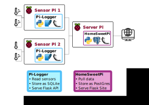

===========
HomeSweetPi
===========

.. image:: https://img.shields.io/pypi/v/homesweetpi.svg
        :target: https://pypi.python.org/pypi/homesweetpi

.. image:: https://img.shields.io/travis/corcorf/homesweetpi.svg
        :target: https://travis-ci.com/corcorf/homesweetpi

.. image:: https://readthedocs.org/projects/homesweetpi/badge/?version=latest
        :target: https://homesweetpi.readthedocs.io/en/latest/?badge=latest
        :alt: Documentation Status

This repository is part of an ongoing data-pipeline project to create a home
environment monitoring system with python and a network of Raspberry Pis.
The other part of the project can be found in my pi_logger_ repository. An overview of the project architecture is
shown in the figure below:

.. _pi_logger: https://www.github.com/corcorf/pi_logger/

Pi_logger runs on Raspberry Pis equipped with environment monitoring sensors
(currently the DHT22 and BME680 sensors are supported). It polls the sensors
for new readings at a frequency specified in a config file and saves these to
a local SQLite database. It also runs a RESTful API in Flask that allows remote
machines to retrieve the data at will.
The HomeSweetPi package contains code for regularly retrieving data from
machines running the Pi_logger API and adding this to a central PostGresSQL
database. The contents of this central database may then be accessed through
a web interface and RESTFUL API, also built in Flask.

* Free software: MIT license

Features
--------

* TODO

Credits
-------

This package was created with Cookiecutter_ and the `audreyr/cookiecutter-pypackage`_ project template.

.. _Cookiecutter: https://github.com/audreyr/cookiecutter
.. _`audreyr/cookiecutter-pypackage`: https://github.com/audreyr/cookiecutter-pypackage
