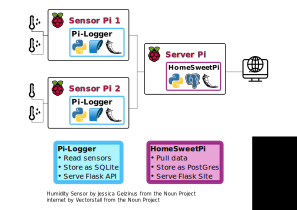

===========
HomeSweetPi
===========

.. image:: https://img.shields.io/travis/corcorf/homesweetpi.svg
        :target: https://travis-ci.com/corcorf/homesweetpi

This repository is part of an ongoing data-pipeline project to create a home
environment monitoring system with python and a network of Raspberry Pis.
The other part of the project can be found in my pi_logger_ repository. 

See it working live here_!

.. _here: http://homesweetpi.duckdns.org:5002/air_charts

An overview of the project architecture is shown in the figure below:

pi_logger_ runs on Raspberry Pis equipped with environment monitoring sensors
(currently the DHT22_ and BME680_ sensors are supported). It polls the sensors
for new readings at a frequency specified in a config file and saves these to
a local SQLite database. It also runs a RESTful API in Flask that allows remote
machines to retrieve the data at will.
The HomeSweetPi package contains code for regularly retrieving data from
machines running the Pi_logger API and adding this to a central PostGresSQL
database. The contents of this central database may then be accessed through
a web interface, which includes interactive graphs built with _Altair, and,
a RESTful API, which is also built in Flask.

.. _pi_logger: https://www.github.com/corcorf/pi_logger

.. _DHT22: https://www.adafruit.com/product/385

.. _BME680: https://www.adafruit.com/product/3660

.. _Altair: https://altair-viz.github.io/

* Free software: MIT license

Features
--------

* Management of PostGreSQL DB with SQLalchemy
* Web-interface and RESTful API in Flask
* Handling of scehduled data retrieval and API / web-interface services with Systemd

Credits
-------

This package was created with Cookiecutter_ and the `audreyr/cookiecutter-pypackage`_ project template.

.. _Cookiecutter: https://github.com/audreyr/cookiecutter
.. _`audreyr/cookiecutter-pypackage`: https://github.com/audreyr/cookiecutter-pypackage
